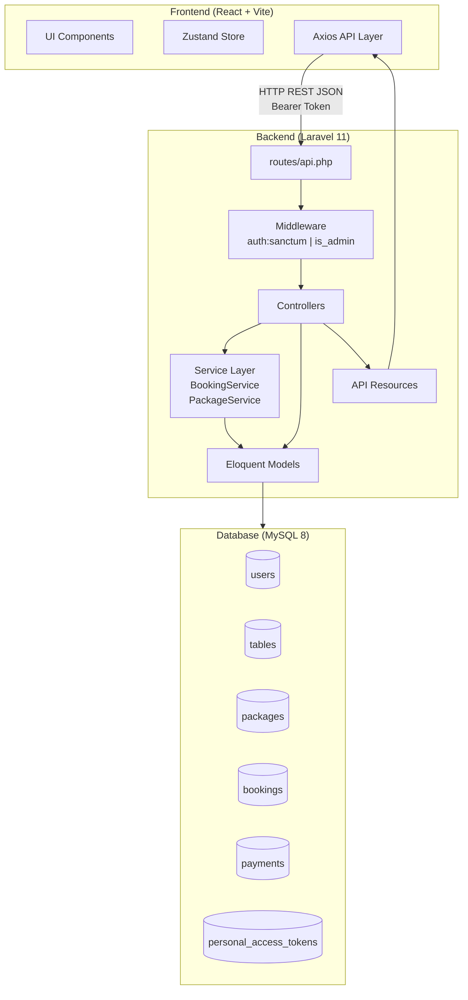
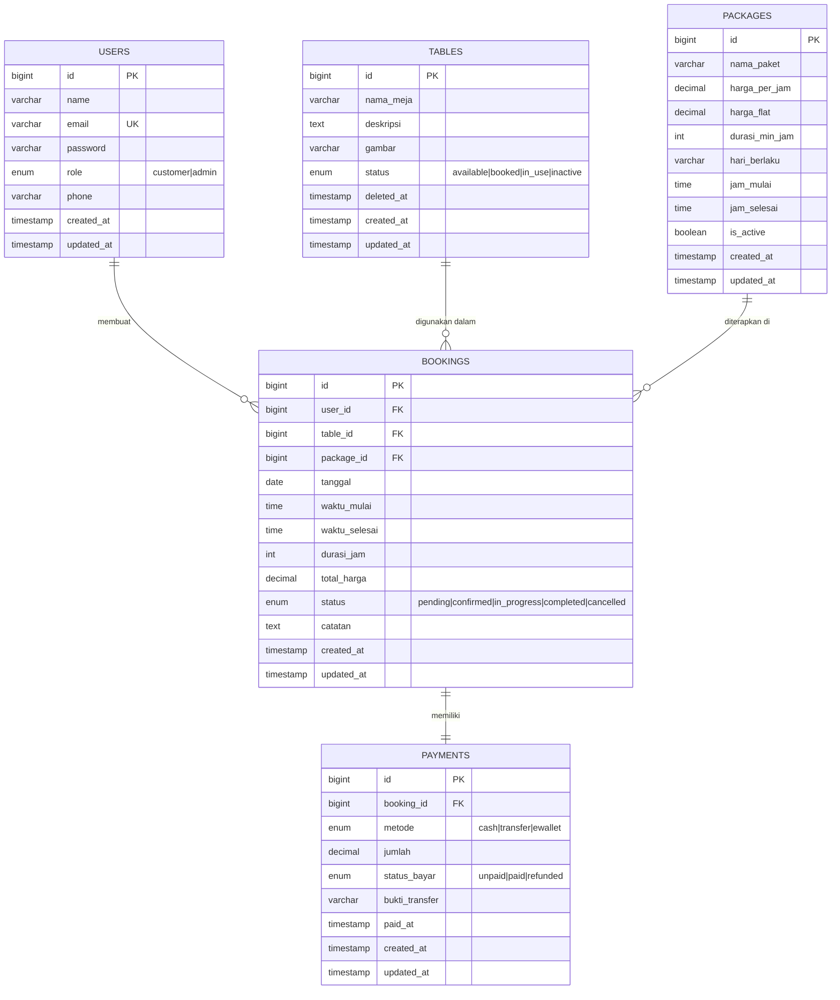
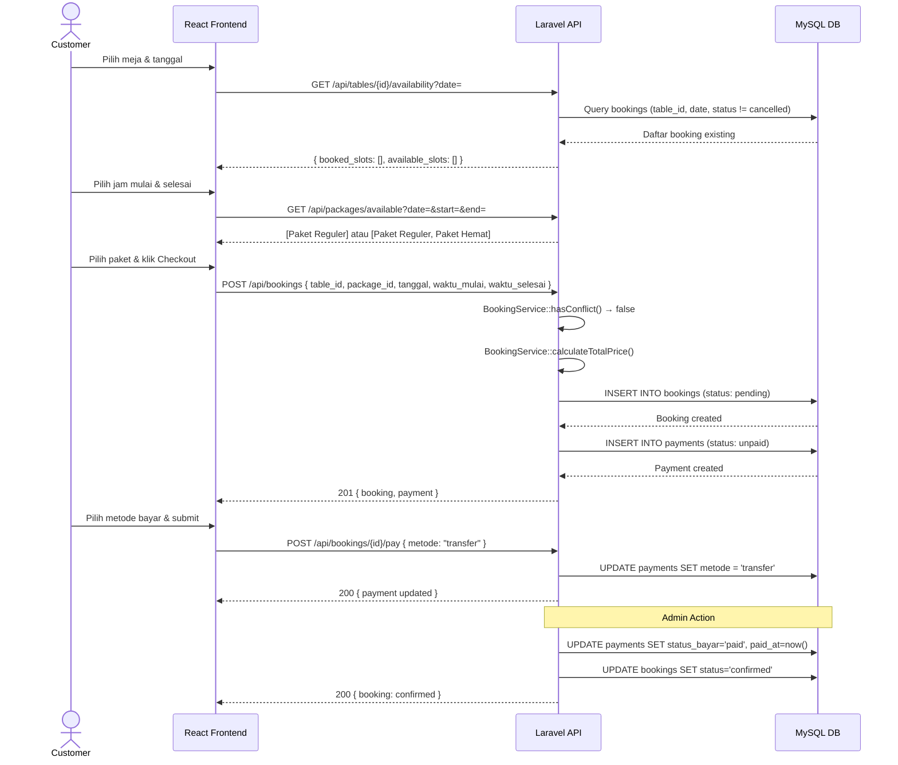

# Backend Planning & PRD — Vibe Billiard Booking System

> Dokumen perencanaan backend berbasis **Laravel** (PHP) dan **MySQL** untuk aplikasi booking meja billiard.
> Disusun berdasarkan analisis frontend yang telah dibangun.

---

## 1. Overview

### 1.1 Latar Belakang

Aplikasi **Vibe Billiard Booking** adalah sistem pemesanan meja billiard secara online yang memungkinkan pelanggan untuk melakukan booking meja, memilih paket harga, dan melakukan pembayaran — tanpa perlu datang langsung ke lokasi. Frontend (React.js + Vite + Tailwind CSS) telah dibangun dan siap diintegrasikan dengan backend yang solid.

### 1.2 Tujuan Backend

Backend berfungsi sebagai **REST API** yang melayani seluruh kebutuhan data frontend, mencakup:

- Autentikasi pengguna berbasis token (Laravel Sanctum)
- Manajemen data meja billiard
- Sistem booking dengan validasi konflik jadwal
- Logika paket harga (Reguler & Paket Hemat)
- Manajemen pembayaran (konfirmasi manual oleh admin)
- Dashboard statistik admin

### 1.3 Scope

| Cakupan | Detail |
|---|---|
| **In Scope** | Auth, Tables, Packages, Bookings, Payments, Admin Dashboard API |
| **Out of Scope** | Payment gateway otomatis (Midtrans/Xendit), notifikasi email/SMS, mobile app |
| **Target Platform** | Web Application (SPA React yang sudah ada) |
| **Deployment Target** | Server lokal (development) / VPS (production) |

---

## 2. Requirements

### 2.1 Functional Requirements

#### FR-01: Autentikasi & Otorisasi
- [ ] Pengguna dapat mendaftar sebagai `customer` dengan nama, email, no. HP, dan password
- [ ] Pengguna dapat login menggunakan email dan password
- [ ] Sistem mengembalikan token (Bearer Token via Laravel Sanctum)
- [ ] Admin login menggunakan akun yang dibuat via database seeder
- [ ] Token divalidasi di setiap request ke endpoint yang dilindungi
- [ ] Pengguna dapat logout dan token di-invalidate
- [ ] Endpoint `GET /api/me` mengembalikan data user yang sedang login

#### FR-02: Manajemen Meja (Tables)
- [ ] Admin dapat menambah meja baru (nama meja, deskripsi, gambar)
- [ ] Admin dapat mengedit informasi meja
- [ ] Admin dapat mengubah status meja (available, booked, in_use, inactive)
- [ ] Admin dapat menonaktifkan (soft delete) meja
- [ ] Customer dapat melihat daftar semua meja beserta status real-time
- [ ] Customer dapat melihat detail satu meja

#### FR-03: Manajemen Paket (Packages)
- [ ] Data paket tersedia dari seeder (Paket Reguler & Paket Hemat)
- [ ] Admin dapat mengupdate harga dan aturan paket
- [ ] Endpoint publik mengembalikan daftar paket aktif
- [ ] Endpoint filter paket tersedia berdasarkan tanggal, jam mulai, dan jam selesai
- [ ] Logika: **Paket Hemat** hanya berlaku Senin–Jumat, pukul 08:00–17:00, minimal 2 jam

#### FR-04: Booking (Pemesanan)
- [ ] Customer dapat membuat booking (meja, tanggal, jam mulai, jam selesai, paket)
- [ ] Sistem memvalidasi konflik jadwal (tidak boleh overlap dengan booking yang sudah ada)
- [ ] Sistem menghitung total harga berdasarkan durasi dan paket yang dipilih
- [ ] Endpoint menyediakan slot jam yang tersedia per meja per tanggal
- [ ] Customer dapat melihat riwayat booking miliknya
- [ ] Customer dapat melihat detail satu booking
- [ ] Admin dapat melihat semua booking dengan filter (tanggal, status, meja)
- [ ] Admin dapat mengubah status booking

#### FR-05: Pembayaran (Payments)
- [ ] Pembayaran dibuat otomatis saat booking di-submit (status: `unpaid`)
- [ ] Customer memilih metode pembayaran (cash, transfer, ewallet)
- [ ] Admin dapat mengkonfirmasi pembayaran secara manual (status: `paid`)
- [ ] Admin dapat melakukan refund (status: `refunded`)
- [ ] Perubahan status pembayaran mempengaruhi status booking

#### FR-06: Dashboard Admin
- [ ] Endpoint mengembalikan statistik hari ini: total booking, pendapatan, meja terpakai
- [ ] Endpoint mengembalikan daftar booking aktif hari ini
- [ ] Endpoint mengembalikan ringkasan transaksi (dengan filter tanggal)

### 2.2 Non-Functional Requirements

| ID | Requirement | Detail |
|---|---|---|
| NFR-01 | **Performance** | Response time API < 500ms untuk query umum |
| NFR-02 | **Security** | Token-based auth, validasi input, CORS, SQL injection protection (Eloquent ORM) |
| NFR-03 | **Scalability** | Struktur modular (Controllers, Services, Resources) untuk kemudahan scaling |
| NFR-04 | **Maintainability** | Kode terstruktur, migration database, seeder untuk data awal |
| NFR-05 | **Reliability** | Validasi server-side di semua endpoint, error response yang informatif |
| NFR-06 | **CORS** | Mengizinkan request dari `http://localhost:5173` (React dev server) |

---

## 3. Core Features

### 3.1 Authentication Module

```
POST   /api/register           → Registrasi customer baru
POST   /api/login              → Login, return token + user data
POST   /api/logout             → Logout (invalidate token)
GET    /api/me                 → Get user yang sedang login
PUT    /api/profile            → Update profil user (nama, no. HP)
PUT    /api/profile/password   → Ubah password
```

**Teknologi:** Laravel Sanctum (stateless token-based auth)

### 3.2 Tables Module

```
GET    /api/tables             → Daftar semua meja + status (public)
GET    /api/tables/{id}        → Detail satu meja (public)
GET    /api/tables/{id}/availability?date= → Slot jam tersedia (authenticated)

POST   /api/admin/tables       → [Admin] Tambah meja baru
PUT    /api/admin/tables/{id}  → [Admin] Edit meja
PATCH  /api/admin/tables/{id}/status → [Admin] Ubah status meja
DELETE /api/admin/tables/{id}  → [Admin] Nonaktifkan/hapus meja
```

### 3.3 Packages Module

```
GET    /api/packages                              → Daftar paket aktif (public)
GET    /api/packages/available?date=&start=&end=  → Paket valid untuk waktu tertentu

PUT    /api/admin/packages/{id}  → [Admin] Update harga & aturan paket
```

### 3.4 Bookings Module

```
POST   /api/bookings               → Buat booking baru (customer)
GET    /api/my-bookings            → Riwayat booking customer yang login
GET    /api/my-bookings/{id}       → Detail satu booking customer

GET    /api/admin/bookings         → [Admin] Semua booking (dengan filter)
GET    /api/admin/bookings/{id}    → [Admin] Detail satu booking
PUT    /api/admin/bookings/{id}/status → [Admin] Update status booking
```

### 3.5 Payments Module

```
POST   /api/bookings/{id}/pay      → Proses pembayaran (customer pilih metode)
GET    /api/bookings/{id}/payment  → Status pembayaran booking tertentu

PUT    /api/admin/payments/{id}/confirm  → [Admin] Konfirmasi pembayaran
PUT    /api/admin/payments/{id}/refund   → [Admin] Refund pembayaran
```

### 3.6 Dashboard Module (Admin Only)

```
GET    /api/admin/dashboard/stats      → Statistik hari ini
GET    /api/admin/dashboard/bookings   → Booking aktif hari ini
GET    /api/admin/dashboard/revenue    → Data pendapatan (filter: harian/bulanan)
```

---

## 4. User Flow

### 4.1 Alur Pelanggan (Customer)

```
1. REGISTRASI / LOGIN
   Customer → POST /api/register
            → POST /api/login
            ← Terima token + data user

2. LIHAT MEJA
   Customer → GET /api/tables
            ← Daftar meja + status

3. CEK KETERSEDIAAN JAM
   Customer → GET /api/tables/{id}/availability?date=YYYY-MM-DD
            ← Array slot jam yang tersedia & yang terbooked

4. CEK PAKET TERSEDIA
   Customer → GET /api/packages/available?date=YYYY-MM-DD&start=HH:MM&end=HH:MM
            ← Daftar paket yang memenuhi syarat (Hemat / Reguler)

5. BUAT BOOKING
   Customer → POST /api/bookings
              {
                table_id, tanggal, waktu_mulai,
                waktu_selesai, package_id
              }
            ← Booking data + payment data (status: pending/unpaid)

6. PROSES PEMBAYARAN
   Customer → POST /api/bookings/{id}/pay
              { metode: "cash|transfer|ewallet" }
            ← Payment updated (menunggu konfirmasi admin)

7. CEK STATUS BOOKING
   Customer → GET /api/my-bookings/{id}
            ← Detail booking + status pembayaran
```

### 4.2 Alur Admin

```
1. LOGIN ADMIN
   Admin → POST /api/login (dengan akun admin dari seeder)
         ← Token + user data (role: admin)

2. DASHBOARD
   Admin → GET /api/admin/dashboard/stats
         ← { total_bookings, total_revenue, tables_in_use, pending_payments }

3. KONFIRMASI PEMBAYARAN
   Admin → GET /api/admin/bookings?status=pending
         ← Daftar booking belum dikonfirmasi
   Admin → PUT /api/admin/payments/{id}/confirm
         ← Payment status: paid, Booking status: confirmed

4. KELOLA MEJA
   Admin → POST /api/admin/tables          → Tambah meja
   Admin → PUT  /api/admin/tables/{id}     → Edit meja
   Admin → DELETE /api/admin/tables/{id}   → Nonaktifkan meja

5. KELOLA PAKET
   Admin → PUT /api/admin/packages/{id}    → Update harga/aturan paket

6. MANAJEMEN TRANSAKSI
   Admin → GET /api/admin/bookings?date=&status=&table_id=
         ← Daftar semua booking dengan filter
   Admin → PUT /api/admin/bookings/{id}/status
              { status: "confirmed|cancelled|completed" }
```

### 4.3 Booking Status — State Machine

```
[Dibuat] → PENDING
    ↓ (Pembayaran dikonfirmasi admin)
CONFIRMED → IN_PROGRESS → COMPLETED
    ↓ (Admin/Customer batalkan)
CANCELLED

PENDING → EXPIRED (jika tidak dibayar dalam X jam — optional)
```

---

## 5. Architecture

### 5.1 Tech Stack Backend

| Kategori | Teknologi | Versi | Keterangan |
|---|---|---|---|
| Language | PHP | ^8.2 | Bahasa pemrograman utama |
| Framework | Laravel | ^11.x | Full-stack PHP framework |
| Authentication | Laravel Sanctum | ^4.x | Token-based API auth |
| Database | MySQL | ^8.0 | Relational database utama |
| ORM | Eloquent | (bawaan Laravel) | Object-Relational Mapping |
| API Response | Laravel API Resources | (bawaan) | Transformasi & formatting response |
| Validation | Laravel Form Request | (bawaan) | Validasi request terstruktur |
| CORS | fruitcake/laravel-cors | (bawaan L11) | Cross-Origin Resource Sharing |
| Dev Tools | Laravel Telescope | ^5.x | Debugging & monitoring (dev) |

### 5.2 Struktur Folder Laravel

```
app/
├── Http/
│   ├── Controllers/
│   │   ├── Api/
│   │   │   ├── AuthController.php
│   │   │   ├── TableController.php
│   │   │   ├── PackageController.php
│   │   │   ├── BookingController.php
│   │   │   ├── PaymentController.php
│   │   │   └── Admin/
│   │   │       ├── DashboardController.php
│   │   │       ├── TableController.php
│   │   │       ├── PackageController.php
│   │   │       ├── BookingController.php
│   │   │       └── PaymentController.php
│   │
│   ├── Middleware/
│   │   └── IsAdmin.php              # Cek role === 'admin'
│   │
│   ├── Requests/
│   │   ├── Auth/
│   │   │   ├── RegisterRequest.php
│   │   │   └── LoginRequest.php
│   │   ├── Booking/
│   │   │   ├── CreateBookingRequest.php
│   │   │   └── UpdateBookingStatusRequest.php
│   │   ├── Table/
│   │   │   └── CreateTableRequest.php
│   │   └── Payment/
│   │       └── ProcessPaymentRequest.php
│   │
│   └── Resources/
│       ├── UserResource.php
│       ├── TableResource.php
│       ├── PackageResource.php
│       ├── BookingResource.php
│       └── PaymentResource.php
│
├── Models/
│   ├── User.php
│   ├── Table.php
│   ├── Package.php
│   ├── Booking.php
│   └── Payment.php
│
├── Services/
│   ├── BookingService.php           # Logika: konflik jadwal, hitung harga
│   ├── PackageService.php           # Logika: eligibility Paket Hemat
│   └── DashboardService.php         # Agregasi statistik admin
│
└── Enums/                           # PHP 8.1+ Backed Enums
    ├── UserRole.php                 # customer, admin
    ├── TableStatus.php              # available, booked, in_use, inactive
    ├── BookingStatus.php            # pending, confirmed, in_progress, completed, cancelled
    └── PaymentStatus.php            # unpaid, paid, refunded

database/
├── migrations/
│   ├── 2026_xx_xx_000001_create_users_table.php
│   ├── 2026_xx_xx_000002_create_tables_table.php
│   ├── 2026_xx_xx_000003_create_packages_table.php
│   ├── 2026_xx_xx_000004_create_bookings_table.php
│   └── 2026_xx_xx_000005_create_payments_table.php
│
└── seeders/
    ├── DatabaseSeeder.php
    ├── AdminSeeder.php              # Buat akun admin default
    ├── TableSeeder.php              # Data meja awal (5-10 meja)
    └── PackageSeeder.php            # Data paket (Reguler & Hemat)

routes/
└── api.php                          # Semua route API
```

### 5.3 Database Schema (ERD)

#### Tabel: `users`

```sql
CREATE TABLE users (
    id              BIGINT UNSIGNED AUTO_INCREMENT PRIMARY KEY,
    name            VARCHAR(255)    NOT NULL,
    email           VARCHAR(255)    NOT NULL UNIQUE,
    email_verified_at TIMESTAMP     NULL,
    password        VARCHAR(255)    NOT NULL,
    role            ENUM('customer', 'admin') NOT NULL DEFAULT 'customer',
    phone           VARCHAR(20)     NULL,
    remember_token  VARCHAR(100)    NULL,
    created_at      TIMESTAMP       NULL,
    updated_at      TIMESTAMP       NULL
);
```

#### Tabel: `tables`

```sql
CREATE TABLE tables (
    id              BIGINT UNSIGNED AUTO_INCREMENT PRIMARY KEY,
    nama_meja       VARCHAR(100)    NOT NULL,
    deskripsi       TEXT            NULL,
    gambar          VARCHAR(255)    NULL,     -- path/URL gambar meja
    status          ENUM('available', 'booked', 'in_use', 'inactive')
                    NOT NULL DEFAULT 'available',
    created_at      TIMESTAMP       NULL,
    updated_at      TIMESTAMP       NULL,
    deleted_at      TIMESTAMP       NULL      -- soft delete
);
```

#### Tabel: `packages`

```sql
CREATE TABLE packages (
    id              BIGINT UNSIGNED AUTO_INCREMENT PRIMARY KEY,
    nama_paket      VARCHAR(100)    NOT NULL, -- "Paket Reguler", "Paket Hemat"
    harga_per_jam   DECIMAL(10, 2)  NULL,     -- untuk Reguler (Rp 35.000/jam)
    harga_flat      DECIMAL(10, 2)  NULL,     -- untuk Hemat (Rp 50.000 flat)
    durasi_min_jam  INT             NOT NULL DEFAULT 1,  -- minimal durasi (2 jam untuk Hemat)
    hari_berlaku    VARCHAR(50)     NOT NULL, -- "everyday" atau "mon-fri"
    jam_mulai       TIME            NULL,     -- NULL = tidak ada batasan
    jam_selesai     TIME            NULL,     -- NULL = tidak ada batasan
    is_active       BOOLEAN         NOT NULL DEFAULT TRUE,
    created_at      TIMESTAMP       NULL,
    updated_at      TIMESTAMP       NULL
);
```

#### Tabel: `bookings`

```sql
CREATE TABLE bookings (
    id              BIGINT UNSIGNED AUTO_INCREMENT PRIMARY KEY,
    user_id         BIGINT UNSIGNED NOT NULL,
    table_id        BIGINT UNSIGNED NOT NULL,
    package_id      BIGINT UNSIGNED NOT NULL,
    tanggal         DATE            NOT NULL,
    waktu_mulai     TIME            NOT NULL,
    waktu_selesai   TIME            NOT NULL,
    durasi_jam      INT             NOT NULL, -- dihitung otomatis
    total_harga     DECIMAL(10, 2)  NOT NULL,
    status          ENUM('pending', 'confirmed', 'in_progress', 'completed', 'cancelled')
                    NOT NULL DEFAULT 'pending',
    catatan         TEXT            NULL,     -- catatan dari customer
    created_at      TIMESTAMP       NULL,
    updated_at      TIMESTAMP       NULL,

    FOREIGN KEY (user_id)    REFERENCES users(id)    ON DELETE CASCADE,
    FOREIGN KEY (table_id)   REFERENCES tables(id)   ON DELETE CASCADE,
    FOREIGN KEY (package_id) REFERENCES packages(id) ON DELETE CASCADE
);
```

#### Tabel: `payments`

```sql
CREATE TABLE payments (
    id              BIGINT UNSIGNED AUTO_INCREMENT PRIMARY KEY,
    booking_id      BIGINT UNSIGNED NOT NULL UNIQUE, -- 1 booking = 1 payment
    metode          ENUM('cash', 'transfer', 'ewallet') NOT NULL DEFAULT 'cash',
    jumlah          DECIMAL(10, 2)  NOT NULL,
    status_bayar    ENUM('unpaid', 'paid', 'refunded') NOT NULL DEFAULT 'unpaid',
    bukti_transfer  VARCHAR(255)    NULL,     -- path foto bukti transfer (optional)
    paid_at         TIMESTAMP       NULL,
    created_at      TIMESTAMP       NULL,
    updated_at      TIMESTAMP       NULL,

    FOREIGN KEY (booking_id) REFERENCES bookings(id) ON DELETE CASCADE
);
```

#### Tabel: `personal_access_tokens` (dibuat otomatis oleh Sanctum)

### 5.4 Relasi Antar Model

```
User         hasMany    Booking
Table        hasMany    Booking
Package      hasMany    Booking
Booking      belongsTo  User
Booking      belongsTo  Table
Booking      belongsTo  Package
Booking      hasOne     Payment
Payment      belongsTo  Booking
```

### 5.5 API Route Structure

```php
// routes/api.php

// ─── PUBLIC ROUTES ──────────────────────────────────────────────
Route::post('/register', [AuthController::class, 'register']);
Route::post('/login',    [AuthController::class, 'login']);

Route::get('/tables',           [TableController::class, 'index']);
Route::get('/tables/{id}',      [TableController::class, 'show']);
Route::get('/packages',         [PackageController::class, 'index']);

// ─── AUTHENTICATED ROUTES ────────────────────────────────────────
Route::middleware('auth:sanctum')->group(function () {
    Route::post('/logout',  [AuthController::class, 'logout']);
    Route::get('/me',       [AuthController::class, 'me']);
    Route::put('/profile',           [AuthController::class, 'updateProfile']);
    Route::put('/profile/password',  [AuthController::class, 'updatePassword']);

    Route::get('/tables/{id}/availability', [TableController::class, 'availability']);
    Route::get('/packages/available',       [PackageController::class, 'available']);

    // Booking (customer)
    Route::post('/bookings',               [BookingController::class, 'store']);
    Route::get('/my-bookings',             [BookingController::class, 'myBookings']);
    Route::get('/my-bookings/{id}',        [BookingController::class, 'myBookingDetail']);

    // Payment (customer)
    Route::post('/bookings/{id}/pay',      [PaymentController::class, 'pay']);
    Route::get('/bookings/{id}/payment',   [PaymentController::class, 'show']);

    // ─── ADMIN ONLY ROUTES ────────────────────────────────────
    Route::middleware('is_admin')->prefix('admin')->group(function () {

        // Dashboard
        Route::get('/dashboard/stats',    [DashboardController::class, 'stats']);
        Route::get('/dashboard/bookings', [DashboardController::class, 'todayBookings']);
        Route::get('/dashboard/revenue',  [DashboardController::class, 'revenue']);

        // Tables
        Route::post('/tables',              [Admin\TableController::class, 'store']);
        Route::put('/tables/{id}',          [Admin\TableController::class, 'update']);
        Route::patch('/tables/{id}/status', [Admin\TableController::class, 'updateStatus']);
        Route::delete('/tables/{id}',       [Admin\TableController::class, 'destroy']);

        // Packages
        Route::put('/packages/{id}',        [Admin\PackageController::class, 'update']);

        // Bookings
        Route::get('/bookings',             [Admin\BookingController::class, 'index']);
        Route::get('/bookings/{id}',        [Admin\BookingController::class, 'show']);
        Route::put('/bookings/{id}/status', [Admin\BookingController::class, 'updateStatus']);

        // Payments
        Route::put('/payments/{id}/confirm', [Admin\PaymentController::class, 'confirm']);
        Route::put('/payments/{id}/refund',  [Admin\PaymentController::class, 'refund']);
    });
});
```

### 5.6 Arsitektur Request-Response

```
Frontend (React)
    │
    │ HTTP Request (Bearer Token)
    ▼
[routes/api.php]
    │
    ▼
[Middleware] → auth:sanctum, is_admin
    │
    ▼
[FormRequest] → Validasi input
    │
    ▼
[Controller] → Memanggil Service jika logic kompleks
    │
    ▼
[Service Layer] → Business logic (cek konflik, hitung harga, eligibility paket)
    │
    ▼
[Eloquent Model] ↔ [MySQL Database]
    │
    ▼
[API Resource] → Transformasi response (format JSON yang konsisten)
    │
    ▼
Frontend (React) menerima response JSON
```

---

## 6. Design & Technical Constraints

### 6.1 API Response Format

Semua response API menggunakan format JSON yang konsisten:

#### Success Response
```json
{
  "success": true,
  "message": "Booking berhasil dibuat",
  "data": {
    "id": 1,
    "tanggal": "2026-04-20",
    "waktu_mulai": "10:00",
    "waktu_selesai": "12:00",
    "total_harga": 70000,
    "status": "pending"
  }
}
```

#### Paginated Response
```json
{
  "success": true,
  "data": [...],
  "meta": {
    "current_page": 1,
    "last_page": 5,
    "per_page": 15,
    "total": 73
  },
  "links": {
    "prev": null,
    "next": "http://localhost:8000/api/admin/bookings?page=2"
  }
}
```

#### Error Response
```json
{
  "success": false,
  "message": "Waktu yang dipilih sudah terbooking",
  "errors": {
    "waktu_mulai": ["Slot jam 10:00 - 12:00 sudah tidak tersedia pada tanggal tersebut"]
  }
}
```

### 6.2 Validation Rules

#### Create Booking
```php
// CreateBookingRequest
[
    'table_id'      => 'required|exists:tables,id',
    'package_id'    => 'required|exists:packages,id',
    'tanggal'       => 'required|date|after_or_equal:today',
    'waktu_mulai'   => 'required|date_format:H:i',
    'waktu_selesai' => 'required|date_format:H:i|after:waktu_mulai',
    'catatan'       => 'nullable|string|max:500',
]
```

#### Register
```php
// RegisterRequest
[
    'name'     => 'required|string|max:255',
    'email'    => 'required|email|unique:users,email',
    'password' => 'required|string|min:8|confirmed',
    'phone'    => 'nullable|string|max:20',
]
```

### 6.3 Business Logic Constraints

#### Konflik Jadwal Booking
```php
// BookingService.php
public function hasConflict(int $tableId, string $date, string $start, string $end, ?int $excludeId = null): bool
{
    return Booking::where('table_id', $tableId)
        ->where('tanggal', $date)
        ->whereNotIn('status', ['cancelled'])
        ->when($excludeId, fn($q) => $q->where('id', '!=', $excludeId))
        ->where(function ($query) use ($start, $end) {
            $query->whereBetween('waktu_mulai', [$start, $end])
                  ->orWhereBetween('waktu_selesai', [$start, $end])
                  ->orWhere(function ($q) use ($start, $end) {
                      $q->where('waktu_mulai', '<=', $start)
                        ->where('waktu_selesai', '>=', $end);
                  });
        })
        ->exists();
}
```

#### Eligibility Paket Hemat
```php
// PackageService.php
public function isEligibleForPaketHemat(string $date, string $start, string $end): bool
{
    $dayOfWeek = Carbon::parse($date)->dayOfWeek;
    $isWeekday = $dayOfWeek >= 1 && $dayOfWeek <= 5; // Senin–Jumat

    $startTime = Carbon::parse($start);
    $endTime   = Carbon::parse($end);

    $isWithinAllowedHours = $startTime->gte(Carbon::parse('08:00'))
                         && $endTime->lte(Carbon::parse('17:00'));

    $durationHours = $startTime->diffInHours($endTime);
    $hasMinDuration = $durationHours >= 2;

    return $isWeekday && $isWithinAllowedHours && $hasMinDuration;
}
```

#### Perhitungan Total Harga
```php
// BookingService.php
public function calculateTotalPrice(Package $package, int $durationHours): float
{
    if ($package->harga_flat !== null) {
        // Paket Hemat: harga flat untuk 2 jam, selebihnya + Reguler rate
        $extraHours = max(0, $durationHours - $package->durasi_min_jam);
        $regularRate = Package::where('nama_paket', 'Paket Reguler')->first()->harga_per_jam;
        return $package->harga_flat + ($extraHours * $regularRate);
    }

    // Paket Reguler: harga per jam × durasi
    return $package->harga_per_jam * $durationHours;
}
```

### 6.4 Jam Operasional

| Parameter | Nilai |
|---|---|
| Jam Buka | 08:00 |
| Jam Tutup | 23:00 |
| Interval Slot | 1 jam |
| Minimal Durasi | 1 jam (Reguler), 2 jam (Hemat) |

### 6.5 CORS Configuration

```php
// config/cors.php
return [
    'paths'           => ['api/*', 'sanctum/csrf-cookie'],
    'allowed_methods' => ['*'],
    'allowed_origins' => [
        'http://localhost:5173',  // React Dev Server
        'http://localhost:3000',  // alternatif
    ],
    'allowed_headers' => ['*'],
    'supports_credentials' => true,
];
```

### 6.6 Environment Variables

```env
# .env
APP_NAME="Vibe Billiard"
APP_ENV=local
APP_DEBUG=true
APP_URL=http://localhost:8000

DB_CONNECTION=mysql
DB_HOST=127.0.0.1
DB_PORT=3306
DB_DATABASE=vibe_billiard
DB_USERNAME=root
DB_PASSWORD=

SANCTUM_STATEFUL_DOMAINS=localhost:5173

BOOKING_OPERASIONAL_START=08:00
BOOKING_OPERASIONAL_END=23:00
BOOKING_EXPIRY_HOURS=2
```

### 6.7 Security Constraints

| Constraint | Implementasi |
|---|---|
| SQL Injection | Gunakan Eloquent ORM, bukan raw query |
| XSS | Response JSON (bukan HTML render), validasi input |
| CSRF | Tidak applicable untuk API stateless |
| Rate Limiting | `throttle:60,1` pada auth endpoints |
| Password | Bcrypt hashing via Laravel built-in |
| Token | Laravel Sanctum personal access token |
| Role Guard | Middleware `is_admin` di semua admin endpoints |

### 6.8 Error Handling Standards

| HTTP Code | Kondisi |
|---|---|
| `200 OK` | Request berhasil |
| `201 Created` | Resource berhasil dibuat |
| `400 Bad Request` | Input tidak valid (validasi gagal) |
| `401 Unauthorized` | Token tidak ada atau expired |
| `403 Forbidden` | Token valid tapi tidak punya izin (bukan admin) |
| `404 Not Found` | Resource tidak ditemukan |
| `409 Conflict` | Konflik jadwal booking |
| `422 Unprocessable Entity` | Validasi Laravel gagal |
| `500 Internal Server Error` | Error server (log ke Telescope) |

---

## 7. Implementation Milestones

### Milestone 1 — Setup & Auth (Hari 1–2)

- [ ] Install Laravel + Laravel Sanctum
- [ ] Konfigurasi database MySQL (`vibe_billiard`)
- [ ] Buat 5 migrations (users, tables, packages, bookings, payments)
- [ ] Buat Enums (UserRole, TableStatus, BookingStatus, PaymentStatus)
- [ ] Buat Models + relasi Eloquent
- [ ] Buat Seeders (Admin, Tables, Packages)
- [ ] Implementasi AuthController (register, login, logout, me)
- [ ] Setup Middleware `IsAdmin`
- [ ] Konfigurasi CORS
- [ ] Test endpoint auth dengan Postman/Insomnia

### Milestone 2 — Tables & Packages (Hari 3)

- [ ] Implementasi TableController (public: index, show)
- [ ] Implementasi Admin\TableController (CRUD, updateStatus)
- [ ] Implementasi API Resource: TableResource
- [ ] Implementasi PackageController (public: index)
- [ ] Implementasi PackageService (eligibility Paket Hemat)
- [ ] Implementasi endpoint `GET /api/packages/available`
- [ ] Implementasi `GET /api/tables/{id}/availability` (slot jam tersedia)
- [ ] Implementasi Admin\PackageController (update)
- [ ] Test semua endpoint Tables & Packages

### Milestone 3 — Booking & Payment (Hari 4–5)

- [ ] Implementasi BookingService (konflik jadwal, hitung harga)
- [ ] Implementasi BookingController (store, myBookings, myBookingDetail)
- [ ] Implementasi Admin\BookingController (index, show, updateStatus)
- [ ] Implementasi PaymentController (pay, show)
- [ ] Implementasi Admin\PaymentController (confirm, refund)
- [ ] Integrasi BookingService dengan perubahan status Table
- [ ] Implementasi API Resources (BookingResource, PaymentResource)
- [ ] Test full booking flow (buat booking → bayar → konfirmasi admin)

### Milestone 4 — Dashboard & Final (Hari 6)

- [ ] Implementasi DashboardService (stats, revenue agregasi)
- [ ] Implementasi DashboardController (stats, todayBookings, revenue)
- [ ] Error handling global (Handler.php)
- [ ] API response format yang konsisten di semua endpoint
- [ ] Implementasi Form Requests (validasi terstruktur)
- [ ] Test integrasi dengan frontend React
- [ ] Dokumentasi API (opsional: Laravel Scribe / Postman collection)
- [ ] Final QA & bug fixing

---

## 8. Seeder Data

### AdminSeeder
```php
User::create([
    'name'     => 'Admin Billiard',
    'email'    => 'admin@vilebilliard.com',
    'password' => bcrypt('Admin1234!'),
    'role'     => 'admin',
    'phone'    => '081234567890',
]);
```

### TableSeeder (5 Meja)
```
Meja 1 — Meja VIP 1       (status: available)
Meja 2 — Meja VIP 2       (status: available)
Meja 3 — Meja Standar 1   (status: available)
Meja 4 — Meja Standar 2   (status: available)
Meja 5 — Meja Standar 3   (status: available)
```

### PackageSeeder (2 Paket)
```
Paket Reguler:
  - harga_per_jam  : 35.000
  - harga_flat     : NULL
  - durasi_min_jam : 1
  - hari_berlaku   : everyday
  - jam_mulai      : NULL (tidak ada batasan)
  - jam_selesai    : NULL

Paket Hemat:
  - harga_per_jam  : NULL
  - harga_flat     : 50.000
  - durasi_min_jam : 2
  - hari_berlaku   : mon-fri
  - jam_mulai      : 08:00
  - jam_selesai    : 17:00
```

---

## 9. Testing Plan

### 9.1 Endpoint Tests (Manual via Postman)

| Endpoint | Test Case | Expected |
|---|---|---|
| `POST /api/register` | Data valid | 201 + user data + token |
| `POST /api/register` | Email duplikat | 422 error |
| `POST /api/login` | Kredensial valid | 200 + token |
| `POST /api/login` | Password salah | 401 error |
| `GET /api/tables` | Tanpa auth | 200 + list meja |
| `GET /api/tables/{id}/availability` | Tanpa token | 401 |
| `POST /api/bookings` | Slot tersedia | 201 + booking data |
| `POST /api/bookings` | Slot konflik | 409 + error message |
| `POST /api/bookings` | Paket Hemat, hari Sabtu | 422 validation error |
| `PUT /api/admin/payments/{id}/confirm` | Role customer | 403 |
| `PUT /api/admin/payments/{id}/confirm` | Role admin | 200 + updated payment |

### 9.2 Business Logic Tests

- [ ] Buat 2 booking di meja yang sama, jam tumpang tindih → harus gagal
- [ ] Buat booking Paket Hemat di hari Sabtu → harus ditolak
- [ ] Buat booking Paket Hemat Senin jam 08:00–10:00 → harus berhasil
- [ ] Konfirmasi pembayaran → status booking berubah ke `confirmed`
- [ ] Admin update status booking ke `cancelled` → status tidak bisa kembali ke pending

---

## 10. Diagram Arsitektur

### 10.1 Arsitektur Keseluruhan



### 10.2 Database ERD



### 10.3 Booking Flow — Sequence Diagram



---

## 11. Dependencies (composer.json)

```json
{
    "require": {
        "php": "^8.2",
        "laravel/framework": "^11.x",
        "laravel/sanctum": "^4.x",
        "laravel/tinker": "^2.9"
    },
    "require-dev": {
        "fakerphp/faker": "^1.23",
        "laravel/telescope": "^5.x",
        "nunomaduro/collision": "^8.1",
        "phpunit/phpunit": "^11.0"
    }
}
```

---

*Dokumen ini disusun berdasarkan analisis frontend yang telah dibangun (React + Vite + Tailwind CSS).*
*Last updated: April 2026*
