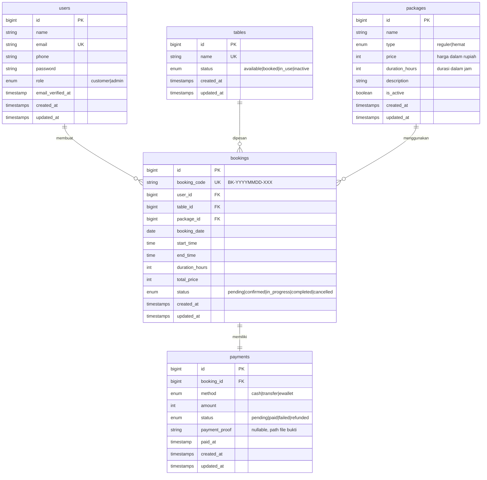
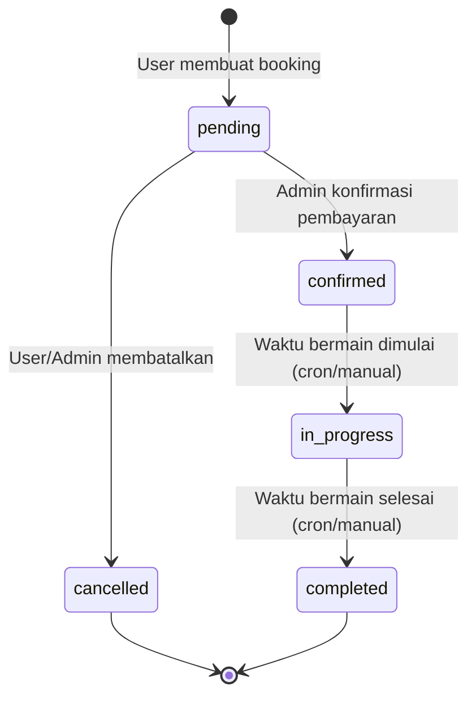

# Backend Planning — Vibe Billiard API

**Tech Stack**: Laravel 11 · PHP 8.2+ · MySQL 8 · Laravel Sanctum (Auth)
**API Style**: RESTful JSON API
**Base URL**: `http://localhost:8000/api`

---

## 1. Ringkasan

Backend ini menyediakan RESTful API untuk aplikasi frontend React "Vibe Billiard" — sebuah sistem booking meja billiard online. API menangani autentikasi pengguna, manajemen meja, logika paket harga, pemesanan dengan validasi clash detection, pembayaran, dan dashboard admin.

---

## 2. Database Schema (MySQL)

### 2.1 ERD Diagram



### 2.2 Detail Tabel

#### `users`
| Kolom | Tipe | Constraint | Keterangan |
|-------|------|-----------|------------|
| id | BIGINT UNSIGNED | PK, AUTO_INCREMENT | |
| name | VARCHAR(255) | NOT NULL | Nama lengkap |
| email | VARCHAR(255) | UNIQUE, NOT NULL | Email login |
| phone | VARCHAR(20) | NULLABLE | No. WhatsApp |
| password | VARCHAR(255) | NOT NULL | Hashed (bcrypt) |
| role | ENUM('customer','admin') | DEFAULT 'customer' | Peran pengguna |
| email_verified_at | TIMESTAMP | NULLABLE | |
| created_at | TIMESTAMP | | |
| updated_at | TIMESTAMP | | |

#### `tables`
| Kolom | Tipe | Constraint | Keterangan |
|-------|------|-----------|------------|
| id | BIGINT UNSIGNED | PK, AUTO_INCREMENT | |
| name | VARCHAR(100) | UNIQUE, NOT NULL | Nama meja (Meja 1, VIP 1, dll) |
| status | ENUM('available','booked','in_use','inactive') | DEFAULT 'available' | Status real-time |
| created_at | TIMESTAMP | | |
| updated_at | TIMESTAMP | | |

#### `packages`
| Kolom | Tipe | Constraint | Keterangan |
|-------|------|-----------|------------|
| id | BIGINT UNSIGNED | PK, AUTO_INCREMENT | |
| name | VARCHAR(100) | NOT NULL | Nama paket |
| type | ENUM('reguler','hemat') | NOT NULL | Tipe paket |
| price | INT UNSIGNED | NOT NULL | Harga dalam rupiah |
| duration_hours | INT UNSIGNED | NOT NULL | Durasi default (jam) |
| description | TEXT | NULLABLE | Deskripsi paket |
| is_active | BOOLEAN | DEFAULT true | Aktif/nonaktif |
| created_at | TIMESTAMP | | |
| updated_at | TIMESTAMP | | |

#### `bookings`
| Kolom | Tipe | Constraint | Keterangan |
|-------|------|-----------|------------|
| id | BIGINT UNSIGNED | PK, AUTO_INCREMENT | |
| booking_code | VARCHAR(20) | UNIQUE, NOT NULL | Format: BK-YYYYMMDD-XXX |
| user_id | BIGINT UNSIGNED | FK → users.id | Pelanggan |
| table_id | BIGINT UNSIGNED | FK → tables.id | Meja yang dipesan |
| package_id | BIGINT UNSIGNED | FK → packages.id | Paket yang dipilih |
| booking_date | DATE | NOT NULL | Tanggal bermain |
| start_time | TIME | NOT NULL | Jam mulai |
| end_time | TIME | NOT NULL | Jam selesai |
| duration_hours | INT UNSIGNED | NOT NULL | Durasi (jam) |
| total_price | INT UNSIGNED | NOT NULL | Total harga (rupiah) |
| status | ENUM('pending','confirmed','in_progress','completed','cancelled') | DEFAULT 'pending' | Status booking |
| created_at | TIMESTAMP | | |
| updated_at | TIMESTAMP | | |

#### `payments`
| Kolom | Tipe | Constraint | Keterangan |
|-------|------|-----------|------------|
| id | BIGINT UNSIGNED | PK, AUTO_INCREMENT | |
| booking_id | BIGINT UNSIGNED | FK → bookings.id | Relasi ke booking |
| method | ENUM('cash','transfer','ewallet') | NOT NULL | Metode pembayaran |
| amount | INT UNSIGNED | NOT NULL | Jumlah bayar (rupiah) |
| status | ENUM('pending','paid','failed','refunded') | DEFAULT 'pending' | Status bayar |
| payment_proof | VARCHAR(255) | NULLABLE | Path file bukti transfer |
| paid_at | TIMESTAMP | NULLABLE | Waktu pembayaran selesai |
| created_at | TIMESTAMP | | |
| updated_at | TIMESTAMP | | |

### 2.3 Seeder Data Awal

```
Tables: Meja 1, Meja 2, Meja 3, Meja 4, Meja 5, Meja 6
Packages:
  - Paket Reguler (reguler, Rp 35.000/jam)
  - Paket Hemat (hemat, Rp 50.000/2jam)
Users:
  - Admin: admin@vibebilliard.com / password
  - Customer: user@contoh.com / password123
```

---

## 3. API Endpoint Specification

### 3.1 Autentikasi (Auth)

| Method | Endpoint | Middleware | Deskripsi |
|--------|----------|-----------|-----------|
| POST | `/api/register` | guest | Registrasi user baru |
| POST | `/api/login` | guest | Login, return token + user |
| POST | `/api/logout` | auth:sanctum | Logout, revoke token |
| GET | `/api/user` | auth:sanctum | Get current user profile |
| PUT | `/api/user` | auth:sanctum | Update profil user |
| PUT | `/api/user/password` | auth:sanctum | Ubah password |

#### `POST /api/register`
**Request Body:**
```json
{
  "name": "John Doe",
  "email": "john@email.com",
  "phone": "081234567890",
  "password": "password123",
  "password_confirmation": "password123"
}
```
**Response (201):**
```json
{
  "message": "Registrasi berhasil",
  "user": { "id": 1, "name": "John Doe", "email": "john@email.com", "role": "customer" },
  "token": "1|abc123..."
}
```

#### `POST /api/login`
**Request Body:**
```json
{
  "email": "john@email.com",
  "password": "password123"
}
```
**Response (200):**
```json
{
  "message": "Login berhasil",
  "user": { "id": 1, "name": "John Doe", "email": "john@email.com", "role": "customer" },
  "token": "2|def456..."
}
```

---

### 3.2 Tables (Meja)

| Method | Endpoint | Middleware | Deskripsi |
|--------|----------|-----------|-----------|
| GET | `/api/tables` | auth:sanctum | List semua meja + real-time status |
| GET | `/api/tables/{id}` | auth:sanctum | Detail meja |
| POST | `/api/admin/tables` | auth:sanctum, role:admin | Tambah meja baru |
| PUT | `/api/admin/tables/{id}` | auth:sanctum, role:admin | Edit meja |
| DELETE | `/api/admin/tables/{id}` | auth:sanctum, role:admin | Hapus meja |

#### `GET /api/tables`
**Query Params:** `?date=2026-04-16&start_time=14:00&end_time=16:00` (opsional, untuk cek ketersediaan)

**Response (200):**
```json
{
  "data": [
    { "id": 1, "name": "Meja 1", "status": "available" },
    { "id": 2, "name": "Meja 2", "status": "booked" },
    { "id": 3, "name": "Meja 3", "status": "available" }
  ]
}
```

> **Logika Status Real-time:**
> Jika ada query param tanggal + waktu, backend mengecek booking table pada slot tersebut. Jika ada booking aktif (confirmed/in_progress) yang overlap → set status `booked`. Jika tidak → `available`. Meja dengan field status `inactive` tetap `inactive`.

---

### 3.3 Packages (Paket)

| Method | Endpoint | Middleware | Deskripsi |
|--------|----------|-----------|-----------|
| GET | `/api/packages` | auth:sanctum | List semua paket aktif |
| GET | `/api/packages/check-eligibility` | auth:sanctum | Cek eligibilitas Paket Hemat |
| POST | `/api/admin/packages` | auth:sanctum, role:admin | Tambah paket (admin) |
| PUT | `/api/admin/packages/{id}` | auth:sanctum, role:admin | Edit paket (admin) |

#### `GET /api/packages/check-eligibility`
**Query Params:** `?date=2026-04-16&start_time=10:00&duration=2`

**Response (200):**
```json
{
  "eligible_packages": [
    { "id": 1, "name": "Paket Reguler", "type": "reguler", "calculated_price": 70000 },
    { "id": 2, "name": "Paket Hemat", "type": "hemat", "calculated_price": 50000 }
  ]
}
```

> **Logika Paket Hemat (Backend Validation — Single Source of Truth):**
> 1. Hari: Hanya Senin–Jumat (Carbon::isWeekday)
> 2. Jam: start_time antara 08:00 – 17:00
> 3. Durasi: Minimum 2 jam
> 4. Perhitungan harga hemat: Rp 50.000 untuk 2 jam pertama + Rp 35.000/jam untuk jam tambahan

---

### 3.4 Bookings (Pemesanan)

| Method | Endpoint | Middleware | Deskripsi |
|--------|----------|-----------|-----------|
| POST | `/api/bookings` | auth:sanctum | Buat booking baru |
| GET | `/api/bookings` | auth:sanctum | List booking user (riwayat) |
| GET | `/api/bookings/active` | auth:sanctum | Booking aktif user saat ini |
| GET | `/api/bookings/{id}` | auth:sanctum | Detail booking |
| PUT | `/api/bookings/{id}/cancel` | auth:sanctum | Batalkan booking (user) |
| GET | `/api/bookings/stats` | auth:sanctum | Statistik bermain user |
| GET | `/api/admin/bookings` | auth:sanctum, role:admin | List semua booking (admin) |
| PUT | `/api/admin/bookings/{id}/status` | auth:sanctum, role:admin | Update status booking (admin) |

#### `POST /api/bookings`
**Request Body:**
```json
{
  "table_id": 1,
  "package_id": 1,
  "booking_date": "2026-04-16",
  "start_time": "14:00",
  "duration_hours": 2,
  "payment_method": "cash"
}
```

**Backend Validation (sebelum simpan):**
1. **Clash Detection**: Cek apakah meja sudah di-booking pada tanggal + rentang waktu yang sama
   ```sql
   SELECT * FROM bookings 
   WHERE table_id = ? 
     AND booking_date = ? 
     AND status IN ('pending', 'confirmed', 'in_progress')
     AND ((start_time < ? AND end_time > ?) -- overlap check
          OR (start_time >= ? AND start_time < ?))
   ```
2. **Paket Hemat Validation**: Jika package_id = 2 (hemat), validasi ulang hari + jam + durasi
3. **Harga Calculation**: Hitung ulang total_price di backend (jangan percaya frontend)
4. **Generate booking_code**: Format `BK-YYYYMMDD-XXX` (auto-increment per hari)

**Response (201):**
```json
{
  "message": "Booking berhasil dibuat",
  "data": {
    "id": 7,
    "booking_code": "BK-20260416-007",
    "table": { "id": 1, "name": "Meja 1" },
    "package": { "id": 1, "name": "Paket Reguler" },
    "booking_date": "2026-04-16",
    "start_time": "14:00",
    "end_time": "16:00",
    "duration_hours": 2,
    "total_price": 70000,
    "status": "pending",
    "payment": {
      "method": "cash",
      "status": "pending",
      "amount": 70000
    }
  }
}
```

#### `GET /api/bookings/stats`
**Response (200):**
```json
{
  "total_bookings": 12,
  "total_hours": 28,
  "total_spent": 840000
}
```

---

### 3.5 Payments (Pembayaran)

| Method | Endpoint | Middleware | Deskripsi |
|--------|----------|-----------|-----------|
| PUT | `/api/admin/payments/{id}/confirm` | auth:sanctum, role:admin | Konfirmasi pembayaran |
| GET | `/api/admin/payments` | auth:sanctum, role:admin | List semua pembayaran |

#### `PUT /api/admin/payments/{id}/confirm`
**Response (200):**
```json
{
  "message": "Pembayaran dikonfirmasi",
  "data": {
    "id": 1,
    "status": "paid",
    "paid_at": "2026-04-16T14:30:00Z",
    "booking_status": "confirmed"
  }
}
```

> Saat admin mengkonfirmasi pembayaran, otomatis update `bookings.status` → `confirmed`.

---

### 3.6 Admin Dashboard

| Method | Endpoint | Middleware | Deskripsi |
|--------|----------|-----------|-----------|
| GET | `/api/admin/dashboard` | auth:sanctum, role:admin | Statistik dashboard |

**Response (200):**
```json
{
  "today_revenue": 1250000,
  "today_bookings": 24,
  "tables_in_use": 6,
  "total_tables": 10,
  "active_customers": 128,
  "recent_bookings": [
    {
      "id": 1,
      "booking_code": "BK-001",
      "customer_name": "Andi Pratama",
      "table_name": "Meja 1",
      "package_name": "Reguler",
      "total_price": 70000,
      "status": "completed"
    }
  ]
}
```

---

## 4. Business Logic Rules

### 4.1 Paket Harga

| Paket | Harga | Syarat | Perhitungan |
|-------|-------|--------|-------------|
| Reguler | Rp 35.000/jam | Setiap hari, jam operasional | `durasi × 35.000` |
| Hemat | Rp 50.000/2jam | Senin-Jumat, 08:00-17:00, min 2 jam | `50.000 + (jam_tambahan × 35.000)` |

### 4.2 Booking Status Flow



### 4.3 Clash Detection Algorithm

```
INPUT: table_id, booking_date, start_time, end_time
1. Query bookings WHERE table_id AND booking_date
   AND status IN (pending, confirmed, in_progress)
2. For each existing booking:
   - IF new_start < existing_end AND new_end > existing_start
     → CLASH DETECTED → return error 409 Conflict
3. No overlaps found → OK, proceed
```

### 4.4 Jam Operasional
- Setiap hari: **08:00 - 23:00 WIB**
- Validasi: `start_time >= 08:00` dan `end_time <= 23:00`

---

## 5. Middleware & Security

### 5.1 Middleware Stack

| Middleware | Tugas |
|-----------|-------|
| `auth:sanctum` | Verifikasi Bearer Token |
| `role:admin` | Cek `user.role === 'admin'` |
| `throttle:api` | Rate limiting (60 req/min) |
| `cors` | Allow frontend origin |

### 5.2 Custom Middleware: `EnsureRole`

```php
// app/Http/Middleware/EnsureRole.php
public function handle($request, Closure $next, string $role)
{
    if ($request->user()->role !== $role) {
        return response()->json(['message' => 'Forbidden'], 403);
    }
    return $next($request);
}
```

### 5.3 CORS Configuration

```php
// config/cors.php
'allowed_origins' => ['http://localhost:5173'],
'allowed_methods' => ['GET', 'POST', 'PUT', 'DELETE'],
'allowed_headers' => ['Content-Type', 'Authorization'],
'supports_credentials' => true,
```

---

## 6. Folder Structure (Laravel)

```
vibe-billiard-api/
├── app/
│   ├── Http/
│   │   ├── Controllers/
│   │   │   ├── Auth/
│   │   │   │   ├── LoginController.php
│   │   │   │   └── RegisterController.php
│   │   │   ├── Admin/
│   │   │   │   ├── DashboardController.php
│   │   │   │   ├── TableController.php
│   │   │   │   ├── PackageController.php
│   │   │   │   ├── BookingController.php
│   │   │   │   └── PaymentController.php
│   │   │   ├── BookingController.php
│   │   │   ├── TableController.php
│   │   │   ├── PackageController.php
│   │   │   └── UserController.php
│   │   ├── Middleware/
│   │   │   └── EnsureRole.php
│   │   └── Requests/
│   │       ├── StoreBookingRequest.php
│   │       ├── RegisterRequest.php
│   │       ├── LoginRequest.php
│   │       └── UpdateProfileRequest.php
│   ├── Models/
│   │   ├── User.php
│   │   ├── Table.php
│   │   ├── Package.php
│   │   ├── Booking.php
│   │   └── Payment.php
│   └── Services/
│       ├── BookingService.php      ← clash detection, price calc
│       └── PackageService.php      ← eligibility check
├── database/
│   ├── migrations/
│   │   ├── create_users_table.php
│   │   ├── create_tables_table.php
│   │   ├── create_packages_table.php
│   │   ├── create_bookings_table.php
│   │   └── create_payments_table.php
│   └── seeders/
│       ├── DatabaseSeeder.php
│       ├── UserSeeder.php
│       ├── TableSeeder.php
│       └── PackageSeeder.php
├── routes/
│   └── api.php
├── .env
└── ...
```

---

## 7. Route File (`routes/api.php`)

```php
use App\Http\Controllers\Auth\LoginController;
use App\Http\Controllers\Auth\RegisterController;
use App\Http\Controllers\BookingController;
use App\Http\Controllers\TableController;
use App\Http\Controllers\PackageController;
use App\Http\Controllers\UserController;
use App\Http\Controllers\Admin;

// === Public (Guest) ===
Route::post('/register', [RegisterController::class, 'register']);
Route::post('/login', [LoginController::class, 'login']);

// === Authenticated ===
Route::middleware('auth:sanctum')->group(function () {
    
    // Auth
    Route::post('/logout', [LoginController::class, 'logout']);
    Route::get('/user', [UserController::class, 'show']);
    Route::put('/user', [UserController::class, 'update']);
    Route::put('/user/password', [UserController::class, 'updatePassword']);

    // Tables (customer view)
    Route::get('/tables', [TableController::class, 'index']);
    Route::get('/tables/{table}', [TableController::class, 'show']);

    // Packages
    Route::get('/packages', [PackageController::class, 'index']);
    Route::get('/packages/check-eligibility', [PackageController::class, 'checkEligibility']);

    // Bookings (customer)
    Route::post('/bookings', [BookingController::class, 'store']);
    Route::get('/bookings', [BookingController::class, 'index']);
    Route::get('/bookings/active', [BookingController::class, 'active']);
    Route::get('/bookings/stats', [BookingController::class, 'stats']);
    Route::get('/bookings/{booking}', [BookingController::class, 'show']);
    Route::put('/bookings/{booking}/cancel', [BookingController::class, 'cancel']);

    // === Admin Routes ===
    Route::middleware('role:admin')->prefix('admin')->group(function () {
        Route::get('/dashboard', [Admin\DashboardController::class, 'index']);
        
        Route::apiResource('/tables', Admin\TableController::class);
        Route::apiResource('/packages', Admin\PackageController::class);
        
        Route::get('/bookings', [Admin\BookingController::class, 'index']);
        Route::put('/bookings/{booking}/status', [Admin\BookingController::class, 'updateStatus']);
        
        Route::get('/payments', [Admin\PaymentController::class, 'index']);
        Route::put('/payments/{payment}/confirm', [Admin\PaymentController::class, 'confirm']);
    });
});
```

---

## 8. Validation Rules

### RegisterRequest
```php
'name'     => 'required|string|max:255',
'email'    => 'required|email|unique:users,email',
'phone'    => 'nullable|string|max:20',
'password' => 'required|string|min:8|confirmed',
```

### StoreBookingRequest
```php
'table_id'       => 'required|exists:tables,id',
'package_id'     => 'required|exists:packages,id',
'booking_date'   => 'required|date|after_or_equal:today',
'start_time'     => 'required|date_format:H:i',
'duration_hours' => 'required|integer|min:1|max:8',
'payment_method' => 'required|in:cash,transfer,ewallet',
```

---

## 9. Environment Variables (.env)

```env
APP_NAME="Vibe Billiard API"
APP_URL=http://localhost:8000

DB_CONNECTION=mysql
DB_HOST=127.0.0.1
DB_PORT=3306
DB_DATABASE=vibe_billiard
DB_USERNAME=root
DB_PASSWORD=

SANCTUM_STATEFUL_DOMAINS=localhost:5173
SESSION_DOMAIN=localhost

FRONTEND_URL=http://localhost:5173
```

---

## 10. Milestone Implementasi

### Minggu 1: Foundation
- [ ] Inisialisasi proyek Laravel 11
- [ ] Setup MySQL database `vibe_billiard`
- [ ] Buat seluruh migration (users, tables, packages, bookings, payments)
- [ ] Buat seeders (admin user, tables, packages)
- [ ] Setup Laravel Sanctum
- [ ] Buat `EnsureRole` middleware

### Minggu 2: Auth & Resource APIs
- [ ] Auth endpoints (register, login, logout)
- [ ] User profile endpoints (get, update, update password)
- [ ] Tables CRUD (admin) + list (customer)
- [ ] Packages CRUD (admin) + list + eligibility check

### Minggu 3: Booking System
- [ ] BookingService (clash detection, price calculation)
- [ ] Booking endpoints (create, list, detail, cancel, active, stats)
- [ ] Payment endpoints (list, confirm)
- [ ] Auto booking_code generation

### Minggu 4: Admin & Polish
- [ ] Admin Dashboard endpoint (stats aggregation)
- [ ] Admin booking management (list all, update status)
- [ ] Integration testing with frontend
- [ ] CORS configuration final
- [ ] Error handling & response standardization

---

## 11. Koneksi Frontend ↔ Backend

### Axios Instance (sudah ada di frontend)
```javascript
// src/api/axiosInstance.js
const API = axios.create({
  baseURL: import.meta.env.VITE_API_URL || 'http://localhost:8000/api',
  headers: { 'Content-Type': 'application/json' },
});
// Interceptors: auto-attach Bearer token + handle 401
```

### Frontend .env
```env
VITE_API_URL=http://localhost:8000/api
```

### Data Mapping (Frontend State → API Request)

| Frontend (Zustand) | API Field | Keterangan |
|---------------------|-----------|------------|
| `selectedTable.id` | `table_id` | ID meja |
| `selectedPackage.id` | `package_id` | ID paket |
| `selectedDate` | `booking_date` | Format YYYY-MM-DD |
| `startTime` | `start_time` | Format HH:mm |
| `duration` (lokal) | `duration_hours` | Integer jam |
| `paymentMethod` (lokal) | `payment_method` | cash/transfer/ewallet |

---

## 12. Error Response Standard

Semua error response mengikuti format konsisten:

```json
{
  "message": "Pesan error yang user-friendly",
  "errors": {
    "field_name": ["Detail validasi error"]
  }
}
```

| HTTP Code | Penggunaan |
|-----------|-----------|
| 200 | Sukses (GET, PUT) |
| 201 | Resource berhasil dibuat (POST) |
| 401 | Unauthorized (token invalid/expired) |
| 403 | Forbidden (role tidak sesuai) |
| 404 | Resource tidak ditemukan |
| 409 | Conflict (clash detection: meja sudah dipesan) |
| 422 | Validation error |
| 500 | Server error |
