# Frontend Planning — Aplikasi Booking Meja Billiard

> Dokumen perencanaan frontend berbasis **React.js** untuk aplikasi booking meja billiard.
> Mengacu pada PRD (Product Requirements Document) yang telah disusun.

---

## 1. Tech Stack Frontend

| Kategori | Teknologi | Keterangan |
|---|---|---|
| Framework | React.js (Vite) | Menggunakan Vite sebagai build tool untuk development yang cepat |
| Routing | React Router v6 | Client-side routing untuk SPA |
| State Management | Zustand | Ringan dan sederhana untuk global state |
| HTTP Client | Axios | Komunikasi dengan Laravel API |
| Styling | Tailwind CSS v3 | Utility-first CSS framework |
| UI Components | Headless UI + Custom | Komponen aksesibel dengan styling custom |
| Icons | React Icons (Lucide) | Ikon modern dan konsisten |
| Date Picker | react-datepicker | Pemilihan tanggal dan jam booking |
| Notifikasi | react-hot-toast | Toast notification yang ringan |
| Form Handling | React Hook Form + Zod | Validasi form yang performant |
| Font | Google Fonts (Inter) | Tipografi modern dan bersih |

---

## 2. Arsitektur & Struktur Folder

```
src/
├── api/                    # Axios instance & API service functions
│   ├── axiosInstance.js     # Base URL, interceptors, token handling
│   ├── authApi.js           # Login, register, logout
│   ├── tableApi.js          # CRUD meja (admin), lihat meja (customer)
│   ├── bookingApi.js        # Booking, cek ketersediaan, riwayat
│   ├── packageApi.js        # Ambil data paket harga
│   └── paymentApi.js        # Proses & konfirmasi pembayaran
│
├── assets/                 # Gambar, logo, ilustrasi statis
│   ├── images/
│   └── icons/
│
├── components/             # Reusable UI components
│   ├── common/             # Button, Input, Modal, Card, Badge, Spinner
│   ├── layout/             # Navbar, Sidebar, Footer, PageWrapper
│   ├── booking/            # TableCard, TimeSlotPicker, PackageSelector
│   └── dashboard/          # StatCard, RevenueChart, BookingTable
│
├── features/               # Feature-based modules (logic + UI)
│   ├── auth/               # LoginPage, RegisterPage, useAuth hook
│   ├── customer/           # Halaman-halaman sisi pelanggan
│   │   ├── BookingPage.jsx
│   │   ├── MyBookingsPage.jsx
│   │   └── BookingDetailPage.jsx
│   └── admin/              # Halaman-halaman sisi admin
│       ├── DashboardPage.jsx
│       ├── ManageTablesPage.jsx
│       ├── ManagePackagesPage.jsx
│       └── TransactionsPage.jsx
│
├── hooks/                  # Custom hooks
│   ├── useAuth.js          # Auth state & token management
│   ├── useBooking.js       # Booking logic, clash detection result
│   └── useDebounce.js      # Debounce untuk search/filter
│
├── store/                  # Zustand stores
│   ├── authStore.js        # User data, token, role
│   └── bookingStore.js     # Selected table, date, time, package
│
├── utils/                  # Helper functions
│   ├── formatCurrency.js   # Format Rupiah (Rp 35.000)
│   ├── formatDate.js       # Format tanggal Indonesia
│   ├── constants.js        # Status enum, role enum, dll
│   └── validators.js       # Validasi custom (jam, tanggal)
│
├── routes/                 # Route configuration
│   ├── AppRoutes.jsx       # Semua route definition
│   ├── PrivateRoute.jsx    # Guard untuk halaman yang butuh login
│   └── AdminRoute.jsx      # Guard khusus role admin
│
├── styles/                 # Global styles & Tailwind config
│   └── index.css           # Tailwind directives + custom base styles
│
├── App.jsx                 # Root component
└── main.jsx                # Entry point (Vite)
```

---

## 3. Halaman & Routing

### 3.1 Halaman Publik (Tanpa Login)

| Route | Halaman | Deskripsi |
|---|---|---|
| `/` | LandingPage | Hero section, info singkat, CTA "Booking Sekarang" |
| `/login` | LoginPage | Form login (email + password) |
| `/register` | RegisterPage | Form registrasi pelanggan baru |

### 3.2 Halaman Pelanggan (Butuh Login, Role: `customer`)

| Route | Halaman | Deskripsi |
|---|---|---|
| `/booking` | BookingPage | Pilih meja, tanggal, jam, durasi, dan paket |
| `/booking/checkout` | CheckoutPage | Ringkasan pesanan + pilih metode bayar |
| `/booking/success` | BookingSuccessPage | Konfirmasi booking berhasil + tiket digital |
| `/my-bookings` | MyBookingsPage | Daftar booking aktif & riwayat |
| `/my-bookings/:id` | BookingDetailPage | Detail satu booking + status pembayaran |
| `/profile` | ProfilePage | Edit profil & ubah password |

### 3.3 Halaman Admin (Butuh Login, Role: `admin`)

| Route | Halaman | Deskripsi |
|---|---|---|
| `/admin` | DashboardPage | Ringkasan hari ini: meja terpakai, total booking, pendapatan |
| `/admin/tables` | ManageTablesPage | CRUD meja billiard (tambah, edit, nonaktifkan) |
| `/admin/packages` | ManagePackagesPage | Edit harga & aturan paket (Reguler, Hemat) |
| `/admin/transactions` | TransactionsPage | Daftar semua transaksi, filter, konfirmasi/batalkan |
| `/admin/transactions/:id` | TransactionDetailPage | Detail transaksi + aksi manual |

---

## 4. Desain & UI/UX Guidelines

### 4.1 Design System

#### Color Palette (Dark Theme Primary)

```
Background Utama   : #0F172A (Slate 900)
Background Card    : #1E293B (Slate 800)
Background Input   : #334155 (Slate 700)
Primary Accent     : #3B82F6 (Blue 500)
Primary Hover      : #2563EB (Blue 600)
Success            : #22C55E (Green 500)
Warning            : #F59E0B (Amber 500)
Danger             : #EF4444 (Red 500)
Text Primary       : #F8FAFC (Slate 50)
Text Secondary     : #94A3B8 (Slate 400)
Border             : #475569 (Slate 600)
```

#### Tipografi

```
Font Family    : 'Inter', sans-serif
Heading 1      : 32px / Bold
Heading 2      : 24px / Semibold
Heading 3      : 20px / Semibold
Body           : 16px / Regular
Caption        : 14px / Regular
Small          : 12px / Medium
```

#### Spacing & Radius

```
Border Radius  : 8px (card), 6px (button), 12px (modal)
Padding Card   : 24px
Gap Grid       : 16px - 24px
```

### 4.2 Komponen Kunci

#### a. TableCard (Kartu Meja)

- Menampilkan: Nama meja, gambar/ikon meja, status (badge warna)
- Status badge:
  - 🟢 **Tersedia** — hijau
  - 🟡 **Dibooking** — kuning
  - 🔴 **Sedang Digunakan** — merah
  - ⚫ **Nonaktif** — abu-abu
- Hover effect: subtle glow + scale
- Klik: Mengarah ke form booking dengan meja terpilih

#### b. TimeSlotPicker (Pemilih Jam)

- Grid visual jam operasional (misal 08:00 - 23:00)
- Jam yang sudah terbooking ditandai disabled (abu-abu)
- Jam tersedia bisa diklik, multi-select berdasarkan durasi
- Animasi transisi smooth saat memilih

#### c. PackageSelector (Pemilih Paket)

- Muncul setelah tanggal & jam dipilih
- Logika conditional:
  - Jika **Senin–Jumat** DAN jam berada dalam **08:00–17:00** → Tampilkan opsi **Paket Hemat** + **Reguler**
  - Selain itu → Hanya tampilkan **Paket Reguler**
- Card perbandingan harga dengan highlight "Hemat Rp X.XXX"

#### d. BookingTicket (Tiket Booking)

- Desain mirip tiket fisik (rounded, dashed border divider)
- Info: Meja, tanggal, jam, durasi, paket, total harga, status
- Badge status: Pending (kuning), Confirmed (hijau), Cancelled (merah), Done (biru)

### 4.3 Animasi & Micro-Interactions

| Elemen | Animasi |
|---|---|
| Page transition | Fade-in + slide-up (150ms) |
| Card hover | Scale(1.02) + shadow elevation |
| Button click | Scale(0.97) press effect |
| Toast notification | Slide-in dari kanan atas |
| Modal | Fade backdrop + scale-in content |
| Status badge | Pulse animation untuk "Sedang Digunakan" |
| Loading state | Skeleton shimmer effect |
| Table slot selection | Smooth highlight transition |

---

## 5. Integrasi API (Frontend ↔ Laravel Backend)

### 5.1 Konfigurasi Axios

```javascript
// api/axiosInstance.js
const API = axios.create({
  baseURL: import.meta.env.VITE_API_URL, // misal: http://localhost:8000/api
  headers: { 'Content-Type': 'application/json' },
});

// Interceptor: otomatis attach token
API.interceptors.request.use((config) => {
  const token = localStorage.getItem('token');
  if (token) config.headers.Authorization = `Bearer ${token}`;
  return config;
});

// Interceptor: handle 401 (token expired)
API.interceptors.response.use(
  (res) => res,
  (err) => {
    if (err.response?.status === 401) {
      localStorage.removeItem('token');
      window.location.href = '/login';
    }
    return Promise.reject(err);
  }
);
```

### 5.2 Daftar Endpoint yang Dikonsumsi

#### Auth

| Method | Endpoint | Keterangan |
|---|---|---|
| POST | `/api/register` | Registrasi pelanggan baru |
| POST | `/api/login` | Login, return token + user data |
| POST | `/api/logout` | Logout, invalidate token |
| GET | `/api/me` | Ambil data user yang sedang login |

#### Tables (Meja)

| Method | Endpoint | Keterangan |
|---|---|---|
| GET | `/api/tables` | Daftar semua meja + status |
| GET | `/api/tables/:id` | Detail satu meja |
| POST | `/api/admin/tables` | [Admin] Tambah meja baru |
| PUT | `/api/admin/tables/:id` | [Admin] Edit meja |
| DELETE | `/api/admin/tables/:id` | [Admin] Hapus/nonaktifkan meja |

#### Packages (Paket)

| Method | Endpoint | Keterangan |
|---|---|---|
| GET | `/api/packages` | Daftar paket yang tersedia |
| GET | `/api/packages/available?date=&start=&end=` | Paket yang valid untuk waktu tertentu |
| PUT | `/api/admin/packages/:id` | [Admin] Update harga/aturan paket |

#### Bookings

| Method | Endpoint | Keterangan |
|---|---|---|
| GET | `/api/tables/:id/availability?date=` | Cek slot jam tersedia per meja per tanggal |
| POST | `/api/bookings` | Buat booking baru |
| GET | `/api/my-bookings` | Riwayat booking pelanggan yang login |
| GET | `/api/my-bookings/:id` | Detail satu booking |
| GET | `/api/admin/bookings` | [Admin] Semua booking, dengan filter |
| PUT | `/api/admin/bookings/:id/status` | [Admin] Ubah status booking |

#### Payments

| Method | Endpoint | Keterangan |
|---|---|---|
| POST | `/api/bookings/:id/pay` | Proses pembayaran |
| GET | `/api/bookings/:id/payment` | Status pembayaran |
| PUT | `/api/admin/payments/:id/confirm` | [Admin] Konfirmasi pembayaran manual |

---

## 6. State Management (Zustand)

### 6.1 Auth Store

```javascript
// store/authStore.js
const useAuthStore = create((set) => ({
  user: null,          // { id, name, email, role }
  token: null,
  isAuthenticated: false,

  setAuth: (user, token) => set({ user, token, isAuthenticated: true }),
  clearAuth: () => set({ user: null, token: null, isAuthenticated: false }),
}));
```

### 6.2 Booking Store

```javascript
// store/bookingStore.js
const useBookingStore = create((set) => ({
  selectedTable: null,     // { id, nama_meja }
  selectedDate: null,      // '2026-04-20'
  startTime: null,         // '10:00'
  endTime: null,           // '12:00'
  selectedPackage: null,   // { id, nama_paket, harga }
  totalPrice: 0,

  setTable: (table) => set({ selectedTable: table }),
  setDateTime: (date, start, end) => set({ selectedDate: date, startTime: start, endTime: end }),
  setPackage: (pkg, total) => set({ selectedPackage: pkg, totalPrice: total }),
  resetBooking: () => set({
    selectedTable: null, selectedDate: null,
    startTime: null, endTime: null,
    selectedPackage: null, totalPrice: 0,
  }),
}));
```

---

## 7. Validasi & Business Logic di Frontend

> **Catatan:** Frontend melakukan validasi awal (UX), validasi final tetap dilakukan oleh backend.

### 7.1 Validasi Form

| Field | Aturan |
|---|---|
| Email | Format email valid, wajib diisi |
| Password | Minimal 8 karakter |
| Tanggal | Tidak boleh di masa lalu |
| Jam Mulai | Harus dalam jam operasional |
| Jam Selesai | Harus setelah jam mulai |
| Durasi | Minimal 1 jam |

### 7.2 Logika Paket Hemat (Frontend)

```javascript
// utils/packageEligibility.js
function isEligibleForPaketHemat(date, startTime, endTime) {
  const dayOfWeek = new Date(date).getDay(); // 0=Minggu, 6=Sabtu
  const isWeekday = dayOfWeek >= 1 && dayOfWeek <= 5;

  const start = parseInt(startTime.replace(':', ''), 10); // "08:00" → 800
  const end = parseInt(endTime.replace(':', ''), 10);       // "17:00" → 1700

  const isWithinTime = start >= 800 && end <= 1700;

  return isWeekday && isWithinTime;
}
```

---

## 8. Responsive Design Breakpoints

| Breakpoint | Ukuran | Target |
|---|---|---|
| `sm` | ≥ 640px | Mobile landscape |
| `md` | ≥ 768px | Tablet |
| `lg` | ≥ 1024px | Laptop |
| `xl` | ≥ 1280px | Desktop |

### Layout Strategy

- **Mobile first**: Desain dimulai dari mobile, scale up ke desktop
- **Navbar**: Bottom navigation di mobile, top navbar di desktop
- **Admin Sidebar**: Collapsible di tablet, full di desktop, drawer di mobile
- **Grid Meja**: 1 kolom (mobile), 2 kolom (tablet), 3-4 kolom (desktop)

---

## 9. Tahapan Implementasi (Milestone)

### Milestone 1 — Foundation & Auth (Minggu 1)

- [x] Inisialisasi project React + Vite
- [ ] Setup Tailwind CSS, folder structure, design tokens
- [ ] Setup Axios instance + interceptors
- [ ] Setup React Router + route guards (PrivateRoute, AdminRoute)
- [ ] Setup Zustand stores (auth, booking)
- [ ] Halaman Login + Register (form + validasi + integrasi API)
- [ ] Komponen Layout: Navbar, Footer, Sidebar (admin)
- [ ] Landing Page

### Milestone 2 — Booking Flow Pelanggan (Minggu 2)

- [ ] Komponen TableCard + halaman katalog meja
- [ ] Komponen TimeSlotPicker (grid jam, cek ketersediaan dari API)
- [ ] Komponen PackageSelector (logika conditional Hemat/Reguler)
- [ ] Halaman BookingPage (wizard: Pilih Meja → Pilih Waktu → Pilih Paket)
- [ ] Halaman CheckoutPage (ringkasan + tombol bayar)
- [ ] Halaman BookingSuccessPage (tiket digital)
- [ ] Halaman MyBookingsPage + BookingDetailPage

### Milestone 3 — Admin Dashboard (Minggu 3)

- [ ] Halaman DashboardPage (stat cards + tabel booking hari ini)
- [ ] Halaman ManageTablesPage (CRUD tabel meja)
- [ ] Halaman ManagePackagesPage (edit harga paket)
- [ ] Halaman TransactionsPage (daftar transaksi + filter + aksi)
- [ ] TransactionDetailPage (detail + konfirmasi pembayaran)

### Milestone 4 — Polish & Optimization (Minggu 4)

- [ ] Implementasi semua animasi & micro-interactions
- [ ] Loading states (skeleton shimmer) di semua halaman
- [ ] Error handling & empty states yang informatif
- [ ] Testing responsive di semua breakpoint
- [ ] Optimisasi performa (lazy loading routes, memo components)
- [ ] SEO: meta tags, title per halaman, semantic HTML
- [ ] Final QA & bug fixing

---

## 10. Environment Variables

```env
VITE_API_URL=http://localhost:8000/api
VITE_APP_NAME=Billiard Booking
VITE_APP_DESCRIPTION=Aplikasi Booking Meja Billiard
```

---

## 11. Dependency List (package.json)

```json
{
  "dependencies": {
    "react": "^18.x",
    "react-dom": "^18.x",
    "react-router-dom": "^6.x",
    "axios": "^1.x",
    "zustand": "^4.x",
    "react-hook-form": "^7.x",
    "zod": "^3.x",
    "@hookform/resolvers": "^3.x",
    "react-datepicker": "^4.x",
    "react-hot-toast": "^2.x",
    "lucide-react": "^0.x",
    "clsx": "^2.x",
    "date-fns": "^3.x"
  },
  "devDependencies": {
    "tailwindcss": "^3.x",
    "autoprefixer": "^10.x",
    "postcss": "^8.x",
    "@vitejs/plugin-react": "^4.x",
    "vite": "^5.x"
  }
}
```

---

## 12. Diagram & Arsitektur Visual

### 12.1 Arsitektur Aplikasi Keseluruhan

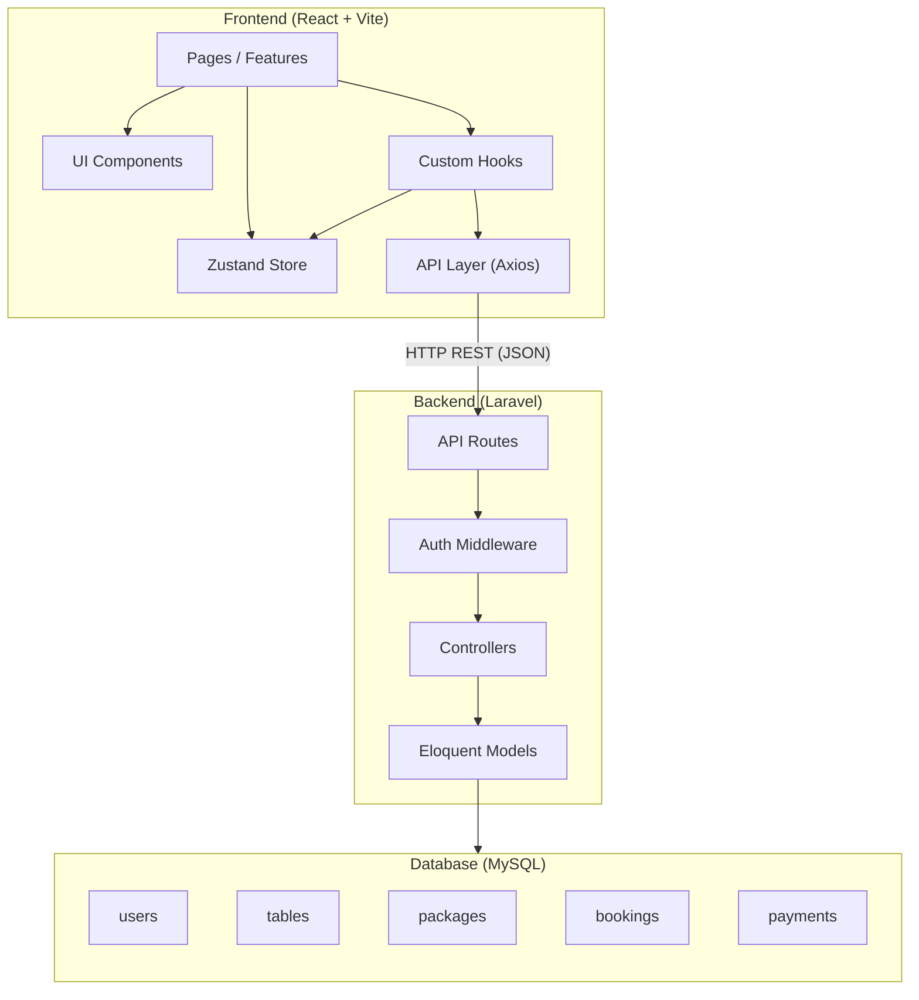

### 12.2 Component Hierarchy (Pohon Komponen)

```mermaid
graph TD
    App["App.jsx"]
    App --> AppRoutes["AppRoutes"]

    AppRoutes --> PublicLayout["PublicLayout"]
    AppRoutes --> CustomerLayout["CustomerLayout"]
    AppRoutes --> AdminLayout["AdminLayout"]

    PublicLayout --> Navbar["Navbar"]
    PublicLayout --> Footer["Footer"]
    PublicLayout --> LandingPage["LandingPage"]
    PublicLayout --> LoginPage["LoginPage"]
    PublicLayout --> RegisterPage["RegisterPage"]

    CustomerLayout --> NavbarAuth["Navbar (Auth)"]
    CustomerLayout --> FooterC["Footer"]
    CustomerLayout --> BookingPage["BookingPage"]
    CustomerLayout --> CheckoutPage["CheckoutPage"]
    CustomerLayout --> SuccessPage["BookingSuccessPage"]
    CustomerLayout --> MyBookingsPage["MyBookingsPage"]
    CustomerLayout --> BookingDetailPage["BookingDetailPage"]
    CustomerLayout --> ProfilePage["ProfilePage"]

    AdminLayout --> Sidebar["Sidebar"]
    AdminLayout --> AdminNavbar["AdminNavbar"]
    AdminLayout --> DashboardPage["DashboardPage"]
    AdminLayout --> ManageTablesPage["ManageTablesPage"]
    AdminLayout --> ManagePackagesPage["ManagePackagesPage"]
    AdminLayout --> TransactionsPage["TransactionsPage"]

    BookingPage --> TableCard["TableCard"]
    BookingPage --> TimeSlotPicker["TimeSlotPicker"]
    BookingPage --> PackageSelector["PackageSelector"]
    CheckoutPage --> BookingSummary["BookingSummary"]
    SuccessPage --> BookingTicket["BookingTicket"]

    DashboardPage --> StatCard["StatCard"]
    DashboardPage --> RevenueChart["RevenueChart"]
    DashboardPage --> BookingTableList["BookingTableList"]
    ManageTablesPage --> TableForm["TableForm"]
    TransactionsPage --> TransactionRow["TransactionRow"]
```

### 12.3 User Flow — Pelanggan (Customer Journey)

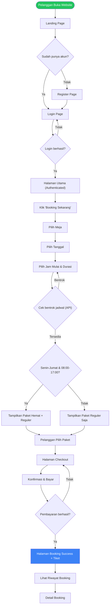

### 12.4 User Flow — Admin

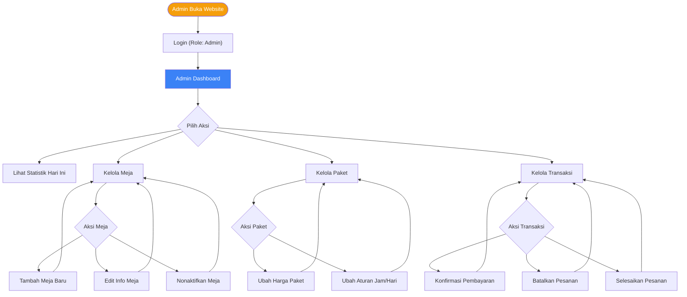

### 12.5 Booking Flow — Sequence Diagram (Frontend ↔ Backend)

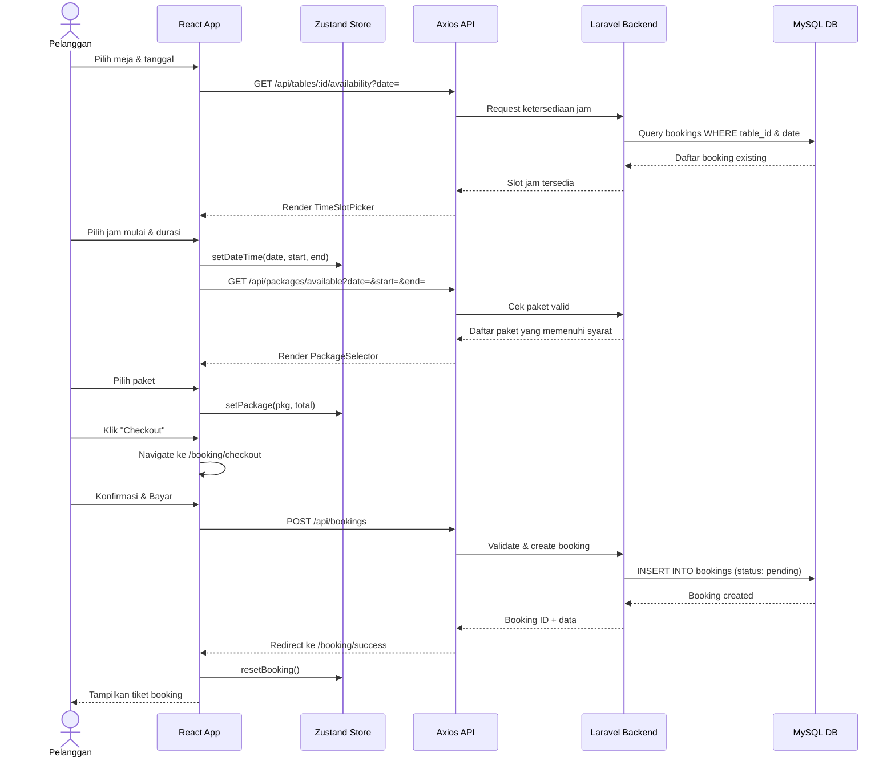

### 12.6 Route Guard — Flowchart Otorisasi

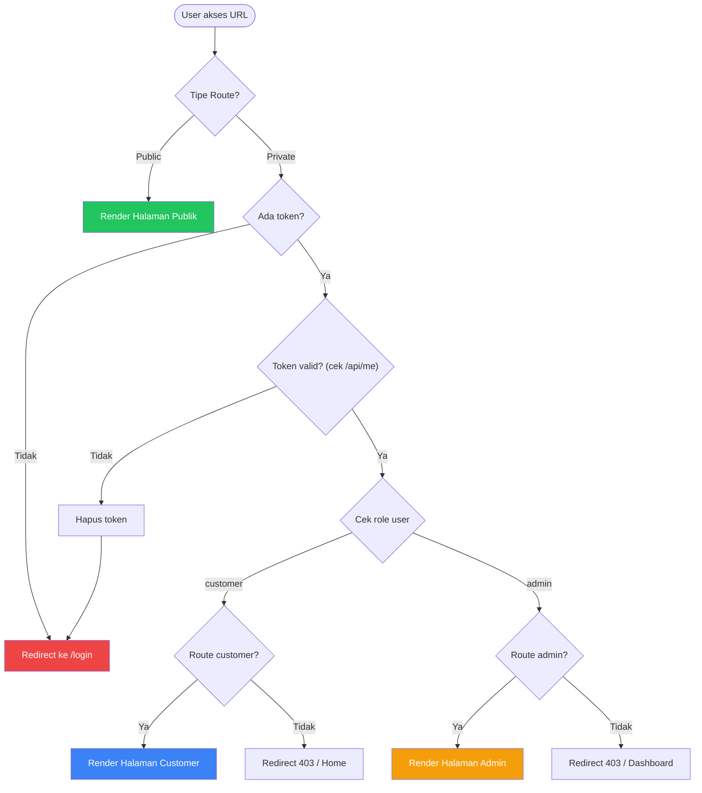

### 12.7 State Management — Data Flow

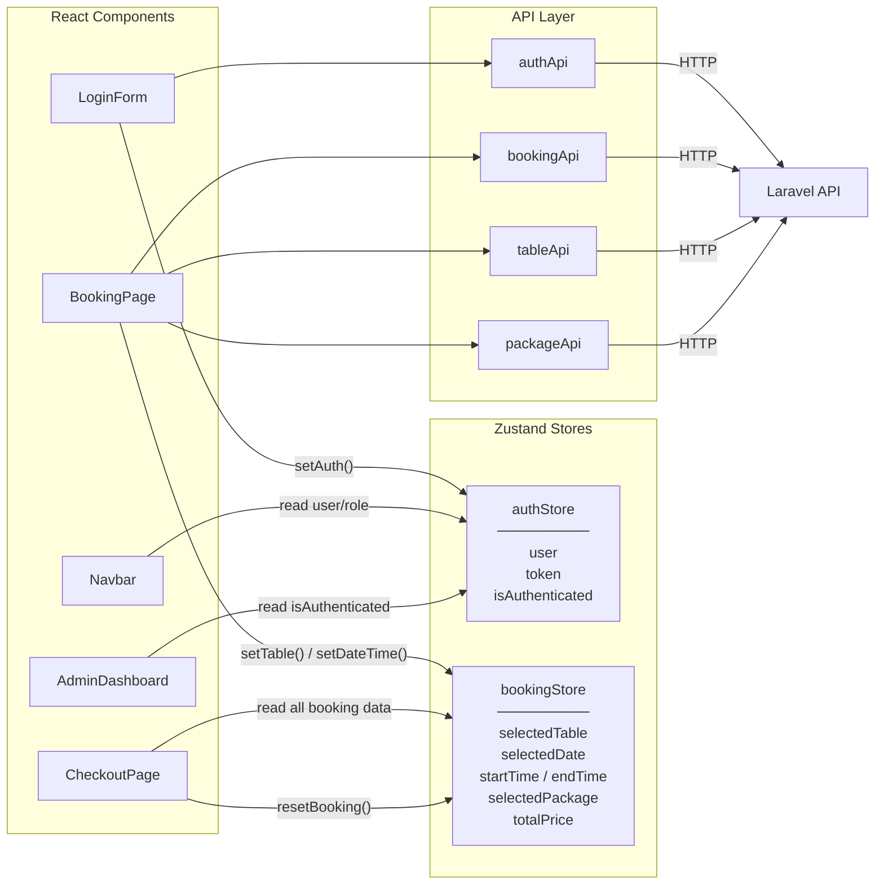

### 12.8 Database Entity Relationship Diagram

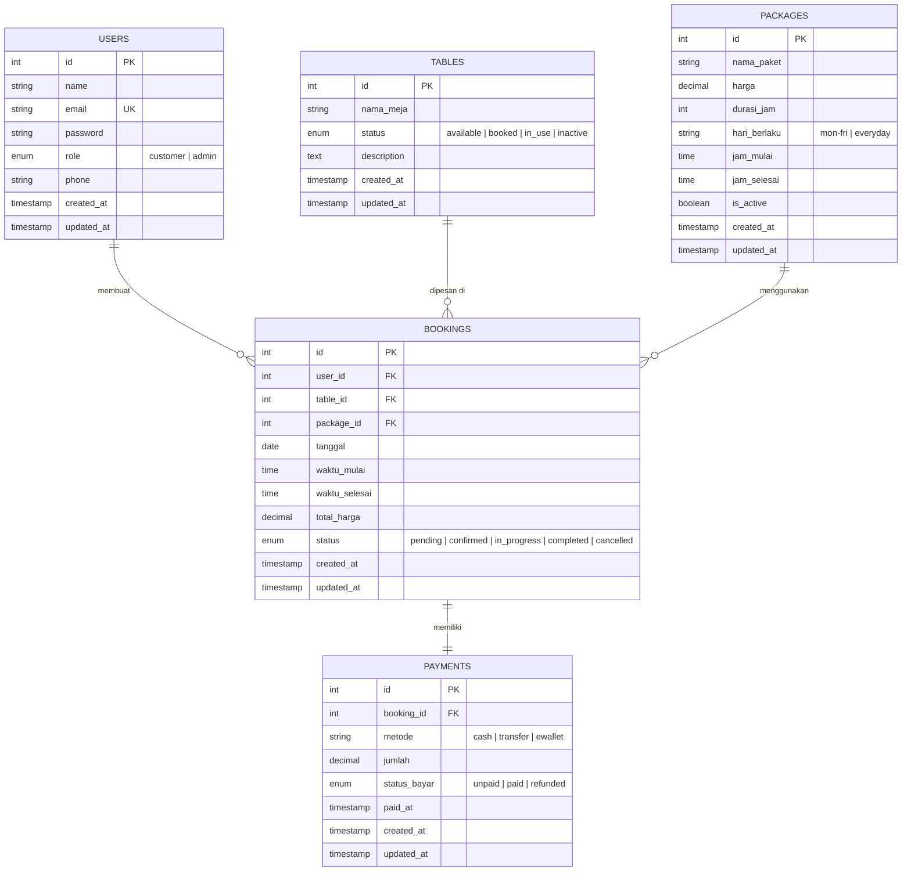

### 12.9 Booking Status — State Machine

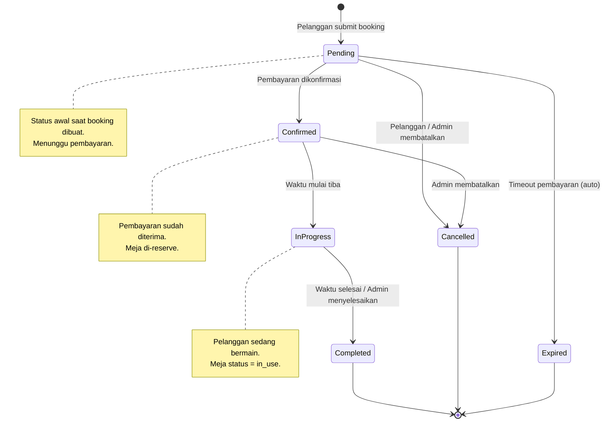

### 12.10 Logika Pemilihan Paket — Decision Tree

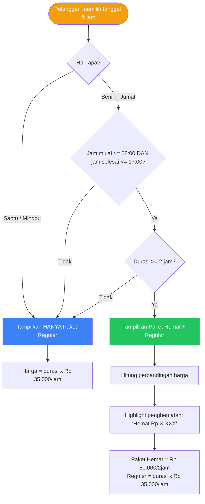

### 12.11 Gantt — Timeline Implementasi

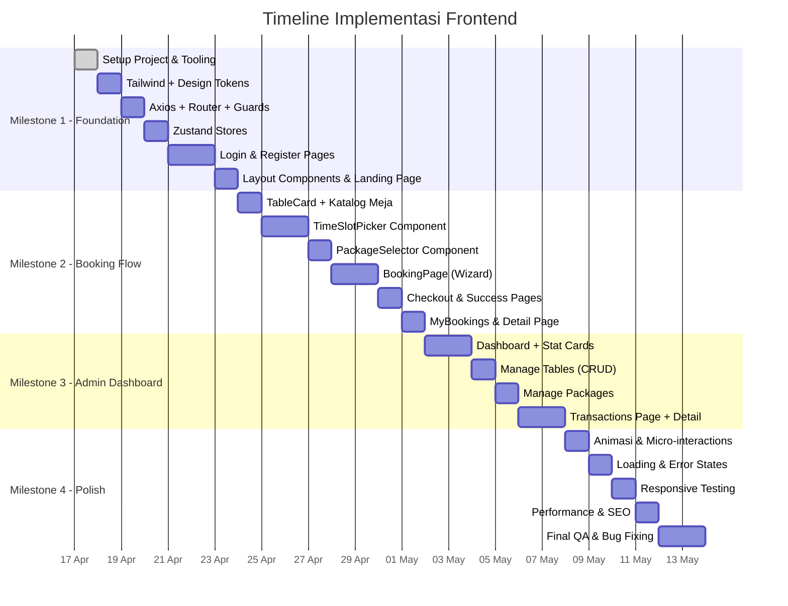

---

## 13. ASCII Wireframes

### 13.1 Landing Page

```
┌─────────────────────────────────────────────────────────────────────────────┐
│  ┌─ NAVBAR ───────────────────────────────────────────────────────────┐    │
│  │  🎱 Billiard Booking          Beranda   Tentang    [Login] [Daftar]│    │
│  └────────────────────────────────────────────────────────────────────┘    │
│                                                                           │
│  ┌─ HERO SECTION ─────────────────────────────────────────────────────┐   │
│  │                                                                     │   │
│  │         Booking Meja Billiard                                       │   │
│  │         Jadi Lebih Mudah!                                           │   │
│  │                                                                     │   │
│  │         Pesan meja favoritmu secara online.                         │   │
│  │         Tanpa antri, tanpa ribet.                                   │   │
│  │                                                                     │   │
│  │         ┌──────────────────────┐  ┌──────────────────────┐         │   │
│  │         │  🎯 Booking Sekarang │  │  📖 Lihat Paket      │         │   │
│  │         └──────────────────────┘  └──────────────────────┘         │   │
│  │                                                                     │   │
│  └─────────────────────────────────────────────────────────────────────┘   │
│                                                                           │
│  ┌─ KEUNGGULAN ───────────────────────────────────────────────────────┐   │
│  │                                                                     │   │
│  │  ┌──────────────┐  ┌──────────────┐  ┌──────────────┐              │   │
│  │  │  ⚡ Cepat     │  │  💰 Hemat   │  │  📱 Online   │              │   │
│  │  │              │  │              │  │              │              │   │
│  │  │  Booking     │  │  Paket hemat │  │  Akses dari  │              │   │
│  │  │  hanya 1     │  │  mulai dari  │  │  mana saja   │              │   │
│  │  │  menit!      │  │  Rp 50.000   │  │  kapan saja  │              │   │
│  │  └──────────────┘  └──────────────┘  └──────────────┘              │   │
│  │                                                                     │   │
│  └─────────────────────────────────────────────────────────────────────┘   │
│                                                                           │
│  ┌─ INFO PAKET ───────────────────────────────────────────────────────┐   │
│  │                                                                     │   │
│  │  ┌─ Paket Reguler ──────────┐  ┌─ Paket Hemat ──────────────┐    │   │
│  │  │                          │  │  ⭐ BEST VALUE              │    │   │
│  │  │  Rp 35.000 /jam          │  │                              │    │   │
│  │  │                          │  │  Rp 50.000 /2jam             │    │   │
│  │  │  ✓ Setiap hari           │  │                              │    │   │
│  │  │  ✓ Jam operasional penuh │  │  ✓ Senin - Jumat            │    │   │
│  │  │  ✓ Durasi fleksibel      │  │  ✓ Pukul 08:00 - 17:00     │    │   │
│  │  │                          │  │  ✓ Hemat hingga 30%!        │    │   │
│  │  │  [Pilih Reguler]         │  │                              │    │   │
│  │  │                          │  │  [Pilih Hemat]               │    │   │
│  │  └──────────────────────────┘  └──────────────────────────────┘    │   │
│  │                                                                     │   │
│  └─────────────────────────────────────────────────────────────────────┘   │
│                                                                           │
│  ┌─ FOOTER ───────────────────────────────────────────────────────────┐   │
│  │  🎱 Billiard Booking    │  Navigasi     │  Kontak                   │   │
│  │  © 2026                 │  Beranda      │  📧 info@billiard.com     │   │
│  │                         │  Booking      │  📞 +62 812-xxxx-xxxx    │   │
│  │                         │  Tentang      │  📍 Jl. Contoh No. 123   │   │
│  └─────────────────────────────────────────────────────────────────────┘   │
└─────────────────────────────────────────────────────────────────────────────┘
```

### 13.2 Login Page

```
┌─────────────────────────────────────────────────────────────────────────────┐
│  ┌─ NAVBAR ───────────────────────────────────────────────────────────┐    │
│  │  🎱 Billiard Booking          Beranda   Tentang    [Login] [Daftar]│    │
│  └────────────────────────────────────────────────────────────────────┘    │
│                                                                           │
│                     ┌──────────────────────────────────┐                  │
│                     │                                  │                  │
│                     │        🔐 Masuk                  │                  │
│                     │                                  │                  │
│                     │  Email                           │                  │
│                     │  ┌────────────────────────────┐  │                  │
│                     │  │ email@contoh.com           │  │                  │
│                     │  └────────────────────────────┘  │                  │
│                     │                                  │                  │
│                     │  Password                        │                  │
│                     │  ┌────────────────────────────┐  │                  │
│                     │  │ ••••••••            👁     │  │                  │
│                     │  └────────────────────────────┘  │                  │
│                     │                                  │                  │
│                     │  ☐ Ingat saya     Lupa password? │                  │
│                     │                                  │                  │
│                     │  ┌────────────────────────────┐  │                  │
│                     │  │       🔵 MASUK             │  │                  │
│                     │  └────────────────────────────┘  │                  │
│                     │                                  │                  │
│                     │  ─────── atau ────────           │                  │
│                     │                                  │                  │
│                     │  ┌────────────────────────────┐  │                  │
│                     │  │  📱 Login via WhatsApp     │  │                  │
│                     │  └────────────────────────────┘  │                  │
│                     │                                  │                  │
│                     │  Belum punya akun? Daftar        │                  │
│                     │                                  │                  │
│                     └──────────────────────────────────┘                  │
│                                                                           │
└─────────────────────────────────────────────────────────────────────────────┘
```

### 13.3 Register Page

```
┌─────────────────────────────────────────────────────────────────────────────┐
│  ┌─ NAVBAR ───────────────────────────────────────────────────────────┐    │
│  │  🎱 Billiard Booking          Beranda   Tentang    [Login] [Daftar]│    │
│  └────────────────────────────────────────────────────────────────────┘    │
│                                                                           │
│                     ┌──────────────────────────────────┐                  │
│                     │                                  │                  │
│                     │        📝 Daftar Akun            │                  │
│                     │                                  │                  │
│                     │  Nama Lengkap                    │                  │
│                     │  ┌────────────────────────────┐  │                  │
│                     │  │ John Doe                   │  │                  │
│                     │  └────────────────────────────┘  │                  │
│                     │                                  │                  │
│                     │  Email                           │                  │
│                     │  ┌────────────────────────────┐  │                  │
│                     │  │ email@contoh.com           │  │                  │
│                     │  └────────────────────────────┘  │                  │
│                     │                                  │                  │
│                     │  No. WhatsApp                    │                  │
│                     │  ┌────────────────────────────┐  │                  │
│                     │  │ +62 812-xxxx-xxxx          │  │                  │
│                     │  └────────────────────────────┘  │                  │
│                     │                                  │                  │
│                     │  Password                        │                  │
│                     │  ┌────────────────────────────┐  │                  │
│                     │  │ ••••••••            👁     │  │                  │
│                     │  └────────────────────────────┘  │                  │
│                     │                                  │                  │
│                     │  Konfirmasi Password             │                  │
│                     │  ┌────────────────────────────┐  │                  │
│                     │  │ ••••••••            👁     │  │                  │
│                     │  └────────────────────────────┘  │                  │
│                     │                                  │                  │
│                     │  ┌────────────────────────────┐  │                  │
│                     │  │      🔵 DAFTAR             │  │                  │
│                     │  └────────────────────────────┘  │                  │
│                     │                                  │                  │
│                     │  Sudah punya akun? Masuk         │                  │
│                     │                                  │                  │
│                     └──────────────────────────────────┘                  │
│                                                                           │
└─────────────────────────────────────────────────────────────────────────────┘
```

### 13.4 Booking Page (Wizard 3 Step)

```
┌─────────────────────────────────────────────────────────────────────────────┐
│  ┌─ NAVBAR (Auth) ────────────────────────────────────────────────────┐   │
│  │  🎱 Billiard Booking    Booking  Riwayat  Profil     [Hi, John ▾] │   │
│  └────────────────────────────────────────────────────────────────────┘   │
│                                                                           │
│  ┌─ PROGRESS STEPPER ────────────────────────────────────────────────┐   │
│  │      ①  Pilih Meja  ───────  ②  Pilih Waktu  ───────  ③ Paket   │   │
│  │      (aktif/done)            (next)                    (locked)   │   │
│  └────────────────────────────────────────────────────────────────────┘   │
│                                                                           │
│  ┌─ STEP 1: PILIH MEJA ──────────────────────────────────────────────┐   │
│  │                                                                    │   │
│  │  Pilih meja yang tersedia:                                        │   │
│  │                                                                    │   │
│  │  ┌──────────┐  ┌──────────┐  ┌──────────┐  ┌──────────┐         │   │
│  │  │  🟢      │  │  🟡      │  │  🟢      │  │  🔴      │         │   │
│  │  │ ┌──────┐ │  │ ┌──────┐ │  │ ┌──────┐ │  │ ┌──────┐ │         │   │
│  │  │ │ 🎱   │ │  │ │ 🎱   │ │  │ │ 🎱   │ │  │ │ 🎱   │ │         │   │
│  │  │ └──────┘ │  │ └──────┘ │  │ └──────┘ │  │ └──────┘ │         │   │
│  │  │ Meja 1   │  │ Meja 2   │  │ Meja 3   │  │ Meja 4   │         │   │
│  │  │ Tersedia │  │ Dibooking│  │ Tersedia │  │ Dipakai  │         │   │
│  │  │ [PILIH]  │  │ [-----] │  │ [PILIH]  │  │ [-----]  │         │   │
│  │  └──────────┘  └──────────┘  └──────────┘  └──────────┘         │   │
│  │                                                                    │   │
│  │  ┌──────────┐  ┌──────────┐                                      │   │
│  │  │  ⚫      │  │  🟢      │                                      │   │
│  │  │ ┌──────┐ │  │ ┌──────┐ │                                      │   │
│  │  │ │ 🎱   │ │  │ │ 🎱   │ │                                      │   │
│  │  │ └──────┘ │  │ └──────┘ │                                      │   │
│  │  │ Meja 5   │  │ Meja 6   │                                      │   │
│  │  │ Nonaktif │  │ Tersedia │                                      │   │
│  │  │ [-----]  │  │ [PILIH]  │                                      │   │
│  │  └──────────┘  └──────────┘                                      │   │
│  │                                                                    │   │
│  └────────────────────────────────────────────────────────────────────┘   │
│                                                                           │
│  ┌─ STEP 2: PILIH WAKTU (setelah meja dipilih) ─────────────────────┐   │
│  │                                                                    │   │
│  │  📅 Tanggal:  ┌─────────────────────┐                             │   │
│  │               │ 📅  20 April 2026   │                             │   │
│  │               └─────────────────────┘                             │   │
│  │                                                                    │   │
│  │  ⏰ Pilih Jam Mulai & Durasi:                                     │   │
│  │                                                                    │   │
│  │  ┌──────┐ ┌──────┐ ┌──────┐ ┌──────┐ ┌──────┐ ┌──────┐         │   │
│  │  │08:00 │ │09:00 │ │10:00 │ │11:00 │ │12:00 │ │13:00 │         │   │
│  │  │ ░░░░ │ │ ████ │ │ ████ │ │      │ │      │ │ ░░░░ │         │   │
│  │  └──────┘ └──────┘ └──────┘ └──────┘ └──────┘ └──────┘         │   │
│  │  ┌──────┐ ┌──────┐ ┌──────┐ ┌──────┐ ┌──────┐ ┌──────┐         │   │
│  │  │14:00 │ │15:00 │ │16:00 │ │17:00 │ │18:00 │ │19:00 │         │   │
│  │  │      │ │      │ │      │ │      │ │ ░░░░ │ │      │         │   │
│  │  └──────┘ └──────┘ └──────┘ └──────┘ └──────┘ └──────┘         │   │
│  │  ┌──────┐ ┌──────┐ ┌──────┐ ┌──────┐ ┌──────┐                   │   │
│  │  │20:00 │ │21:00 │ │22:00 │ │23:00 │ │      │                   │   │
│  │  │      │ │      │ │      │ │ ░░░░ │ │      │                   │   │
│  │  └──────┘ └──────┘ └──────┘ └──────┘ └──────┘                   │   │
│  │                                                                    │   │
│  │  Keterangan:  ████ = Sudah dipesan   ░░░░ = Dipilih               │   │
│  │               [  ] = Tersedia                                      │   │
│  │                                                                    │   │
│  │  Durasi:  ┌──────────────┐                                        │   │
│  │           │  2 jam    ▾  │                                        │   │
│  │           └──────────────┘                                        │   │
│  │                                                                    │   │
│  └────────────────────────────────────────────────────────────────────┘   │
│                                                                           │
│  ┌─ STEP 3: PILIH PAKET (setelah waktu dipilih) ────────────────────┐   │
│  │                                                                    │   │
│  │  ┌─ Paket Reguler ──────────┐  ┌─ Paket Hemat ──────────────┐   │   │
│  │  │                          │  │  ⭐ REKOMENDASI             │   │   │
│  │  │  Rp 35.000 /jam          │  │                              │   │   │
│  │  │  2 jam = Rp 70.000       │  │  Rp 50.000 /2jam            │   │   │
│  │  │                          │  │  Hemat Rp 20.000!           │   │   │
│  │  │  ○ Pilih                 │  │                              │   │   │
│  │  │                          │  │  ● Pilih (selected)          │   │   │
│  │  └──────────────────────────┘  └──────────────────────────────┘   │   │
│  │                  *Paket Hemat tampil jika syarat terpenuhi        │   │
│  │                                                                    │   │
│  │                          ┌──────────────────┐                     │   │
│  │                          │  Lanjut Checkout →│                     │   │
│  │                          └──────────────────┘                     │   │
│  └────────────────────────────────────────────────────────────────────┘   │
│                                                                           │
└─────────────────────────────────────────────────────────────────────────────┘
```

### 13.5 Checkout Page

```
┌─────────────────────────────────────────────────────────────────────────────┐
│  ┌─ NAVBAR (Auth) ────────────────────────────────────────────────────┐   │
│  │  🎱 Billiard Booking    Booking  Riwayat  Profil     [Hi, John ▾] │   │
│  └────────────────────────────────────────────────────────────────────┘   │
│                                                                           │
│         ← Kembali ke Booking                                             │
│                                                                           │
│  ┌─ RINGKASAN PESANAN ───────────────────────────────────────────────┐   │
│  │                                                                    │   │
│  │  📋 Ringkasan Booking                                             │   │
│  │  ──────────────────────────────────────────────────────────        │   │
│  │                                                                    │   │
│  │  Meja          : Meja 1                                           │   │
│  │  Tanggal       : Minggu, 20 April 2026                            │   │
│  │  Jam           : 08:00 - 10:00 (2 jam)                            │   │
│  │  Paket         : Paket Hemat                                      │   │
│  │  ──────────────────────────────────────────────────────────        │   │
│  │  Total         : Rp 50.000                                        │   │
│  │                                                                    │   │
│  └────────────────────────────────────────────────────────────────────┘   │
│                                                                           │
│  ┌─ METODE PEMBAYARAN ───────────────────────────────────────────────┐   │
│  │                                                                    │   │
│  │  Pilih metode pembayaran:                                         │   │
│  │                                                                    │   │
│  │  ┌──────────────────────────────────────────────┐                 │   │
│  │  │  ● 💵 Bayar di Kasir (Cash)                  │                 │   │
│  │  └──────────────────────────────────────────────┘                 │   │
│  │  ┌──────────────────────────────────────────────┐                 │   │
│  │  │  ○ 🏦 Transfer Bank                          │                 │   │
│  │  └──────────────────────────────────────────────┘                 │   │
│  │  ┌──────────────────────────────────────────────┐                 │   │
│  │  │  ○ 📱 E-Wallet (GoPay / OVO / Dana)          │                 │   │
│  │  └──────────────────────────────────────────────┘                 │   │
│  │                                                                    │   │
│  │  ┌──────────────────────────────────────────────┐                 │   │
│  │  │         🔵 KONFIRMASI BOOKING                │                 │   │
│  │  └──────────────────────────────────────────────┘                 │   │
│  │                                                                    │   │
│  └────────────────────────────────────────────────────────────────────┘   │
│                                                                           │
└─────────────────────────────────────────────────────────────────────────────┘
```

### 13.6 Booking Success Page (Tiket Digital)

```
┌─────────────────────────────────────────────────────────────────────────────┐
│  ┌─ NAVBAR (Auth) ────────────────────────────────────────────────────┐   │
│  │  🎱 Billiard Booking    Booking  Riwayat  Profil     [Hi, John ▾] │   │
│  └────────────────────────────────────────────────────────────────────┘   │
│                                                                           │
│                        ✅ Booking Berhasil!                               │
│                                                                           │
│              ┌────────────────────────────────────────┐                   │
│              │  ┌──────────────────────────────────┐  │                   │
│              │  │        🎱 TIKET BOOKING          │  │                   │
│              │  │        #BK-20260420-001          │  │                   │
│              │  └──────────────────────────────────┘  │                   │
│              │                                        │                   │
│              │  Nama        : John Doe                │                   │
│              │  Meja        : Meja 1                  │                   │
│              │  Tanggal     : 20 April 2026           │                   │
│              │  Waktu       : 08:00 - 10:00           │                   │
│              │  Durasi      : 2 jam                   │                   │
│              │  Paket       : Paket Hemat             │                   │
│              │                                        │                   │
│              │  - - - - - - - - - - - - - - - - - -   │                   │
│              │                                        │                   │
│              │  Total       : Rp 50.000               │                   │
│              │  Pembayaran  : Bayar di Kasir          │                   │
│              │  Status      : 🟡 Pending              │                   │
│              │                                        │                   │
│              │  ┌──────────────────────────────────┐  │                   │
│              │  │         ▓▓▓▓▓▓▓▓▓▓▓▓▓▓           │  │                   │
│              │  │         ▓▓ QR CODE  ▓▓           │  │                   │
│              │  │         ▓▓▓▓▓▓▓▓▓▓▓▓▓▓           │  │                   │
│              │  └──────────────────────────────────┘  │                   │
│              └────────────────────────────────────────┘                   │
│                                                                           │
│         ┌──────────────────┐  ┌──────────────────────┐                   │
│         │  📋 Lihat Riwayat│  │  🎱 Booking Lagi     │                   │
│         └──────────────────┘  └──────────────────────┘                   │
│                                                                           │
└─────────────────────────────────────────────────────────────────────────────┘
```

### 13.7 My Bookings Page (Riwayat Booking)

```
┌─────────────────────────────────────────────────────────────────────────────┐
│  ┌─ NAVBAR (Auth) ────────────────────────────────────────────────────┐   │
│  │  🎱 Billiard Booking    Booking  Riwayat  Profil     [Hi, John ▾] │   │
│  └────────────────────────────────────────────────────────────────────┘   │
│                                                                           │
│  📋 Riwayat Booking Saya                                                 │
│                                                                           │
│  Tab: [ Aktif (2) ] [ Selesai ] [ Dibatalkan ]                           │
│                                                                           │
│  ┌─ BOOKING CARD ─────────────────────────────────────────────────────┐  │
│  │                                                                     │  │
│  │  #BK-20260420-001                              🟡 Pending          │  │
│  │  ─────────────────────────────────────────────────────              │  │
│  │  🎱 Meja 1  │  📅 20 Apr 2026  │  ⏰ 08:00-10:00  │  💰 Rp50.000 │  │
│  │  Paket: Hemat                                                       │  │
│  │                                                                     │  │
│  │                         [Lihat Detail]  [Batalkan]                  │  │
│  └─────────────────────────────────────────────────────────────────────┘  │
│                                                                           │
│  ┌─ BOOKING CARD ─────────────────────────────────────────────────────┐  │
│  │                                                                     │  │
│  │  #BK-20260418-003                              🟢 Confirmed       │  │
│  │  ─────────────────────────────────────────────────────              │  │
│  │  🎱 Meja 3  │  📅 22 Apr 2026  │  ⏰ 19:00-21:00  │  💰 Rp70.000 │  │
│  │  Paket: Reguler                                                     │  │
│  │                                                                     │  │
│  │                         [Lihat Detail]                              │  │
│  └─────────────────────────────────────────────────────────────────────┘  │
│                                                                           │
│  ────────── Tidak ada booking lagi ──────────                            │
│                                                                           │
└─────────────────────────────────────────────────────────────────────────────┘
```

### 13.8 Admin Dashboard

```
┌─────────────────────────────────────────────────────────────────────────────┐
│ ┌─ SIDEBAR ─────┐  ┌─ ADMIN NAVBAR ─────────────────────────────────────┐│
│ │                │  │  📊 Dashboard                    🔔 (3) [Admin ▾] ││
│ │  🎱 ADMIN     │  └────────────────────────────────────────────────────┘│
│ │                │                                                       │
│ │  📊 Dashboard  │  ┌─ STAT CARDS ───────────────────────────────────┐   │
│ │  🎱 Meja      │  │                                                 │   │
│ │  📦 Paket     │  │  ┌───────────┐ ┌───────────┐ ┌───────────┐    │   │
│ │  📋 Transaksi │  │  │ 🎱 Meja   │ │ 📋 Booking│ │ 💰 Revenue│    │   │
│ │                │  │  │ Terpakai  │ │ Hari Ini  │ │ Hari Ini  │    │   │
│ │  ─────────     │  │  │           │ │           │ │           │    │   │
│ │  🚪 Logout    │  │  │   3 / 6   │ │    12     │ │ Rp 850K   │    │   │
│ │                │  │  │  ▲ 50%    │ │  ▲ 20%    │ │  ▲ 15%    │    │   │
│ │                │  │  └───────────┘ └───────────┘ └───────────┘    │   │
│ │                │  │                                                 │   │
│ │                │  └─────────────────────────────────────────────────┘   │
│ │                │                                                       │
│ │                │  ┌─ STATUS MEJA HARI INI ──────────────────────────┐  │
│ │                │  │                                                  │  │
│ │                │  │  ┌───┐  ┌───┐  ┌───┐  ┌───┐  ┌───┐  ┌───┐    │  │
│ │                │  │  │ 1 │  │ 2 │  │ 3 │  │ 4 │  │ 5 │  │ 6 │    │  │
│ │                │  │  │ 🟢│  │ 🔴│  │ 🟡│  │ 🟢│  │ ⚫│  │ 🔴│    │  │
│ │                │  │  └───┘  └───┘  └───┘  └───┘  └───┘  └───┘    │  │
│ │                │  │                                                  │  │
│ │                │  └──────────────────────────────────────────────────┘  │
│ │                │                                                       │
│ │                │  ┌─ BOOKING TERBARU ───────────────────────────────┐  │
│ │                │  │                                                  │  │
│ │                │  │  ID        Pelanggan   Meja   Waktu     Status  │  │
│ │                │  │  ──────────────────────────────────────────────  │  │
│ │                │  │  #001      John Doe    Meja1  08-10    🟡 Pend │  │
│ │                │  │  #002      Jane Doe    Meja2  10-12    🟢 Conf │  │
│ │                │  │  #003      Bob Smith   Meja6  13-15    🔴 InUse│  │
│ │                │  │  #004      Alice W.    Meja3  15-17    🟡 Pend │  │
│ │                │  │                                                  │  │
│ │                │  │               [Lihat Semua Transaksi →]          │  │
│ │                │  └──────────────────────────────────────────────────┘  │
│ │                │                                                       │
│ └────────────────┘                                                       │
└─────────────────────────────────────────────────────────────────────────────┘
```

### 13.9 Manage Tables Page (Admin CRUD Meja)

```
┌─────────────────────────────────────────────────────────────────────────────┐
│ ┌─ SIDEBAR ─────┐  ┌─ ADMIN NAVBAR ─────────────────────────────────────┐│
│ │                │  │  🎱 Manajemen Meja                🔔 (3) [Admin ▾]││
│ │  🎱 ADMIN     │  └────────────────────────────────────────────────────┘│
│ │                │                                                       │
│ │  📊 Dashboard  │  ┌─ HEADER ────────────────────────────────────────┐  │
│ │  🎱 Meja  ◀   │  │  🎱 Daftar Meja Billiard     [+ Tambah Meja]   │  │
│ │  📦 Paket     │  └─────────────────────────────────────────────────┘  │
│ │  📋 Transaksi │                                                       │
│ │                │  ┌─ TABLE ─────────────────────────────────────────┐  │
│ │                │  │                                                  │  │
│ │                │  │  No   Nama Meja    Status      Aksi             │  │
│ │                │  │  ─────────────────────────────────────────────   │  │
│ │                │  │  1    Meja 1       🟢 Aktif    [✏️] [🗑️]       │  │
│ │                │  │  2    Meja 2       🟢 Aktif    [✏️] [🗑️]       │  │
│ │                │  │  3    Meja 3       🟢 Aktif    [✏️] [🗑️]       │  │
│ │                │  │  4    Meja 4       🟢 Aktif    [✏️] [🗑️]       │  │
│ │                │  │  5    Meja 5       ⚫ Nonaktif [✏️] [🗑️]       │  │
│ │                │  │  6    Meja 6       🟢 Aktif    [✏️] [🗑️]       │  │
│ │                │  │                                                  │  │
│ │                │  └──────────────────────────────────────────────────┘  │
│ │                │                                                       │
│ │                │  ┌─ MODAL: TAMBAH/EDIT MEJA (if open) ────────────┐  │
│ │                │  │  ┌──────────────────────────────────────────┐   │  │
│ │                │  │  │                                          │   │  │
│ │                │  │  │  ✏️  Tambah Meja Baru                   │   │  │
│ │                │  │  │                                          │   │  │
│ │                │  │  │  Nama Meja                               │   │  │
│ │                │  │  │  ┌──────────────────────────────┐        │   │  │
│ │                │  │  │  │ Meja 7                       │        │   │  │
│ │                │  │  │  └──────────────────────────────┘        │   │  │
│ │                │  │  │                                          │   │  │
│ │                │  │  │  Deskripsi                               │   │  │
│ │                │  │  │  ┌──────────────────────────────┐        │   │  │
│ │                │  │  │  │ Meja premium, dekat jendela  │        │   │  │
│ │                │  │  │  └──────────────────────────────┘        │   │  │
│ │                │  │  │                                          │   │  │
│ │                │  │  │  Status: ● Aktif  ○ Nonaktif            │   │  │
│ │                │  │  │                                          │   │  │
│ │                │  │  │      [Batal]         [💾 Simpan]        │   │  │
│ │                │  │  │                                          │   │  │
│ │                │  │  └──────────────────────────────────────────┘   │  │
│ │                │  └────────────────────────────────────────────────┘  │
│ └────────────────┘                                                       │
└─────────────────────────────────────────────────────────────────────────────┘
```

### 13.10 Manage Packages Page (Admin Edit Paket)

```
┌─────────────────────────────────────────────────────────────────────────────┐
│ ┌─ SIDEBAR ─────┐  ┌─ ADMIN NAVBAR ─────────────────────────────────────┐│
│ │                │  │  📦 Manajemen Paket               🔔 (3) [Admin ▾]││
│ │  🎱 ADMIN     │  └────────────────────────────────────────────────────┘│
│ │                │                                                       │
│ │  📊 Dashboard  │  ┌─ PAKET REGULER ─────────────────────────────────┐  │
│ │  🎱 Meja      │  │                                                  │  │
│ │  📦 Paket  ◀  │  │  📦 Paket Reguler                  [✏️ Edit]   │  │
│ │  📋 Transaksi │  │  ──────────────────────────────────────────────  │  │
│ │                │  │                                                  │  │
│ │                │  │  Harga       : Rp 35.000 / jam                  │  │
│ │                │  │  Hari        : Setiap hari                      │  │
│ │                │  │  Jam         : Jam operasional penuh            │  │
│ │                │  │  Durasi Min. : 1 jam                            │  │
│ │                │  │  Status      : 🟢 Aktif                        │  │
│ │                │  │                                                  │  │
│ │                │  └──────────────────────────────────────────────────┘  │
│ │                │                                                       │
│ │                │  ┌─ PAKET HEMAT ────────────────────────────────────┐  │
│ │                │  │                                                  │  │
│ │                │  │  📦 Paket Hemat   ⭐               [✏️ Edit]   │  │
│ │                │  │  ──────────────────────────────────────────────  │  │
│ │                │  │                                                  │  │
│ │                │  │  Harga       : Rp 50.000 / 2 jam               │  │
│ │                │  │  Hari        : Senin - Jumat                    │  │
│ │                │  │  Jam         : 08:00 - 17:00                    │  │
│ │                │  │  Durasi      : 2 jam (tetap)                    │  │
│ │                │  │  Status      : 🟢 Aktif                        │  │
│ │                │  │                                                  │  │
│ │                │  └──────────────────────────────────────────────────┘  │
│ │                │                                                       │
│ │                │  ┌─ MODAL: EDIT PAKET (if open) ──────────────────┐  │
│ │                │  │  ┌──────────────────────────────────────────┐   │  │
│ │                │  │  │  ✏️  Edit Paket Hemat                   │   │  │
│ │                │  │  │                                          │   │  │
│ │                │  │  │  Harga (Rp)                              │   │  │
│ │                │  │  │  ┌───────────────────┐                   │   │  │
│ │                │  │  │  │ 50000             │                   │   │  │
│ │                │  │  │  └───────────────────┘                   │   │  │
│ │                │  │  │  Durasi (jam)                            │   │  │
│ │                │  │  │  ┌───────────────────┐                   │   │  │
│ │                │  │  │  │ 2                 │                   │   │  │
│ │                │  │  │  └───────────────────┘                   │   │  │
│ │                │  │  │  Hari: ☑ Sen ☑ Sel ☑ Rab ☑ Kam ☑ Jum   │   │  │
│ │                │  │  │        ☐ Sab ☐ Min                      │   │  │
│ │                │  │  │  Jam Mulai: [08:00]  Jam Selesai: [17:00]│  │  │
│ │                │  │  │                                          │   │  │
│ │                │  │  │      [Batal]         [💾 Simpan]        │   │  │
│ │                │  │  └──────────────────────────────────────────┘   │  │
│ │                │  └────────────────────────────────────────────────┘  │
│ └────────────────┘                                                       │
└─────────────────────────────────────────────────────────────────────────────┘
```

### 13.11 Transactions Page (Admin)

```
┌─────────────────────────────────────────────────────────────────────────────┐
│ ┌─ SIDEBAR ─────┐  ┌─ ADMIN NAVBAR ─────────────────────────────────────┐│
│ │                │  │  📋 Manajemen Transaksi           🔔 (3) [Admin ▾]││
│ │  🎱 ADMIN     │  └────────────────────────────────────────────────────┘│
│ │                │                                                       │
│ │  📊 Dashboard  │  ┌─ FILTER BAR ────────────────────────────────────┐  │
│ │  🎱 Meja      │  │  📅 Tanggal: [Hari ini ▾]   Status: [Semua ▾]  │  │
│ │  📦 Paket     │  │  🔍 Cari: [________________]   [🔍 Filter]     │  │
│ │  📋 Trans. ◀  │  └─────────────────────────────────────────────────┘  │
│ │                │                                                       │
│ │                │  ┌─ TRANSACTIONS TABLE ─────────────────────────────┐ │
│ │                │  │                                                   │ │
│ │                │  │  ID     Pelanggan  Meja  Waktu    Paket   Harga  │ │
│ │                │  │         ─────────────────────────────────────    │ │
│ │                │  │  Status   Bayar    Aksi                          │ │
│ │                │  │  ═══════════════════════════════════════════════  │ │
│ │                │  │                                                   │ │
│ │                │  │  #001   John D.   M1   08-10  Hemat   Rp50K    │ │
│ │                │  │  🟡Pend  💵Cash   [✅ Konfirm] [❌ Batal]       │ │
│ │                │  │  ───────────────────────────────────────────     │ │
│ │                │  │  #002   Jane D.   M2   10-12  Reguler Rp70K    │ │
│ │                │  │  🟢Conf  🏦Trans  [📋 Detail] [✅ Selesai]      │ │
│ │                │  │  ───────────────────────────────────────────     │ │
│ │                │  │  #003   Bob S.    M6   13-15  Reguler Rp70K    │ │
│ │                │  │  🔵InUse 📱EWallet [📋 Detail] [✅ Selesai]     │ │
│ │                │  │  ───────────────────────────────────────────     │ │
│ │                │  │  #004   Alice W.  M3   15-17  Hemat   Rp50K    │ │
│ │                │  │  🟡Pend  💵Cash   [✅ Konfirm] [❌ Batal]       │ │
│ │                │  │                                                   │ │
│ │                │  │  ◀ Prev    Halaman 1 dari 5     Next ▶          │ │
│ │                │  │                                                   │ │
│ │                │  └───────────────────────────────────────────────────┘ │
│ │                │                                                       │
│ └────────────────┘                                                       │
└─────────────────────────────────────────────────────────────────────────────┘
```

### 13.12 Mobile Layout — Bottom Navigation

```
┌───────────────────────────────┐
│  🎱 Billiard Booking    [≡]  │
├───────────────────────────────┤
│                               │
│  Selamat Datang, John! 👋    │
│                               │
│  ┌───────────────────────┐   │
│  │  🎱 Booking Sekarang  │   │
│  └───────────────────────┘   │
│                               │
│  Meja Tersedia Hari Ini:     │
│                               │
│  ┌───────────────────────┐   │
│  │ 🟢 Meja 1 - Tersedia │   │
│  │    [Booking →]        │   │
│  └───────────────────────┘   │
│  ┌───────────────────────┐   │
│  │ 🟡 Meja 2 - Dibooking│   │
│  │    [Tidak tersedia]   │   │
│  └───────────────────────┘   │
│  ┌───────────────────────┐   │
│  │ 🟢 Meja 3 - Tersedia │   │
│  │    [Booking →]        │   │
│  └───────────────────────┘   │
│                               │
│                               │
├───────────────────────────────┤
│  🏠    🎱     📋     👤     │
│ Home  Booking  Riwayat Profil │
└───────────────────────────────┘
```

---

## 14. Diagram Tambahan

### 14.1 Payment Flow — Sequence Diagram

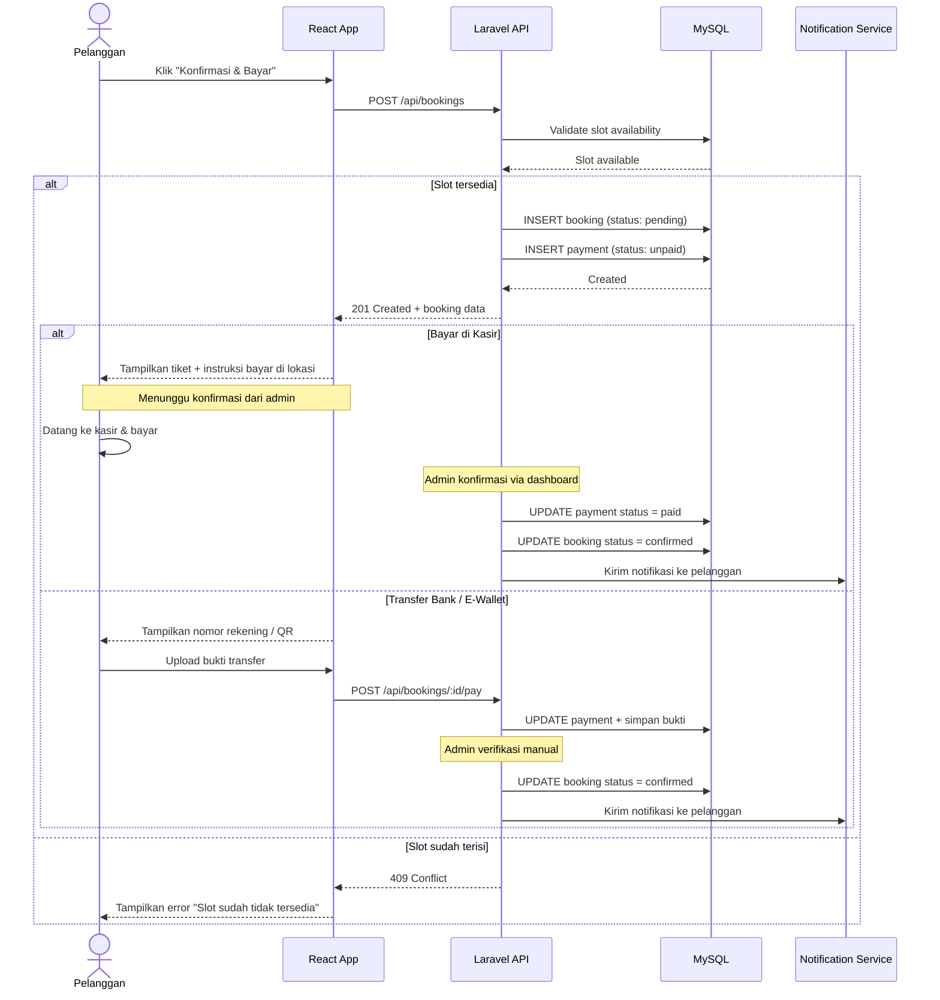

### 14.2 Frontend Architecture — Layer Diagram

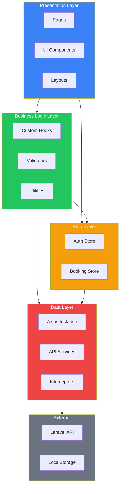

### 14.3 Clash Detection — Logic Flowchart

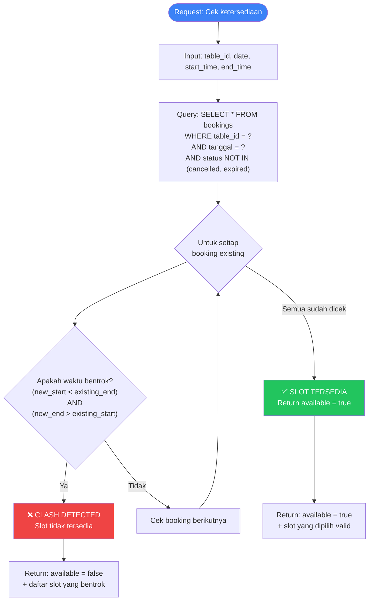

---

> **Catatan Akhir:** Dokumen ini bersifat *living document* — akan diperbarui seiring berkembangnya kebutuhan dan feedback dari tim. Semua business logic kritis (harga, validasi paket, clash detection) tetap harus divalidasi di sisi backend (Laravel) sebagai single source of truth.

tes
