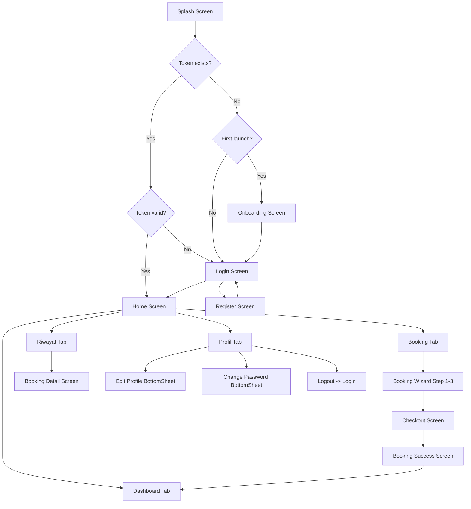

# 📱 Mobile Planning — Vibe Billiard (Flutter)

> Dokumen perencanaan aplikasi mobile **Flutter** untuk sistem booking meja billiard.
> Disusun berdasarkan analisis menyeluruh terhadap frontend (React + Vite + TailwindCSS) dan backend (Laravel 11 + MySQL) yang sudah ada.

---

## 1. Rangkuman Analisis Project Web

### 1.1 Frontend Web (React)

| Aspek | Detail |
|---|---|
| **Framework** | React 18 + Vite |
| **Styling** | TailwindCSS (dark mode, Material Design 3 color tokens) |
| **State Management** | Zustand (authStore, bookingStore) |
| **HTTP Client** | Axios (dengan interceptor token & 401 handler) |
| **Routing** | React Router v6 (3 guard: GuestRoute, PrivateRoute, AdminRoute) |
| **Icons** | Lucide React |
| **Notifikasi** | React Hot Toast |
| **Font** | Inter (Google Fonts) |

#### Halaman yang Tersedia di Web:

| Modul | Halaman | File |
|---|---|---|
| **Public** | Landing Page | `LandingPage.jsx` |
| **Auth** | Login Page | `LoginPage.jsx` |
| **Auth** | Register Page | `RegisterPage.jsx` |
| **Customer** | User Dashboard | `UserDashboard.jsx` |
| **Customer** | Booking Page (3-step wizard) | `BookingPage.jsx` |
| **Customer** | Checkout Page | `CheckoutPage.jsx` |
| **Customer** | Booking Success | `BookingSuccessPage.jsx` |
| **Customer** | My Bookings (riwayat) | `MyBookingsPage.jsx` |
| **Customer** | Profile Page | `ProfilePage.jsx` |
| **Admin** | Dashboard (stats + tabel booking) | `DashboardPage.jsx` |
| **Admin** | Manage Tables (CRUD) | `ManageTablesPage.jsx` |
| **Admin** | Manage Packages (CRUD) | `ManagePackagesPage.jsx` |
| **Admin** | Transactions (payment list) | `TransactionsPage.jsx` |

#### Komponen Reusable:
- `TableCard` — Kartu pilihan meja
- `TimeSlotPicker` — Pemilih tanggal + waktu + durasi
- `PackageSelector` — Pemilih paket (Reguler / Hemat)
- `Navbar` — Navigation bar publik
- `Sidebar` — Sidebar admin
- `UserLayout` — Layout customer (bottom navigation / sidebar)

### 1.2 Backend (Laravel 11)

| Aspek | Detail |
|---|---|
| **Framework** | Laravel 11 |
| **Auth** | Laravel Sanctum (Bearer Token) |
| **Database** | MySQL 8 (dev: SQLite) |
| **Pattern** | Controller → Service → Model → API Resource |
| **Validation** | Form Request classes |
| **Enums** | PHP 8.1 Backed Enums (UserRole, TableStatus, BookingStatus, PaymentStatus) |

#### Database Schema (5 tabel utama):

```
users           → id, name, email, password, role, phone
billiard_tables → id, nama_meja, deskripsi, gambar, status (soft delete)
packages        → id, nama_paket, harga_per_jam, harga_flat, durasi_min_jam, hari_berlaku, jam_mulai, jam_selesai, is_active
bookings        → id, user_id, table_id, package_id, tanggal, waktu_mulai, waktu_selesai, durasi_jam, total_harga, status, catatan
payments        → id, booking_id, metode, jumlah, status_bayar, bukti_transfer, paid_at
```

#### API Endpoints yang Tersedia:

```
AUTH:
  POST   /api/register
  POST   /api/login
  POST   /api/logout
  GET    /api/user
  PUT    /api/user/profile
  PUT    /api/user/password

PUBLIC:
  GET    /api/tables
  GET    /api/tables/{id}
  GET    /api/packages

CUSTOMER (auth required):
  GET    /api/bookings
  POST   /api/bookings
  GET    /api/bookings/{id}
  PATCH  /api/bookings/{id}/cancel
  POST   /api/bookings/{id}/payment

ADMIN (auth + is_admin):
  GET    /api/admin/dashboard/stats
  CRUD   /api/admin/tables
  CRUD   /api/admin/packages
  GET    /api/admin/bookings
  PATCH  /api/admin/bookings/{id}/status
  GET    /api/admin/payments
  PATCH  /api/admin/payments/{id}/status
```

#### Business Logic di Backend:
1. **Konflik Jadwal** — Overlap detection saat booking meja yang sama
2. **Eligibility Paket Hemat** — Hanya Senin–Jumat, 08:00–17:00, min. 2 jam
3. **Perhitungan Harga** — Reguler: per jam × durasi; Hemat: flat + extra × reguler rate
4. **Status Machine** — PENDING → CONFIRMED → IN_PROGRESS → COMPLETED / CANCELLED

### 1.3 Design System Web (untuk dijadikan referensi Flutter)

#### Color Palette (Material Design 3 — Dark Mode):

| Token | Hex | Keterangan |
|---|---|---|
| `background` | `#0B1326` | Background utama (navy very dark) |
| `surface` | `#0B1326` | Surface utama |
| `surface-container-low` | `#131B2E` | Container level rendah |
| `surface-container` | `#171F33` | Container default |
| `surface-container-high` | `#222A3D` | Container level tinggi (cards) |
| `surface-container-highest` | `#2D3449` | Container level tertinggi |
| `primary` | `#ADC6FF` | Warna aksen utama (biru muda) |
| `primary-container` | `#4D8EFF` | Container primary |
| `tertiary` | `#4AE176` | Warna aksen sekunder (hijau neon) |
| `tertiary-container` | `#00A74B` | Container tertiary |
| `secondary` | `#B9C7DF` | Warna sekunder |
| `on-surface` | `#DAE2FD` | Teks di atas surface |
| `on-surface-variant` | `#C2C6D6` | Teks sekunder |
| `outline-variant` | `#424754` | Border/divider |
| `error` | `#FFB4AB` | Warna error |

#### Typography:
- Font utama: **Inter** (weight: 300–900)
- Heading: Extra Bold/Black (tracking tight)
- Body: Regular/Medium
- Label: Bold uppercase, letter-spacing widest

#### Elemen Desain Khas:
- **Glass Morphism** — Panel dengan `backdrop-blur` + transparansi
- **Glow Effect** — Shadow berwarna primary/tertiary
- **Gradient** — Primary to primary-container, tertiary to tertiary-container
- **Status Badge** — Rounded-full, uppercase, tracking-widest, 10px font
- **Card Elevated** — surface-container-high, border outline-variant/10, rounded-2xl
- **Micro-animations** — Float animation, glow pulse, scale on hover/tap

---

## 2. Spesifikasi Aplikasi Mobile Flutter

### 2.1 Overview

| Aspek | Detail |
|---|---|
| **Nama Aplikasi** | Vibe Billiard |
| **Platform** | Android & iOS (cross-platform) |
| **Framework** | Flutter 3.x (Dart) |
| **Minimum SDK** | Android API 24 (Android 7.0) / iOS 14 |
| **Target** | Customer Only (Admin tetap via Web) |
| **Backend** | Menggunakan REST API Laravel yang sudah ada |
| **Bahasa UI** | Bahasa Indonesia |

> **PENTING:**
> Aplikasi mobile **hanya untuk role Customer**. Fitur admin tetap dikelola melalui web dashboard. Ini sesuai best practice mobile-first approach — customer butuh akses cepat, sementara admin memerlukan data table/chart yang lebih baik di desktop.

### 2.2 Fitur Utama (Customer Mobile)

| ID | Fitur | Deskripsi | Prioritas |
|---|---|---|---|
| F-01 | **Onboarding** | Splash screen + onboarding 3 slide | 🟡 Medium |
| F-02 | **Register** | Daftar dengan nama, email, no. HP, password | 🔴 High |
| F-03 | **Login** | Login via email + password | 🔴 High |
| F-04 | **Dashboard** | Ringkasan: greeting, quick actions, booking aktif, statistik, riwayat terakhir | 🔴 High |
| F-05 | **Lihat Meja** | Grid card meja billiard + status (available/booked/in_use) | 🔴 High |
| F-06 | **Booking Wizard** | Step 1: Pilih Meja → Step 2: Pilih Waktu → Step 3: Pilih Paket | 🔴 High |
| F-07 | **Checkout** | Ringkasan pesanan + pilih metode pembayaran + konfirmasi | 🔴 High |
| F-08 | **Booking Success** | Halaman sukses + detail tiket digital | 🔴 High |
| F-09 | **Riwayat Booking** | List semua booking + status badge + batal booking pending | 🔴 High |
| F-10 | **Detail Booking** | Detail lengkap satu booking + info pembayaran | 🟡 Medium |
| F-11 | **Profil** | Lihat & edit profil (nama, HP), ubah password | 🔴 High |
| F-12 | **Logout** | Invalidate token + redirect ke login | 🔴 High |
| F-13 | **Pull-to-Refresh** | Refresh data di semua list view | 🟡 Medium |
| F-14 | **Offline Indicator** | Tampilkan banner saat koneksi terputus | 🟢 Low |
| F-15 | **Secure Storage** | Simpan token di flutter_secure_storage | 🔴 High |

### 2.3 Fitur Non-Fungsional

| ID | Requirement | Detail |
|---|---|---|
| NF-01 | **Performance** | Cold start < 3 detik, API response handling < 500ms |
| NF-02 | **Security** | Token disimpan di secure storage (bukan SharedPreferences), HTTPS |
| NF-03 | **UX** | Loading skeleton/shimmer, error handling dengan SnackBar, smooth transitions |
| NF-04 | **Responsive** | Support layar 5" - 7" (phone), tablet opsional |
| NF-05 | **Accessibility** | Semantic labels pada widget, ukuran tap target minimum 48dp |

---

## 3. App Theme & Design System (Flutter)

### 3.1 ThemeData Configuration

```dart
// lib/core/theme/app_theme.dart

import 'package:flutter/material.dart';
import 'package:google_fonts/google_fonts.dart';

class AppTheme {
  // ─── Color Palette ────────────────────────────────────────
  static const Color background      = Color(0xFF0B1326);
  static const Color surface         = Color(0xFF0B1326);
  static const Color surfaceContLow  = Color(0xFF131B2E);
  static const Color surfaceCont     = Color(0xFF171F33);
  static const Color surfaceContHigh = Color(0xFF222A3D);
  static const Color surfaceContHighest = Color(0xFF2D3449);
  
  static const Color primary          = Color(0xFFADC6FF);
  static const Color primaryContainer = Color(0xFF4D8EFF);
  static const Color onPrimary        = Color(0xFF002E6A);
  static const Color onPrimaryContainer = Color(0xFF00285D);
  
  static const Color tertiary          = Color(0xFF4AE176);
  static const Color tertiaryContainer = Color(0xFF00A74B);
  static const Color onTertiary        = Color(0xFF003915);
  
  static const Color secondary          = Color(0xFFB9C7DF);
  static const Color secondaryContainer = Color(0xFF3C4A5E);
  
  static const Color onSurface        = Color(0xFFDAE2FD);
  static const Color onSurfaceVariant = Color(0xFFC2C6D6);
  static const Color outlineVariant   = Color(0xFF424754);
  static const Color outline          = Color(0xFF8C909F);
  static const Color error            = Color(0xFFFFB4AB);
  static const Color errorContainer   = Color(0xFF93000A);

  // ─── ThemeData ────────────────────────────────────────────
  static ThemeData get darkTheme {
    return ThemeData(
      useMaterial3: true,
      brightness: Brightness.dark,
      scaffoldBackgroundColor: background,
      
      colorScheme: const ColorScheme.dark(
        primary: primary,
        primaryContainer: primaryContainer,
        onPrimary: onPrimary,
        onPrimaryContainer: onPrimaryContainer,
        secondary: secondary,
        secondaryContainer: secondaryContainer,
        tertiary: tertiary,
        tertiaryContainer: tertiaryContainer,
        surface: surface,
        onSurface: onSurface,
        onSurfaceVariant: onSurfaceVariant,
        outline: outline,
        outlineVariant: outlineVariant,
        error: error,
        errorContainer: errorContainer,
      ),
      
      textTheme: GoogleFonts.interTextTheme(
        ThemeData.dark().textTheme,
      ).apply(
        bodyColor: onSurface,
        displayColor: onSurface,
      ),
      
      cardTheme: CardThemeData(
        color: surfaceContHigh,
        shape: RoundedRectangleBorder(
          borderRadius: BorderRadius.circular(16),
          side: BorderSide(color: outlineVariant.withOpacity(0.1)),
        ),
        elevation: 0,
      ),
      
      inputDecorationTheme: InputDecorationTheme(
        filled: true,
        fillColor: surfaceCont,
        border: OutlineInputBorder(
          borderRadius: BorderRadius.circular(12),
          borderSide: BorderSide(color: outlineVariant.withOpacity(0.2)),
        ),
        enabledBorder: OutlineInputBorder(
          borderRadius: BorderRadius.circular(12),
          borderSide: BorderSide(color: outlineVariant.withOpacity(0.2)),
        ),
        focusedBorder: OutlineInputBorder(
          borderRadius: BorderRadius.circular(12),
          borderSide: BorderSide(color: primary.withOpacity(0.5), width: 2),
        ),
        contentPadding: const EdgeInsets.symmetric(horizontal: 16, vertical: 14),
        hintStyle: TextStyle(color: onSurfaceVariant.withOpacity(0.5)),
      ),
      
      elevatedButtonTheme: ElevatedButtonThemeData(
        style: ElevatedButton.styleFrom(
          backgroundColor: primaryContainer,
          foregroundColor: onPrimaryContainer,
          padding: const EdgeInsets.symmetric(horizontal: 32, vertical: 14),
          shape: RoundedRectangleBorder(
            borderRadius: BorderRadius.circular(12),
          ),
          textStyle: GoogleFonts.inter(
            fontWeight: FontWeight.w700,
          ),
        ),
      ),
      
      bottomNavigationBarTheme: const BottomNavigationBarThemeData(
        backgroundColor: surfaceContLow,
        selectedItemColor: primary,
        unselectedItemColor: onSurfaceVariant,
        type: BottomNavigationBarType.fixed,
      ),
      
      appBarTheme: AppBarTheme(
        backgroundColor: background,
        elevation: 0,
        centerTitle: false,
        titleTextStyle: GoogleFonts.inter(
          fontSize: 20,
          fontWeight: FontWeight.w800,
          color: onSurface,
        ),
      ),
    );
  }
}
```

### 3.2 Design Patterns yang Harus Diimplementasi

| Pattern | Implementasi di Flutter |
|---|---|
| **Glass Morphism** | `ClipRRect` + `BackdropFilter(filter: ImageFilter.blur())` + `Container(color: Colors.white.withOpacity(0.05))` |
| **Glow Effect** | `BoxShadow(color: primary.withOpacity(0.3), blurRadius: 20)` |
| **Gradient Primary** | `LinearGradient(colors: [primary, primaryContainer])` |
| **Gradient Tertiary** | `LinearGradient(colors: [tertiary, tertiaryContainer])` |
| **Status Badge** | Custom `StatusBadge` widget — rounded, uppercase, small font |
| **Card Elevated** | `Container` — `surfaceContHigh`, border `outlineVariant.withOpacity(0.1)`, `borderRadius: 16` |
| **Shimmer Loading** | Package `shimmer` untuk loading skeleton |
| **Float Animation** | `AnimationController` + `Transform.translate` sinusoidal |
| **Micro Animations** | `Hero`, `AnimatedContainer`, `SlideTransition`, `FadeTransition` |

### 3.3 Icon Set

Gunakan **Lucide Icons** via package `lucide_icons` agar konsisten dengan web, atau `Iconsax` sebagai alternatif modern.

---

## 4. Arsitektur Aplikasi Flutter

### 4.1 Architecture Pattern

Menggunakan **Clean Architecture** sederhana dengan **Riverpod** sebagai state management:

```
┌─────────────────────────────────────────────┐
│                   UI Layer                  │
│         (Screens / Widgets / Pages)         │
├─────────────────────────────────────────────┤
│              Presentation Layer             │
│      (Providers / Notifiers / States)       │
├─────────────────────────────────────────────┤
│               Domain Layer                  │
│          (Models / Repositories)            │
├─────────────────────────────────────────────┤
│                Data Layer                   │
│    (API Service / Secure Storage / DTOs)    │
└─────────────────────────────────────────────┘
```

### 4.2 State Management: Riverpod

Dipilih karena:
- **Type-safe** & compile-time error
- **Testable** & scalable
- Pendekatan mirip Zustand (yang dipakai di web) — provider-based, bukan boilerplate-heavy

Alternatif: **BLoC** jika tim lebih familiar.

### 4.3 Dependencies (pubspec.yaml)

```yaml
dependencies:
  flutter:
    sdk: flutter
  
  # State Management
  flutter_riverpod: ^2.5.x
  
  # HTTP Client
  dio: ^5.x
  
  # Routing
  go_router: ^14.x
  
  # Secure Storage
  flutter_secure_storage: ^9.x
  
  # UI/UX
  google_fonts: ^6.x
  lucide_icons: ^0.x           # Konsisten dengan web
  shimmer: ^3.x                # Loading skeleton
  cached_network_image: ^3.x   # Image caching
  flutter_svg: ^2.x            # SVG support
  
  # Forms & Validation
  reactive_forms: ^17.x
  
  # Utility
  intl: ^0.19.x                # Date/Currency formatting Indonesia
  connectivity_plus: ^6.x      # Network check
  
  # Animations
  flutter_animate: ^4.x        # Deklaratif animations
  lottie: ^3.x                 # Lottie animations (opsional)
  
dev_dependencies:
  flutter_test:
    sdk: flutter
  flutter_lints: ^4.x
  mockito: ^5.x
  build_runner: ^2.x
```

### 4.4 Folder Structure

```
lib/
├── main.dart                           # Entry point + ProviderScope
│
├── core/
│   ├── constants/
│   │   ├── api_constants.dart          # Base URL, endpoints
│   │   ├── app_constants.dart          # App name, operational hours, etc
│   │   └── route_constants.dart        # Named route paths
│   │
│   ├── theme/
│   │   ├── app_theme.dart              # ThemeData
│   │   ├── app_colors.dart             # Color constants
│   │   ├── app_text_styles.dart        # Text style presets
│   │   └── app_decorations.dart        # BoxDecoration presets (card, glass, glow)
│   │
│   ├── network/
│   │   ├── api_client.dart             # Dio instance + interceptors
│   │   ├── api_response.dart           # Generic response wrapper
│   │   └── api_exceptions.dart         # Custom exception classes
│   │
│   ├── storage/
│   │   └── secure_storage_service.dart # Token CRUD via flutter_secure_storage
│   │
│   └── utils/
│       ├── formatters.dart             # Currency, date, time formatters (id-ID)
│       ├── validators.dart             # Email, phone, password validators
│       └── extensions.dart             # Dart/BuildContext extensions
│
├── data/
│   ├── models/
│   │   ├── user_model.dart             # User data class (fromJson/toJson)
│   │   ├── table_model.dart            # BilliardTable data class
│   │   ├── package_model.dart          # Package data class
│   │   ├── booking_model.dart          # Booking data class (with nested)
│   │   └── payment_model.dart          # Payment data class
│   │
│   ├── enums/
│   │   ├── booking_status.dart         # pending, confirmed, in_progress, completed, cancelled
│   │   ├── payment_status.dart         # unpaid, paid, refunded
│   │   ├── table_status.dart           # available, booked, in_use, inactive
│   │   └── payment_method.dart         # cash, transfer, ewallet
│   │
│   └── repositories/
│       ├── auth_repository.dart        # register, login, logout, getMe, updateProfile, updatePassword
│       ├── table_repository.dart       # getTables, getTableById
│       ├── package_repository.dart     # getPackages
│       ├── booking_repository.dart     # createBooking, getMyBookings, getBookingById, cancelBooking
│       └── payment_repository.dart     # processPayment
│
├── providers/
│   ├── auth_provider.dart              # AuthNotifier — login/register/logout/checkAuth state
│   ├── table_provider.dart             # FutureProvider<List<TableModel>>
│   ├── package_provider.dart           # FutureProvider<List<PackageModel>>
│   ├── booking_provider.dart           # BookingNotifier — create, list, cancel + BookingWizardState
│   └── payment_provider.dart           # PaymentNotifier — processPayment
│
├── screens/
│   ├── splash/
│   │   └── splash_screen.dart          # Logo + check auth → redirect
│   │
│   ├── onboarding/
│   │   └── onboarding_screen.dart      # 3-slide onboarding (first launch only)
│   │
│   ├── auth/
│   │   ├── login_screen.dart
│   │   └── register_screen.dart
│   │
│   ├── home/
│   │   ├── home_screen.dart            # Shell dengan BottomNavigationBar
│   │   └── dashboard_tab.dart          # Dashboard tab content
│   │
│   ├── booking/
│   │   ├── booking_screen.dart         # 3-step wizard (PageView / Stepper)
│   │   ├── checkout_screen.dart        # Ringkasan + metode bayar
│   │   └── booking_success_screen.dart # Halaman sukses + tiket digital
│   │
│   ├── history/
│   │   ├── my_bookings_screen.dart     # List riwayat booking
│   │   └── booking_detail_screen.dart  # Detail satu booking
│   │
│   └── profile/
│       ├── profile_screen.dart         # Info profil + aksi
│       ├── edit_profile_screen.dart    # Form edit nama & HP (atau BottomSheet)
│       └── change_password_screen.dart # Form ubah password (atau BottomSheet)
│
├── widgets/
│   ├── common/
│   │   ├── app_scaffold.dart           # Base scaffold dengan background
│   │   ├── loading_indicator.dart      # Custom circular loader
│   │   ├── shimmer_placeholder.dart    # Shimmer loading skeleton
│   │   ├── error_view.dart             # Empty/error state widget
│   │   ├── status_badge.dart           # Reusable status badge (booking/payment)
│   │   ├── glass_container.dart        # Glass morphism container
│   │   ├── gradient_button.dart        # Button dengan gradient primary/tertiary
│   │   └── section_header.dart         # "Riwayat Terakhir" + "Lihat Semua →"
│   │
│   └── booking/
│       ├── table_card.dart             # Kartu meja (grid item)
│       ├── time_slot_picker.dart       # Date picker + time grid + duration
│       ├── package_selector.dart       # Kartu paket (Reguler / Hemat)
│       └── booking_summary_card.dart   # Ringkasan pesanan di checkout
│
└── router/
    └── app_router.dart                 # GoRouter config + redirects
```

---

## 5. Screen-by-Screen Specification

### 5.1 Splash Screen

| Aspek | Detail |
|---|---|
| **Durasi** | 2 detik |
| **Konten** | Logo "Vibe Billiard" + animasi fade-in |
| **Logic** | Cek token di secure storage → valid: redirect ke Home, expired/none: redirect ke Login/Onboarding |
| **Background** | Gradient `background` to `surfaceContLow` |

### 5.2 Onboarding Screen

| Aspek | Detail |
|---|---|
| **Jumlah Slide** | 3 |
| **Slide 1** | 🎱 "Booking Meja Billiard Online" — Pesan meja favoritmu kapan saja, di mana saja |
| **Slide 2** | ⚡ "Cek Real-Time & Pilih Paket" — Lihat ketersediaan meja dan pilih paket terbaik |
| **Slide 3** | 🏆 "Langsung Main Tanpa Antri" — Bayar, tunjukkan tiket digital, dan mulai bermain |
| **Navigasi** | Dot indicator + tombol "Lanjut" / "Mulai Sekarang" |
| **Logic** | Simpan flag `isOnboardingDone` di SharedPreferences |

### 5.3 Login Screen

| Aspek | Detail |
|---|---|
| **Fields** | Email (keyboard: email), Password (obscured) + toggle visibility |
| **Tombol** | "Masuk" (gradient primary button) |
| **Link** | "Belum punya akun? Daftar" → Register |
| **Validasi** | Client: email format, password min 8 chars. Server: 401 invalid credentials |
| **API** | `POST /api/login` → simpan token + user |
| **Loading** | Button disabled + CircularProgressIndicator |

### 5.4 Register Screen

| Aspek | Detail |
|---|---|
| **Fields** | Nama Lengkap, Email, No. HP (opsional), Password, Konfirmasi Password |
| **Tombol** | "Daftar" (gradient primary button) |
| **Link** | "Sudah punya akun? Masuk" → Login |
| **Validasi** | Client: required, email unique, password match, min 8. Server: 422 validation |
| **API** | `POST /api/register` → simpan token + user → redirect ke Home |

### 5.5 Home Screen (Shell)

| Aspek | Detail |
|---|---|
| **Layout** | `Scaffold` + `BottomNavigationBar` (4 tab) |
| **Tab 1** | 🏠 Dashboard |
| **Tab 2** | 🎱 Booking |
| **Tab 3** | 📋 Riwayat |
| **Tab 4** | 👤 Profil |
| **Style** | Bottom bar: `surfaceContLow`, selected: `primary`, unselected: `onSurfaceVariant` |
| **Persistensi** | State tab dipertahankan (IndexedStack / AutomaticKeepAlive) |

### 5.6 Dashboard Tab

| Aspek | Detail |
|---|---|
| **Greeting** | "Halo, {nama}! 👋" + subtitle "Siap bermain hari ini?" |
| **Quick Actions** | 3 card horizontal: Booking Baru, Riwayat, Profil (ripple effect + icon) |
| **Booking Aktif** | Card booking confirmed/in_progress (jika ada), atau ilustrasi empty state |
| **Statistik** | 3 stat mini: Total Booking, Jam Bermain, Total Bayar |
| **Riwayat Terakhir** | List 3 booking terakhir + link "Lihat Semua →" |
| **API** | `GET /api/bookings` → filter & compute di client |
| **Refresh** | Pull-to-refresh |

### 5.7 Booking Screen (3-Step Wizard)

#### Step 1: Pilih Meja
| Aspek | Detail |
|---|---|
| **Layout** | Grid 2 kolom → `TableCard` (icon, nama, status badge) |
| **Interaksi** | Tap untuk select → border glow primary + checkmark |
| **Data** | `GET /api/tables` → filter status != inactive |
| **Tombol** | "Lanjut" (disabled jika belum pilih) |

#### Step 2: Pilih Waktu
| Aspek | Detail |
|---|---|
| **Date Picker** | Horizontal scrollable date chips (hari ini + 7 hari ke depan) |
| **Time Grid** | Grid jam 08:00–23:00 (slot per jam), tap untuk select start time |
| **Duration** | Stepper (1–5 jam), menampilkan end time otomatis |
| **Validasi** | Tidak bisa pilih waktu yang sudah lewat |
| **Tombol** | "Lanjut" (disabled jika belum lengkap) |

#### Step 3: Pilih Paket
| Aspek | Detail |
|---|---|
| **Cards** | 2 kartu paket: Reguler (Rp 35K/jam) & Hemat (Rp 50K/2jam) |
| **Logic** | Paket Hemat di-disable jika hari weekend / di luar jam 08–17 / durasi < 2 jam |
| **Harga** | Tampilkan total harga terhitung di bawah kartu |
| **Tombol** | "Lanjut Checkout" |

**Stepper Indicator**: Horizontal step indicator di atas konten (numbered circles + connecting lines, mirip web).

### 5.8 Checkout Screen

| Aspek | Detail |
|---|---|
| **Ringkasan** | Card: Meja, Tanggal, Waktu, Paket, Total Harga |
| **Metode Bayar** | 3 radio option: Cash (Kasir), Transfer Bank, E-Wallet |
| **Tombol** | "KONFIRMASI BOOKING" full-width gradient button |
| **API Sequence** | `POST /api/bookings` → `POST /api/bookings/{id}/payment` |
| **Loading** | Full-screen overlay dengan animasi saat proses |
| **Error** | SnackBar dengan pesan dari server (konflik jadwal: 409) |

### 5.9 Booking Success Screen

| Aspek | Detail |
|---|---|
| **Animasi** | Checkmark animasi (Lottie) + confetti effect (opsional) |
| **Tiket Digital** | Card: ID booking, meja, tanggal, waktu, paket, status, harga |
| **Instruksi** | "Tunjukkan tiket ini ke kasir saat datang" |
| **Tombol** | "Kembali ke Dashboard" + "Lihat Riwayat Booking" |
| **Reset** | Clear booking wizard state |

### 5.10 My Bookings Screen (Riwayat)

| Aspek | Detail |
|---|---|
| **List** | `ListView` card per booking (nama meja, tanggal, waktu, paket, harga, status badge) |
| **Filter** | Tab chips: Semua, Aktif, Selesai, Batal (opsional) |
| **Aksi** | Booking pending: tombol "Batalkan" |
| **Empty** | Ilustrasi + "Belum ada booking" + tombol "Mulai Booking" |
| **API** | `GET /api/bookings` |
| **Refresh** | Pull-to-refresh |

### 5.11 Booking Detail Screen

| Aspek | Detail |
|---|---|
| **Navigasi** | Push dari riwayat → detail |
| **Konten** | ID, Meja, Tanggal, Waktu, Durasi, Paket, Total Harga, Status, Catatan |
| **Pembayaran** | Metode bayar, status bayar, waktu pembayaran |
| **Aksi** | Batal (jika pending) |
| **API** | `GET /api/bookings/{id}` |

### 5.12 Profile Screen

| Aspek | Detail |
|---|---|
| **Header** | Avatar (initial huruf pertama nama, background gradient), nama, email, role badge |
| **Info List** | Nama, Email, No. HP, Role |
| **Aksi** | "Edit Profil" → BottomSheet form (nama, HP) |
| **Keamanan** | "Ubah Password" → BottomSheet form (current, new, confirm) |
| **Logout** | Tombol logout danger di bawah |
| **API** | `PUT /api/user/profile`, `PUT /api/user/password` |

---

## 6. App Flow (Navigation)

### 6.1 Flow Diagram



### 6.2 GoRouter Configuration

```dart
// lib/router/app_router.dart

final goRouter = GoRouter(
  initialLocation: '/splash',
  redirect: (context, state) {
    final isLoggedIn = ref.read(authProvider).isAuthenticated;
    final isAuthRoute = state.matchedLocation == '/login' 
        || state.matchedLocation == '/register';
    final isSplash = state.matchedLocation == '/splash';
    
    if (isSplash) return null; // Let splash handle its own redirect
    if (!isLoggedIn && !isAuthRoute) return '/login';
    if (isLoggedIn && isAuthRoute) return '/home';
    return null;
  },
  routes: [
    GoRoute(path: '/splash', builder: (_, __) => const SplashScreen()),
    GoRoute(path: '/onboarding', builder: (_, __) => const OnboardingScreen()),
    GoRoute(path: '/login', builder: (_, __) => const LoginScreen()),
    GoRoute(path: '/register', builder: (_, __) => const RegisterScreen()),
    
    ShellRoute(
      builder: (_, __, child) => HomeScreen(child: child),
      routes: [
        GoRoute(path: '/home', builder: (_, __) => const DashboardTab()),
        GoRoute(path: '/booking', builder: (_, __) => const BookingScreen()),
        GoRoute(path: '/history', builder: (_, __) => const MyBookingsScreen()),
        GoRoute(path: '/profile', builder: (_, __) => const ProfileScreen()),
      ],
    ),
    
    GoRoute(
      path: '/checkout', 
      builder: (_, __) => const CheckoutScreen(),
    ),
    GoRoute(
      path: '/booking-success', 
      builder: (_, __) => const BookingSuccessScreen(),
    ),
    GoRoute(
      path: '/booking/:id', 
      builder: (_, state) => BookingDetailScreen(
        id: state.pathParameters['id']!,
      ),
    ),
    GoRoute(
      path: '/edit-profile', 
      builder: (_, __) => const EditProfileScreen(),
    ),
    GoRoute(
      path: '/change-password', 
      builder: (_, __) => const ChangePasswordScreen(),
    ),
  ],
);
```

---

## 7. API Integration Layer

### 7.1 Dio Client Configuration

```dart
// lib/core/network/api_client.dart

class ApiClient {
  late final Dio _dio;
  final SecureStorageService _storage;
  
  ApiClient(this._storage) {
    _dio = Dio(BaseOptions(
      baseUrl: ApiConstants.baseUrl,
      connectTimeout: const Duration(seconds: 10),
      receiveTimeout: const Duration(seconds: 10),
      headers: {
        'Content-Type': 'application/json',
        'Accept': 'application/json',
      },
    ));
    
    // Request Interceptor: Attach Bearer Token
    _dio.interceptors.add(InterceptorsWrapper(
      onRequest: (options, handler) async {
        final token = await _storage.getToken();
        if (token != null) {
          options.headers['Authorization'] = 'Bearer $token';
        }
        return handler.next(options);
      },
      onError: (error, handler) async {
        if (error.response?.statusCode == 401) {
          await _storage.deleteToken();
          // Trigger auth state clear via provider
        }
        return handler.next(error);
      },
    ));
  }
  
  Future<Response> get(String path, {Map<String, dynamic>? queryParams}) =>
      _dio.get(path, queryParameters: queryParams);
      
  Future<Response> post(String path, {dynamic data}) =>
      _dio.post(path, data: data);
      
  Future<Response> put(String path, {dynamic data}) =>
      _dio.put(path, data: data);
      
  Future<Response> patch(String path, {dynamic data}) =>
      _dio.patch(path, data: data);
      
  Future<Response> delete(String path) =>
      _dio.delete(path);
}
```

### 7.2 API Endpoint Mapping (Mobile → Backend)

| Action | Method | Endpoint | Request Body | Response |
|---|---|---|---|---|
| Register | POST | `/register` | `{name, email, password, password_confirmation, phone}` | `{user, token}` |
| Login | POST | `/login` | `{email, password}` | `{user, token}` |
| Logout | POST | `/logout` | — | `{message}` |
| Get User | GET | `/user` | — | `{user}` |
| Update Profile | PUT | `/user/profile` | `{name, phone}` | `{user}` |
| Update Password | PUT | `/user/password` | `{current_password, new_password, new_password_confirmation}` | `{message}` |
| Get Tables | GET | `/tables` | — | `{data: [TableModel]}` |
| Get Packages | GET | `/packages` | — | `{data: [PackageModel]}` |
| Create Booking | POST | `/bookings` | `{table_id, package_id, tanggal, waktu_mulai, waktu_selesai, catatan}` | `{data: BookingModel}` |
| My Bookings | GET | `/bookings` | — | `{data: [BookingModel]}` |
| Booking Detail | GET | `/bookings/{id}` | — | `{data: BookingModel}` |
| Cancel Booking | PATCH | `/bookings/{id}/cancel` | — | `{data: BookingModel}` |
| Process Payment | POST | `/bookings/{id}/payment` | `{metode, bukti_transfer}` | `{data: PaymentModel}` |

### 7.3 Data Models (Dart)

```dart
// lib/data/models/user_model.dart
class UserModel {
  final int id;
  final String name;
  final String email;
  final String? phone;
  final String role; // 'customer' | 'admin'
  
  UserModel({
    required this.id, 
    required this.name, 
    required this.email, 
    this.phone, 
    required this.role,
  });
  
  factory UserModel.fromJson(Map<String, dynamic> json) => UserModel(
    id: json['id'],
    name: json['name'],
    email: json['email'],
    phone: json['phone'],
    role: json['role'],
  );
}

// lib/data/models/table_model.dart
class TableModel {
  final int id;
  final String namaMeja;
  final String? deskripsi;
  final String? gambar;
  final String status; // available, booked, in_use, inactive
  
  TableModel({
    required this.id, 
    required this.namaMeja, 
    this.deskripsi, 
    this.gambar, 
    required this.status,
  });
  
  factory TableModel.fromJson(Map<String, dynamic> json) => TableModel(
    id: json['id'],
    namaMeja: json['nama_meja'],
    deskripsi: json['deskripsi'],
    gambar: json['gambar'],
    status: json['status'],
  );
}

// lib/data/models/package_model.dart
class PackageModel {
  final int id;
  final String namaPaket;
  final double? hargaPerJam;
  final double? hargaFlat;
  final int durasiMinJam;
  final String hariBerlaku; // 'everyday' | 'mon-fri'
  final String? jamMulai;
  final String? jamSelesai;
  final bool isActive;
  
  PackageModel({
    required this.id,
    required this.namaPaket,
    this.hargaPerJam,
    this.hargaFlat,
    required this.durasiMinJam,
    required this.hariBerlaku,
    this.jamMulai,
    this.jamSelesai,
    required this.isActive,
  });
  
  factory PackageModel.fromJson(Map<String, dynamic> json) => PackageModel(
    id: json['id'],
    namaPaket: json['nama_paket'],
    hargaPerJam: json['harga_per_jam'] != null 
        ? double.parse(json['harga_per_jam'].toString()) : null,
    hargaFlat: json['harga_flat'] != null 
        ? double.parse(json['harga_flat'].toString()) : null,
    durasiMinJam: json['durasi_min_jam'],
    hariBerlaku: json['hari_berlaku'],
    jamMulai: json['jam_mulai'],
    jamSelesai: json['jam_selesai'],
    isActive: json['is_active'] ?? true,
  );
  
  /// Cek apakah paket hemat eligible (logic mirror dari backend)
  bool isEligibleForDate(DateTime date, String startTime, String endTime) {
    if (hargaFlat == null) return true; // Paket Reguler selalu eligible
    
    final dayOfWeek = date.weekday; // 1=Mon, 7=Sun
    final isWeekday = dayOfWeek >= 1 && dayOfWeek <= 5;
    
    final start = int.parse(startTime.split(':')[0]);
    final end = int.parse(endTime.split(':')[0]);
    
    final isWithinHours = start >= 8 && end <= 17;
    final duration = end - start;
    final hasMinDuration = duration >= 2;
    
    return isWeekday && isWithinHours && hasMinDuration;
  }
  
  /// Hitung total harga
  double calculatePrice(int durationHours, {double regularRate = 35000}) {
    if (hargaFlat != null) {
      final extra = (durationHours - durasiMinJam).clamp(0, 99);
      return hargaFlat! + (extra * regularRate);
    }
    return (hargaPerJam ?? 0) * durationHours;
  }
}

// lib/data/models/booking_model.dart
class BookingModel {
  final int id;
  final int userId;
  final int tableId;
  final int packageId;
  final String tanggal;
  final String waktuMulai;
  final String waktuSelesai;
  final int durasiJam;
  final double totalHarga;
  final String status;
  final String? catatan;
  final TableModel? table;
  final PackageModel? package;
  final PaymentModel? payment;
  final String? createdAt;
  
  BookingModel({
    required this.id,
    required this.userId,
    required this.tableId,
    required this.packageId,
    required this.tanggal,
    required this.waktuMulai,
    required this.waktuSelesai,
    required this.durasiJam,
    required this.totalHarga,
    required this.status,
    this.catatan,
    this.table,
    this.package,
    this.payment,
    this.createdAt,
  });
  
  factory BookingModel.fromJson(Map<String, dynamic> json) => BookingModel(
    id: json['id'],
    userId: json['user_id'],
    tableId: json['table_id'],
    packageId: json['package_id'],
    tanggal: json['tanggal'],
    waktuMulai: json['waktu_mulai'],
    waktuSelesai: json['waktu_selesai'],
    durasiJam: json['durasi_jam'],
    totalHarga: double.parse(json['total_harga'].toString()),
    status: json['status'],
    catatan: json['catatan'],
    table: json['table'] != null ? TableModel.fromJson(json['table']) : null,
    package: json['package'] != null ? PackageModel.fromJson(json['package']) : null,
    payment: json['payment'] != null ? PaymentModel.fromJson(json['payment']) : null,
    createdAt: json['created_at'],
  );
}

// lib/data/models/payment_model.dart
class PaymentModel {
  final int id;
  final int bookingId;
  final String metode;
  final double jumlah;
  final String statusBayar;
  final String? buktiTransfer;
  final String? paidAt;
  
  PaymentModel({
    required this.id,
    required this.bookingId,
    required this.metode,
    required this.jumlah,
    required this.statusBayar,
    this.buktiTransfer,
    this.paidAt,
  });
  
  factory PaymentModel.fromJson(Map<String, dynamic> json) => PaymentModel(
    id: json['id'],
    bookingId: json['booking_id'],
    metode: json['metode'],
    jumlah: double.parse(json['jumlah'].toString()),
    statusBayar: json['status_bayar'],
    buktiTransfer: json['bukti_transfer'],
    paidAt: json['paid_at'],
  );
}
```

---

## 8. State Management Detail (Riverpod)

### 8.1 Auth Provider

```dart
// lib/providers/auth_provider.dart

@immutable
class AuthState {
  final UserModel? user;
  final String? token;
  final bool isAuthenticated;
  final bool isLoading;
  final String? errorMessage;
  
  const AuthState({
    this.user,
    this.token,
    this.isAuthenticated = false,
    this.isLoading = false,
    this.errorMessage,
  });
  
  AuthState copyWith({
    UserModel? user, 
    String? token, 
    bool? isAuthenticated, 
    bool? isLoading, 
    String? errorMessage,
  }) => AuthState(
    user: user ?? this.user,
    token: token ?? this.token,
    isAuthenticated: isAuthenticated ?? this.isAuthenticated,
    isLoading: isLoading ?? this.isLoading,
    errorMessage: errorMessage,
  );
}

class AuthNotifier extends StateNotifier<AuthState> {
  final AuthRepository _authRepo;
  final SecureStorageService _storage;
  
  AuthNotifier(this._authRepo, this._storage) : super(const AuthState());
  
  Future<void> checkAuth() async {
    /* cek token → getMe → set state */
  }
  
  Future<void> login(String email, String password) async {
    /* POST /login → set state */
  }
  
  Future<void> register(
    String name, String email, String password, String? phone,
  ) async {
    /* POST /register → set state */
  }
  
  Future<void> logout() async {
    /* POST /logout → clear state + storage */
  }
  
  Future<void> updateProfile(String name, String? phone) async {
    /* PUT /user/profile → refresh state */
  }
  
  Future<void> updatePassword(
    String current, String newPass, String confirm,
  ) async {
    /* PUT /user/password */
  }
}

final authProvider = StateNotifierProvider<AuthNotifier, AuthState>((ref) {
  return AuthNotifier(
    ref.read(authRepoProvider), 
    ref.read(storageProvider),
  );
});
```

### 8.2 Booking Wizard Provider

```dart
// lib/providers/booking_provider.dart

@immutable
class BookingWizardState {
  final int currentStep; // 1, 2, 3
  final TableModel? selectedTable;
  final DateTime? selectedDate;
  final String? startTime;
  final String? endTime;
  final int duration;
  final PackageModel? selectedPackage;
  final double totalPrice;
  
  const BookingWizardState({
    this.currentStep = 1,
    this.selectedTable,
    this.selectedDate,
    this.startTime,
    this.endTime,
    this.duration = 2,
    this.selectedPackage,
    this.totalPrice = 0,
  });
}

class BookingWizardNotifier extends StateNotifier<BookingWizardState> {
  BookingWizardNotifier() : super(const BookingWizardState());
  
  void selectTable(TableModel table) { /* ... */ }
  void setDateTime(DateTime date, String start, int duration) { /* ... */ }
  void selectPackage(PackageModel package) { /* ... */ }
  void nextStep() { /* ... */ }
  void previousStep() { /* ... */ }
  void reset() { /* ... */ }
}
```

---

## 9. Backend Compatibility Notes

### 9.1 Endpoint URL untuk Emulator

```dart
class ApiConstants {
  // Untuk Android Emulator (map localhost ke host)
  static const String baseUrl = 'http://10.0.2.2:8000/api';
  
  // Untuk iOS Simulator
  // static const String baseUrl = 'http://localhost:8000/api';
  
  // Untuk real device (gunakan IP komputer dev)
  // static const String baseUrl = 'http://192.168.x.x:8000/api';
}
```

### 9.2 CORS — Tidak perlu konfigurasi tambahan

Karena mobile app menggunakan HTTP request langsung (bukan dari browser), CORS tidak berlaku. Namun, pastikan Laravel `.env` mengizinkan koneksi dari IP yang digunakan.

### 9.3 Backend Adjustment yang Diperlukan

> **PENTING:** Backend yang sudah ada **tidak memerlukan perubahan signifikan** untuk mendukung mobile. Semua API endpoint menggunakan JSON REST yang compatible. Namun, ada beberapa hal minor:

1. **Image Upload** — Jika mobile ingin upload bukti_transfer, pastikan endpoint payment menerima `multipart/form-data` selain JSON
2. **Push Notification** (future) — Perlu menambah tabel `device_tokens` dan integrasi Firebase Cloud Messaging (FCM)
3. **API Versioning** (opsional) — Pertimbangkan prefix `/api/v1/` jika ke depan ada breaking changes

---

## 10. Implementation Milestones

### Milestone 1 — Setup & Core (Hari 1–2)

- [ ] Inisialisasi project Flutter (`flutter create vibe_billiard_mobile`)
- [ ] Setup folder structure sesuai arsitektur di atas
- [ ] Setup dependencies di `pubspec.yaml`
- [ ] Implementasi `AppTheme` — color palette, typography, component themes
- [ ] Implementasi `AppColors`, `AppTextStyles`, `AppDecorations`
- [ ] Implementasi `SecureStorageService`
- [ ] Implementasi `ApiClient` (Dio + interceptors + token management)
- [ ] Implementasi `ApiConstants` (base URL, endpoints)
- [ ] Implementasi semua Data Models (`UserModel`, `TableModel`, `PackageModel`, `BookingModel`, `PaymentModel`)
- [ ] Implementasi semua Enums
- [ ] Implementasi reusable widgets: `StatusBadge`, `GlassContainer`, `GradientButton`, `LoadingIndicator`, `ShimmerPlaceholder`
- [ ] Setup `GoRouter` (routing + redirect guards)
- [ ] Setup `ProviderScope` di `main.dart`

### Milestone 2 — Auth Module (Hari 3)

- [ ] Implementasi `AuthRepository` (register, login, logout, getMe, updateProfile, updatePassword)
- [ ] Implementasi `AuthNotifier` + `authProvider`
- [ ] Build `SplashScreen` (logo + checkAuth redirect logic)
- [ ] Build `OnboardingScreen` (3 slides + PageView + dot indicator)
- [ ] Build `LoginScreen` (form + validasi + loading + error)
- [ ] Build `RegisterScreen` (form + validasi + loading + error)
- [ ] Test auth flow: register → login → splash redirect → logout

### Milestone 3 — Home & Dashboard (Hari 4)

- [ ] Build `HomeScreen` shell (BottomNavigationBar + IndexedStack)
- [ ] Implementasi `BookingRepository` (`getMyBookings`)
- [ ] Build `DashboardTab`:
  - [ ] Greeting section
  - [ ] Quick action cards (3 horizontal)
  - [ ] Active booking card (atau empty state)
  - [ ] Mini statistics (total booking, jam, bayar)
  - [ ] Recent bookings list (3 item)
- [ ] Implementasi pull-to-refresh
- [ ] Test dashboard dengan data dari API

### Milestone 4 — Booking Wizard (Hari 5–6)

- [ ] Implementasi `TableRepository` (`getTables`, `getTableById`)
- [ ] Implementasi `PackageRepository` (`getPackages`)
- [ ] Implementasi `BookingWizardNotifier` (state: table, date, time, package)
- [ ] Build `BookingScreen`:
  - [ ] Step indicator (3 horizontal steps)
  - [ ] Step 1: Grid `TableCard` — select meja
  - [ ] Step 2: `TimeSlotPicker` — date chips + time grid + duration stepper
  - [ ] Step 3: `PackageSelector` — 2 kartu paket + eligibility + harga
  - [ ] Navigation: "Kembali" / "Lanjut"
- [ ] Build `TableCard` widget (icon, nama, status, selected state)
- [ ] Build `TimeSlotPicker` widget (date row, time grid, duration)
- [ ] Build `PackageSelector` widget (reguler/hemat cards, dimmed/enabled)
- [ ] Test booking wizard flow

### Milestone 5 — Checkout & Payment (Hari 7)

- [ ] Implementasi `BookingRepository.createBooking()`
- [ ] Implementasi `PaymentRepository.processPayment()`
- [ ] Build `CheckoutScreen`:
  - [ ] Booking summary card (meja, tanggal, waktu, paket, total)
  - [ ] Payment method selector (Cash, Transfer, E-Wallet)
  - [ ] Confirm button + loading overlay
  - [ ] Error handling (409 conflict, 400 validation)
- [ ] Build `BookingSuccessScreen`:
  - [ ] Animated checkmark (Lottie)
  - [ ] Digital ticket card
  - [ ] Action buttons
  - [ ] Reset wizard state
- [ ] Test full booking → payment → success flow

### Milestone 6 — History & Detail (Hari 8)

- [ ] Build `MyBookingsScreen`:
  - [ ] List booking cards (per item: nama meja, tanggal, waktu, harga, status badge)
  - [ ] Cancel button untuk status pending
  - [ ] Empty state illustration
  - [ ] Pull-to-refresh
- [ ] Build `BookingDetailScreen`:
  - [ ] Full detail section
  - [ ] Payment info section
  - [ ] Cancel action (jika pending)
- [ ] Implementasi `BookingRepository.cancelBooking()`
- [ ] Test cancel & refresh flow

### Milestone 7 — Profile & Settings (Hari 9)

- [ ] Build `ProfileScreen`:
  - [ ] Avatar card (initial, nama, email, role badge)
  - [ ] Info list (nama, email, HP, role)
  - [ ] Edit Profile button → BottomSheet/Screen
  - [ ] Change Password button → BottomSheet/Screen
  - [ ] Logout button (with confirmation dialog)
- [ ] Build `EditProfileScreen` / BottomSheet:
  - [ ] Form: Nama, HP
  - [ ] Submit → API → refresh user data
- [ ] Build `ChangePasswordScreen` / BottomSheet:
  - [ ] Form: Current password, New password, Confirm
  - [ ] Show/hide password toggle
  - [ ] Submit → API
- [ ] Test profile update & password change

### Milestone 8 — Polish & Testing (Hari 10–11)

- [ ] Implementasi shimmer loading di semua list/card
- [ ] Implementasi error state views (retry, no internet)
- [ ] Implementasi connectivity indicator (banner saat offline)
- [ ] Add Hero animation untuk navigasi card → detail
- [ ] Add FadeIn/SlideIn animation di semua screen transition
- [ ] Review semua screen untuk consistency (padding, spacing, typography)
- [ ] Testing di Android Emulator
- [ ] Testing di iOS Simulator (jika memungkinkan)
- [ ] Fix bugs & edge cases
- [ ] Performance review (jank, unnecessary rebuilds)

### Milestone 9 — Build & Documentation (Hari 12)

- [ ] Build APK debug (`flutter build apk --debug`)
- [ ] Build APK release (`flutter build apk --release`)
- [ ] Test APK release di real device
- [ ] Screenshot semua screen untuk dokumentasi
- [ ] Update README.md dengan setup instructions
- [ ] Final code review & cleanup

---

## 11. Testing Plan

### 11.1 Unit Tests

| Test | Detail |
|---|---|
| Model fromJson | Test parsing semua model dari JSON response |
| Package eligibility | Test `isEligibleForDate()` — weekday, weekend, jam, durasi |
| Price calculation | Test `calculatePrice()` — reguler, hemat, hemat + extra hours |
| Validators | Test email, password, phone validators |

### 11.2 Widget Tests

| Test | Detail |
|---|---|
| StatusBadge | Render correct color/text untuk setiap status |
| TableCard | Selected/unselected state rendering |
| GradientButton | Loading state + disabled state |

### 11.3 Integration Tests

| Flow | Test Cases |
|---|---|
| Auth | Register → auto login → dashboard visible → logout → redirect login |
| Booking | Select table → select time → select package → checkout → confirm → success → riwayat ada |
| Cancel | Booking pending → cancel → status berubah |
| Profile | Edit nama → simpan → data terupdate → edit password → berhasil |

### 11.4 Manual Testing Checklist

- [ ] Cold start performance (< 3 detik)
- [ ] Login dengan wrong password → tampilkan error
- [ ] Booking saat slot bentrok → tampilkan pesan 409
- [ ] Paket Hemat di hari Sabtu → disabled/dimmed
- [ ] Pull to refresh di semua halaman list
- [ ] Rotate device → layout tidak pecah
- [ ] Back button behavior benar di semua screen
- [ ] Keyboard tidak menutupi input field
- [ ] Scroll smooth di semua list panjang

---

## 12. Ringkasan Perbandingan Web vs Mobile

| Aspek | Web (React) | Mobile (Flutter) |
|---|---|---|
| **Role** | Customer + Admin | Customer Only |
| **State Management** | Zustand | Riverpod |
| **HTTP Client** | Axios | Dio |
| **Routing** | React Router | GoRouter |
| **Styling** | TailwindCSS + CSS | Flutter ThemeData + Custom Widgets |
| **Auth Storage** | localStorage | flutter_secure_storage |
| **Icons** | Lucide React | lucide_icons |
| **Font** | Inter (Google Fonts CSS) | google_fonts package |
| **Navigasi** | Sidebar (admin), Navbar + UserLayout (customer) | BottomNavigationBar (4 tab) |
| **Booking Wizard** | 3-step in-page stepper | 3-step PageView/stepper |
| **Admin Features** | Full dashboard, CRUD tables, packages, bookings, payments | ❌ Tidak ada |
| **Onboarding** | ❌ Tidak ada | ✅ 3-slide onboarding |
| **Offline Support** | ❌ | 🟡 Connectivity indicator |

---

*Dokumen ini disusun berdasarkan analisis menyeluruh terhadap seluruh codebase Vibe Billiard (Frontend React + Backend Laravel).*
*Last updated: April 2026*
