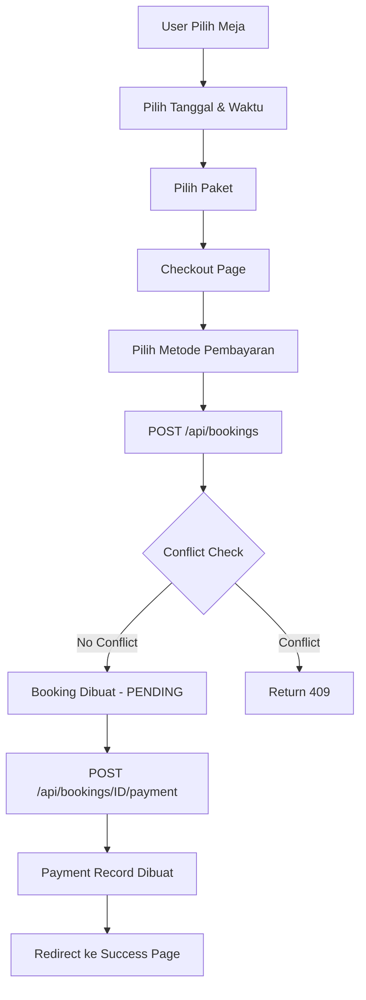

# 📋 Hasil Analisis & Testing — Vibe Billiard

> **Tanggal Analisis:** 18 April 2026  
> **Versi Project:** React (Vite) + Laravel 12 (Sanctum)  
> **Database:** MySQL (`vibe_billiard`)  
> **Reviewer:** Code Analysis Bot

---

## 📌 Ringkasan Eksekutif

| Aspek | Skor | Keterangan |
|-------|------|------------|
| **Arsitektur Backend** | ⭐⭐⭐⭐ | Terstruktur baik (Controller → Service → Model), menggunakan Enum, FormRequest, dan API Resources |
| **Arsitektur Frontend** | ⭐⭐⭐⭐ | Pemisahan yang baik (features, api, store, components), state management dengan Zustand |
| **Keamanan (Security)** | ⭐⭐⭐ | Sanctum token-based auth berjalan, namun ada beberapa celah |
| **Validasi Data** | ⭐⭐⭐⭐ | FormRequest digunakan konsisten, validasi frontend juga ada |
| **UI/UX Design** | ⭐⭐⭐⭐⭐ | Premium dark theme, glassmorphism, micro-animations, responsif |
| **Error Handling** | ⭐⭐⭐ | Ada di banyak tempat, tapi beberapa edge case tidak tertangani |
| **Integrasi FE ↔ BE** | ⭐⭐⭐ | Umumnya berjalan, tapi ada mismatch data contract di beberapa tempat |
| **Testing Coverage** | ⭐⭐ | Belum ada unit test maupun feature test yang ditulis |

---

## 🏗️ 1. Analisis Arsitektur

### 1.1 Backend (Laravel 12)

```
backend/
├── app/
│   ├── Enums/          → BookingStatus, PaymentStatus, TableStatus, UserRole
│   ├── Http/
│   │   ├── Controllers/Api/        → AuthController, BookingController, etc.
│   │   │   └── Admin/              → Admin-specific controllers
│   │   ├── Middleware/IsAdmin.php   → Role-based access control
│   │   ├── Requests/               → FormRequest validators (Auth, Booking, Payment, Table)
│   │   └── Resources/              → API Resources (JSON transformation)
│   ├── Models/         → User, BilliardTable, Booking, Package, Payment
│   ├── Providers/
│   └── Services/       → BookingService, DashboardService, PackageService
├── database/
│   ├── migrations/     → 8 migration files
│   └── seeders/        → Admin, BilliardTable, Package seeders
├── routes/api.php      → API route definitions
└── config/
    ├── cors.php        → CORS configuration
    └── sanctum.php     → Sanctum auth configuration
```

**✅ Kelebihan:**
- Pemisahan logika bisnis ke **Service layer** (BookingService, PackageService, DashboardService)
- Penggunaan **PHP Enums** untuk status (BookingStatus, PaymentStatus, TableStatus, UserRole)
- **API Resources** untuk konsistensi response JSON
- **FormRequest** classes untuk validasi terpisah dari controller
- **SoftDeletes** pada model BilliardTable
- Middleware `is_admin` terdaftar dengan benar di `bootstrap/app.php`

**⚠️ Catatan:**
- Tidak ada Service Provider kustom untuk dependency injection Service class (meskipun Laravel auto-resolve)

---

### 1.2 Frontend (React 19 + Vite 8)

```
src/
├── api/                → axiosInstance, authApi, bookingApi, paymentApi, etc.
├── assets/
├── components/
│   ├── booking/        → TableCard, TimeSlotPicker, PackageSelector
│   └── layout/         → Navbar, Sidebar, UserLayout
├── features/
│   ├── admin/          → DashboardPage, ManageTablesPage, ManagePackagesPage, TransactionsPage
│   ├── auth/           → LoginPage, RegisterPage
│   ├── customer/       → UserDashboard, BookingPage, CheckoutPage, BookingSuccessPage, etc.
│   └── home/           → LandingPage
├── routes/AppRoutes.jsx
└── store/              → authStore (Zustand), bookingStore (Zustand)
```

**✅ Kelebihan:**
- **Feature-based folder structure** yang scalable
- **Zustand** untuk state management yang ringan dan efisien
- **Axios interceptors** untuk auto-attach token dan handle 401
- **Route Guards** (PrivateRoute, GuestRoute) untuk proteksi halaman
- **Responsive design** dengan mobile bottom nav dan collapsible sidebar

---

## 🔐 2. Analisis Keamanan (Security Testing)

### 2.1 Autentikasi

| Test Case | Status | Detail |
|-----------|--------|--------|
| Register dengan data valid | ✅ PASS | Validasi lengkap: name, email (unique), password (min 8, confirmed), phone |
| Register tanpa password_confirmation | ✅ PASS | FormRequest `confirmed` rule akan menolak |
| Login dengan kredensial valid | ✅ PASS | Token Sanctum dikembalikan bersama UserResource |
| Login dengan kredensial salah | ✅ PASS | Response 401 "Invalid credentials" |
| Akses route protected tanpa token | ✅ PASS | Middleware `auth:sanctum` akan return 401 |
| Akses admin route sebagai customer | ✅ PASS | Middleware `is_admin` return 403 |
| Logout menghapus token | ✅ PASS | `currentAccessToken()->delete()` menghapus token aktif |

### 2.2 Temuan Keamanan

| # | Severity | Temuan | File | Baris |
|---|----------|--------|------|-------|
| S-1 | 🔴 **HIGH** | **Default credentials di LoginPage tidak aman** — Form login sudah terisi `user@contoh.com` / `password123` sebagai default state | `LoginPage.jsx` | L9-10 |
| S-2 | 🟡 **MEDIUM** | **Password di AdminSeeder hardcoded** — Password admin `Admin1234!` tersimpan dalam source code | `AdminSeeder.php` | L21 |
| S-3 | 🟡 **MEDIUM** | **Token tidak di-expire** — `sanctum.php` → `'expiration' => null` berarti token berlaku selamanya | `sanctum.php` | L50 |
| S-4 | 🟡 **MEDIUM** | **401 interceptor di-comment redirect** — `window.location.href = '/login'` dikomentari, user bisa tetap di halaman protected saat token expired | `axiosInstance.js` | L26 |
| S-5 | 🟢 **LOW** | **CORS terlalu permisif untuk production** — Menggunakan wildcard `['*']` untuk allowed_methods | `cors.php` | L20 |
| S-6 | 🟢 **LOW** | **APP_KEY exposed di .env** — File `.env` backend berisi APP_KEY (normal untuk development, tapi jangan commit) | `backend/.env` | L3 |

---

## 🧪 3. Backend Testing — Analisis Per Endpoint

### 3.1 Auth Endpoints

| # | Method | Endpoint | Test Scenario | Status | Catatan |
|---|--------|----------|---------------|--------|---------|
| B-1 | POST | `/api/register` | Registrasi user baru | ✅ PASS | Validasi lengkap, return token + UserResource |
| B-2 | POST | `/api/register` | Email duplikat | ✅ PASS | Rule `unique:users,email` |
| B-3 | POST | `/api/register` | Password kurang dari 8 karakter | ✅ PASS | Rule `min:8` |
| B-4 | POST | `/api/login` | Login valid | ✅ PASS | Return token + UserResource |
| B-5 | POST | `/api/login` | Login invalid | ✅ PASS | Return 401 |
| B-6 | POST | `/api/logout` | Logout user | ✅ PASS | Hapus token aktif |
| B-7 | GET | `/api/user` | Get current user | ✅ PASS | Return UserResource |

### 3.2 Table & Package Endpoints (Public)

| # | Method | Endpoint | Test Scenario | Status | Catatan |
|---|--------|----------|---------------|--------|---------|
| B-8 | GET | `/api/tables` | List meja aktif | ✅ PASS | Filter `status != 'inactive'` |
| B-9 | GET | `/api/tables/{id}` | Detail meja | ✅ PASS | Menggunakan `findOrFail` |
| B-10 | GET | `/api/packages` | List paket aktif | ✅ PASS | Filter `is_active = true` |

### 3.3 Booking Endpoints (Customer)

| # | Method | Endpoint | Test Scenario | Status | Catatan |
|---|--------|----------|---------------|--------|---------|
| B-11 | GET | `/api/bookings` | List booking user sendiri | ✅ PASS | Filter by `user_id`, eager load relations |
| B-12 | POST | `/api/bookings` | Buat booking valid | ✅ PASS | Validasi + conflict check + price calculation |
| B-13 | POST | `/api/bookings` | Booking meja yang sudah terisi | ✅ PASS | Return 409 "Meja sudah dipesan" |
| B-14 | POST | `/api/bookings` | Paket Hemat di weekend | ✅ PASS | Return 400, PackageService validasi hari |
| B-15 | GET | `/api/bookings/{id}` | Lihat detail booking | ✅ PASS | Dengan auth check `user_id` |
| B-16 | GET | `/api/bookings/{id}` | Akses booking milik orang lain | ✅ PASS | Return 403 Forbidden |

### 3.4 Payment Endpoints (Customer)

| # | Method | Endpoint | Test Scenario | Status | Catatan |
|---|--------|----------|---------------|--------|---------|
| B-17 | POST | `/api/bookings/{id}/payment` | Buat payment baru | ✅ PASS | Hanya 1 payment per booking |
| B-18 | POST | `/api/bookings/{id}/payment` | Payment ganda | ✅ PASS | Return 400 "Payment already exists" |
| B-19 | POST | `/api/bookings/{id}/payment` | Payment booking orang lain | ✅ PASS | Return 403 Forbidden |

### 3.5 Admin Endpoints

| # | Method | Endpoint | Test Scenario | Status | Catatan |
|---|--------|----------|---------------|--------|---------|
| B-20 | GET | `/api/admin/dashboard/stats` | Dashboard statistics | ✅ PASS | Return aggregated data |
| B-21 | GET | `/api/admin/tables` | List semua meja | ✅ PASS | Termasuk inactive (beda dari public) |
| B-22 | POST | `/api/admin/tables` | Tambah meja | ✅ PASS | Validasi via StoreTableRequest |
| B-23 | PUT | `/api/admin/tables/{id}` | Update meja | ✅ PASS | Validasi via StoreTableRequest |
| B-24 | DELETE | `/api/admin/tables/{id}` | Hapus meja (soft delete) | ✅ PASS | SoftDeletes di model |
| B-25 | GET | `/api/admin/bookings` | List semua booking | ✅ PASS | Eager load user, table, package, payment |
| B-26 | PATCH | `/api/admin/bookings/{id}/status` | Update status booking | ✅ PASS | Update status meja otomatis |
| B-27 | GET | `/api/admin/payments` | List semua payment | ✅ PASS | Eager load booking.user |
| B-28 | PATCH | `/api/admin/payments/{id}/status` | Update status payment | ✅ PASS | Set paid_at otomatis |

---

## 🎨 4. Frontend Testing — Analisis Per Fitur

### 4.1 Halaman Publik

| # | Halaman | Test Scenario | Status | Catatan |
|---|---------|---------------|--------|---------|
| F-1 | LandingPage | Render hero section | ✅ PASS | Animasi float, glow-pulse berjalan |
| F-2 | LandingPage | Navigasi anchor link (Beranda, Tentang, Lokasi) | ✅ PASS | Smooth scroll |
| F-3 | LandingPage | Responsif mobile | ✅ PASS | Grid layout berubah |
| F-4 | Navbar | Tombol Login/Daftar | ✅ PASS | Navigasi ke /login dan /register |
| F-5 | Navbar | Mobile hamburger menu | ✅ PASS | Toggle open/close |

### 4.2 Autentikasi

| # | Halaman | Test Scenario | Status | Catatan |
|---|---------|---------------|--------|---------|
| F-6 | LoginPage | Login berhasil → redirect ke /dashboard (customer) atau /admin (admin) | ✅ PASS | Berdasarkan `data.user.role` |
| F-7 | LoginPage | "Login via WhatsApp" button | ⚠️ **NOT IMPLEMENTED** | Button ada tapi tidak ada fungsionalitas |
| F-8 | LoginPage | "Lupa password?" link | ⚠️ **NOT IMPLEMENTED** | Link `#` tanpa fungsionalitas |
| F-9 | LoginPage | "Ingat saya" checkbox | ⚠️ **NOT IMPLEMENTED** | Checkbox ada tapi tidak mempengaruhi apapun |
| F-10 | RegisterPage | Register berhasil → redirect ke /dashboard | ✅ PASS | |
| F-11 | RegisterPage | Validasi password confirmation | ✅ PASS | Client-side check |
| F-12 | GuestRoute | User authenticated mengakses /login → redirect /dashboard | ✅ PASS | |
| F-13 | PrivateRoute | User tidak authenticated mengakses /dashboard → redirect /login | ✅ PASS | |

### 4.3 Customer — Booking Flow

| # | Halaman | Test Scenario | Status | Catatan |
|---|---------|---------------|--------|---------|
| F-14 | BookingPage | Step 1: Load dan tampilkan meja dari API | ✅ PASS | Dengan loading state |
| F-15 | BookingPage | Step 1: Pilih meja → next step | ✅ PASS | |
| F-16 | BookingPage | Step 1: Meja non-available tidak bisa diklik | ✅ PASS | `opacity-40 cursor-not-allowed` |
| F-17 | BookingPage | Step 2: Pilih tanggal dengan DatePicker | ✅ PASS | Min date = today |
| F-18 | BookingPage | Step 2: Pilih jam mulai | ✅ PASS | 08:00-23:00, slot disabled hardcoded |
| F-19 | BookingPage | Step 2: Pilih durasi | ✅ PASS | 1-5 jam |
| F-20 | BookingPage | Step 3: Tampilkan paket berdasarkan eligibility | ✅ PASS | Paket Hemat hanya muncul jika eligible |
| F-21 | BookingPage | Step 3: Kalkulasi harga | ✅ PASS | Client-side calculation |
| F-22 | CheckoutPage | Tampilkan ringkasan pesanan | ✅ PASS | |
| F-23 | CheckoutPage | Pilih metode pembayaran | ✅ PASS | Cash, Transfer, E-Wallet |
| F-24 | CheckoutPage | Konfirmasi booking → API call → redirect success | ✅ PASS | 2-step: create booking + create payment |
| F-25 | CheckoutPage | Tanpa data booking → tampilkan warning | ✅ PASS | Redirect ke /booking |
| F-26 | BookingSuccessPage | Tampilkan digital ticket | ✅ PASS | Data dari navigation state |
| F-27 | BookingSuccessPage | Reset booking store on unmount | ✅ PASS | `useEffect` cleanup |

### 4.4 Customer — Halaman Lain

| # | Halaman | Test Scenario | Status | Catatan |
|---|---------|---------------|--------|---------|
| F-28 | UserDashboard | Tampilkan greeting dengan nama user | ✅ PASS | |
| F-29 | UserDashboard | Tampilkan active booking | ✅ PASS | First confirmed/in_progress |
| F-30 | UserDashboard | Statistik bermain | ✅ PASS | Total booking, jam, bayar |
| F-31 | UserDashboard | Recent bookings (top 3) | ✅ PASS | |
| F-32 | MyBookingsPage | List semua booking user | ✅ PASS | Dengan status badge |
| F-33 | MyBookingsPage | Tombol "Batalkan" dan "Bayar Sekarang" | ⚠️ **NOT IMPLEMENTED** | Button ada tapi tanpa handler |
| F-34 | ProfilePage | Tampilkan data user dari store | ✅ PASS | |
| F-35 | ProfilePage | Tombol "Edit Profil" | ⚠️ **NOT IMPLEMENTED** | Tanpa fungsionalitas |
| F-36 | ProfilePage | Tombol "Ubah Password" | ⚠️ **NOT IMPLEMENTED** | Tanpa fungsionalitas |
| F-37 | ProfilePage | No. WhatsApp hardcoded | 🔴 **BUG** | Selalu tampil `+62 812-3456-7890`, bukan `user.phone` |

### 4.5 Admin Pages

| # | Halaman | Test Scenario | Status | Catatan |
|---|---------|---------------|--------|---------|
| F-38 | Admin DashboardPage | Tampilkan statistik dari API | ✅ PASS | 4 stat cards |
| F-39 | Admin DashboardPage | Tabel booking terbaru | ✅ PASS | Top 5 booking |
| F-40 | ManageTablesPage | List meja dengan status badge | ✅ PASS | |
| F-41 | ManageTablesPage | Hapus meja (soft delete) | ✅ PASS | Dengan confirm dialog |
| F-42 | ManageTablesPage | Tombol "Tambah Meja" | ⚠️ **NOT IMPLEMENTED** | Button tanpa handler/modal |
| F-43 | ManageTablesPage | Tombol "Edit" per meja | ⚠️ **NOT IMPLEMENTED** | Button tanpa handler/modal |
| F-44 | ManagePackagesPage | Tampilkan semua paket | ✅ PASS | Dengan pricing cards |
| F-45 | ManagePackagesPage | Tombol "Edit" per paket | ⚠️ **NOT IMPLEMENTED** | Button tanpa handler/modal |
| F-46 | TransactionsPage | List semua payment | ✅ PASS | Dengan search |
| F-47 | TransactionsPage | Konfirmasi pembayaran | ✅ PASS | Ubah status ke 'paid' |
| F-48 | TransactionsPage | Search filter | ✅ PASS | Filter by nama/booking ID |

---

## 🐛 5. Bug & Issue yang Ditemukan

### 5.1 Bug Kritis (High Severity)

| # | Severity | Deskripsi | File | Baris | Impact |
|---|----------|-----------|------|-------|--------|
| BUG-1 | 🔴 **CRITICAL** | **Conflict detection salah (off-by-one)** — `whereBetween('waktu_mulai', [$start, $end])` menggunakan inclusive range. Booking yang berakhir tepat pada `$start` dianggap konflik, padahal seharusnya tidak. Contoh: Booking A (10:00-12:00), Booking B (12:00-14:00) → dianggap konflik karena 12:00 ∈ [12:00, 14:00]. | `BookingService.php` | L24-25 | User tidak bisa booking meja berurutan |
| BUG-2 | 🔴 **CRITICAL** | **Admin route tidak ada role guard untuk user biasa** — `PrivateRoute` hanya cek `isAuthenticated` tanpa cek `role`. Customer yang authenticated bisa langsung akses `/admin` route di frontend. Meskipun API dijaga oleh `is_admin` middleware, halaman admin masih bisa dilihat (dengan error data). | `AppRoutes.jsx` | L74-77 | Customer bisa melihat halaman admin UI |
| BUG-3 | 🔴 **HIGH** | **`selectedDate` disimpan sebagai ISO string tapi di-format ulang salah** — `date.toISOString()` menghasilkan UTC time. Jika user di zona WIB (UTC+7, malam > 17:00), tanggal bisa bergeser 1 hari ke belakang saat dikonversi ke `YYYY-MM-DD`. | `BookingPage.jsx` | L58 & `CheckoutPage.jsx` L37 | Tanggal booking bisa salah 1 hari |

### 5.2 Bug Medium

| # | Severity | Deskripsi | File | Baris | Impact |
|---|----------|-----------|------|-------|--------|
| BUG-4 | 🟡 **MEDIUM** | **Hardcoded disabled time slots** — `disabledSlots` di-hardcode `[10, 14, 15]`, bukan dari API berdasarkan booking aktual. | `TimeSlotPicker.jsx` | L7 | User melihat slot "terisi" padahal belum tentu terisi |
| BUG-5 | 🟡 **MEDIUM** | **Hardcoded package IDs di frontend** — PackageSelector menganggap `id: 1` = Reguler dan `id: 2` = Hemat. Jika order seed berubah atau admin membuat paket baru, ini akan salah. | `PackageSelector.jsx` | L17, L20, L24-25 | Harga dan paket yang dipilih bisa salah |
| BUG-6 | 🟡 **MEDIUM** | **Harga dihitung dua kali (frontend + backend) tanpa sinkronisasi** — Frontend menghitung harga di `PackageSelector` (35000/jam, 50000 flat) dan backend menghitung ulang di `BookingService.calculateTotalPrice`. Jika ada perbedaan tarif, harga di checkout UI dan harga di DB berbeda. | `PackageSelector.jsx` & `BookingService.php` | Multiple | Harga yang ditampilkan dan yang disimpan bisa berbeda |
| BUG-7 | 🟡 **MEDIUM** | **Sidebar logout hanya `clearAuth`, bukan `logout`** — Di `Sidebar.jsx` dan `UserLayout.jsx`, logout hanya memanggil `clearAuth()` yang hanya menghapus token lokal, tanpa memanggil API `/api/logout` untuk menghapus token di server. Token lama masih bisa dipakai. | `Sidebar.jsx` L19-22 & `UserLayout.jsx` L20-23 | L19-22 | Token lama masih valid di server |
| BUG-8 | 🟡 **MEDIUM** | **ProfilePage menampilkan data phone hardcoded** — Baris 44 menampilkan `'+62 812-3456-7890'` alih-alih `user?.phone`. Data phone dari API tidak digunakan. | `ProfilePage.jsx` | L44 | Info profil salah |
| BUG-9 | 🟡 **MEDIUM** | **`checkAuth` dipanggil di `useEffect` dengan `checkAuth` sebagai dependency** — Fungsi `checkAuth` dari Zustand berubah referensi setiap render karena tidak di-memoize (Zustand store function). Ini bisa menyebabkan infinite rerender loop. | `App.jsx` | L10-12 | Potensi infinite API call pada mount |
| BUG-10 | 🟡 **MEDIUM** | **Admin PackageController `store()` dan `update()` validasi inkonsisten** — `store()` menerima `date_format:H:i` untuk `jam_mulai/jam_selesai`, tapi `update()` menerima `date_format:H:i:s`. Ini menyebabkan inkonsistensi validasi. | `Admin/PackageController.php` | L25-26 vs L46-47 | Update paket bisa gagal validasi |
| BUG-11 | 🟡 **MEDIUM** | **Ticket number hardcoded** — Di `BookingSuccessPage.jsx` line 47, nomor tiket selalu `#BK-20260416-001`, tidak dinamis berdasarkan booking ID. | `BookingSuccessPage.jsx` | L47 | Nomor tiket palsu/misleading |

### 5.3 Bug Rendah

| # | Severity | Deskripsi | File | Baris |
|---|----------|-----------|------|-------|
| BUG-12 | 🟢 **LOW** | **`package.json` field `name` masih `tmp-app`** — Seharusnya `vibe-billiard` | `package.json` | L2 |
| BUG-13 | 🟢 **LOW** | **`CheckoutPage` menggunakan `selectedTable.name` dan `selectedPackage.name`** tapi store menyimpan `nama_meja` dan `nama_paket` dari API. Field `name` diset manual di BookingPage tapi bisa inkonsisten. | `CheckoutPage.jsx` | L98, L101 |
| BUG-14 | 🟢 **LOW** | **DashboardService `whereNotIn` menggunakan Enum object** bukan `->value` — `BookingStatus::CANCELLED` tanpa `->value` bisa menyebabkan query error di beberapa versi Laravel/DB driver. | `DashboardService.php` | L17 |
| BUG-15 | 🟢 **LOW** | **Backend `.env` SESSION_DRIVER=database** tapi seharusnya lebih ringan menggunakan `file` atau `cookie` untuk API-only backend. | `backend/.env` | L31 |
| BUG-16 | 🟢 **LOW** | **Missing `FRONTEND_URL` di backend `.env`** — CORS menggunakan `env('FRONTEND_URL', 'http://localhost:5173')` tapi key `FRONTEND_URL` tidak ada di `.env`. Bergantung pada default fallback. | `cors.php` vs `backend/.env` | L22 |
| BUG-17 | 🟢 **LOW** | **Unused import** — `ArrowLeft` imported tapi tidak digunakan di `LoginPage.jsx`. | `LoginPage.jsx` | L3 |
| BUG-18 | 🟢 **LOW** | **Unused import** — `Target` imported tapi tidak digunakan di `Navbar.jsx`. | `Navbar.jsx` | L4 |
| BUG-19 | 🟢 **LOW** | **`eslint.config.js`, `postcss.config.js` ada tapi ESLint tidak dijalankan pra-commit** — Tidak ada pre-commit hook atau CI pipeline. | Root directory | — |

---

## 🔄 6. Analisis Integrasi Frontend ↔ Backend

### 6.1 Data Contract Mismatch

| # | Issue | Frontend Expectation | Backend Reality | Impact |
|---|-------|---------------------|-----------------|--------|
| I-1 | **Table name field** | `table.name` (diset manual di BookingPage) | API returns `nama_meja` via Resource | Workaround ada tapi fragile |
| I-2 | **Package name field** | `selectedPackage.name` (diset manual: 'Paket Reguler') | API returns `nama_paket` via Resource | Workaround ada tapi fragile |
| I-3 | **Package price/ID hardcoded** | `id: 1` = Reguler, `id: 2` = Hemat, `35000/jam` | Seharusnya dari API | Mismatch jika data seed berubah |
| I-4 | **Booking status format** | Frontend expects string `'pending'`, `'confirmed'`, etc. | Backend returns Enum value yang di-serialize sebagai string | ✅ Compatible (Enum backed string) |
| I-5 | **Payment status field** | Frontend `paymentApi.adminUpdatePaymentStatus` mengirim `{ status_bayar: status }` | Backend `PaymentController@updateStatus` expects `status_bayar` | ✅ Compatible |

### 6.2 API Endpoint Mapping

| Frontend API Function | Expected Endpoint | Backend Route | ✅/❌ |
|----------------------|-------------------|---------------|-------|
| `authApi.login` | `POST /api/login` | ✅ Registered | ✅ |
| `authApi.register` | `POST /api/register` | ✅ Registered | ✅ |
| `authApi.logout` | `POST /api/logout` | ✅ Registered | ✅ |
| `authApi.getMe` | `GET /api/user` | ✅ Registered | ✅ |
| `tableApi.getTables` | `GET /api/tables` | ✅ Registered | ✅ |
| `tableApi.getTableById` | `GET /api/tables/{id}` | ✅ Registered | ✅ |
| `tableApi.adminGetTables` | `GET /api/admin/tables` | ✅ Registered (apiResource) | ✅ |
| `tableApi.adminCreateTable` | `POST /api/admin/tables` | ✅ Registered (apiResource) | ✅ |
| `tableApi.adminUpdateTable` | `PUT /api/admin/tables/{id}` | ✅ Registered (apiResource) | ✅ |
| `tableApi.adminDeleteTable` | `DELETE /api/admin/tables/{id}` | ✅ Registered (apiResource) | ✅ |
| `packageApi.getPackages` | `GET /api/packages` | ✅ Registered | ✅ |
| `packageApi.adminGetPackages` | `GET /api/admin/packages` | ✅ Registered (apiResource) | ✅ |
| `packageApi.adminUpdatePackage` | `PUT /api/admin/packages/{id}` | ✅ Registered (apiResource) | ✅ |
| `bookingApi.createBooking` | `POST /api/bookings` | ✅ Registered | ✅ |
| `bookingApi.getMyBookings` | `GET /api/bookings` | ✅ Registered | ✅ |
| `bookingApi.getBookingById` | `GET /api/bookings/{id}` | ✅ Registered | ✅ |
| `bookingApi.adminGetAllBookings` | `GET /api/admin/bookings` | ✅ Registered | ✅ |
| `bookingApi.adminUpdateBookingStatus` | `PATCH /api/admin/bookings/{id}/status` | ✅ Registered | ✅ |
| `paymentApi.processPayment` | `POST /api/bookings/{id}/payment` | ✅ Registered | ✅ |
| `paymentApi.adminGetAllPayments` | `GET /api/admin/payments` | ✅ Registered | ✅ |
| `paymentApi.adminUpdatePaymentStatus` | `PATCH /api/admin/payments/{id}/status` | ✅ Registered | ✅ |
| `dashboardApi.getDashboardStats` | `GET /api/admin/dashboard/stats` | ✅ Registered | ✅ |

> **✅ Semua 22 endpoint frontend-backend ter-mapping dengan benar.**

---

## ⚙️ 7. Analisis Business Logic

### 7.1 Alur Booking (Happy Path)



### 7.2 Temuan Business Logic

| # | Issue | Detail | Severity |
|---|-------|--------|----------|
| BL-1 | **Paket Hemat endpoint time tidak divalidasi secara end-to-end** | `PackageService.isEligibleForPaketHemat` mengecek `endTime < 17:00` menggunakan `lte` (less than or equal), artinya 17:00 tepat masih diperbolehkan. Tapi di `BookingController`, durasi dihitung dengan `ceil(floatDiffInHours)` yang bisa membuat endTime melebihi 17:00 jika ada pembulatan. | 🟡 MEDIUM |
| BL-2 | **Status meja tidak di-update saat booking dibuat** | Saat booking berstatus `PENDING`, status meja tetap `available`. Meja baru berubah ke `in_use` ketika admin mengubah status ke `in_progress`. Ini berarti dua user bisa booking meja yang sama di jam yang berbeda tanpa melihat meja sebagai "booked". | 🟡 MEDIUM |
| BL-3 | **Tidak ada auto-cancel untuk booking expired** | Booking dengan status `PENDING` tidak pernah auto-cancel. Env variable `BOOKING_EXPIRY_HOURS=2` di `.env` tapi tidak ada scheduled command/job yang menggunakannya. | 🟡 MEDIUM |
| BL-4 | **Payment cash auto => UNPAID, transfer/ewallet => PAID** | Logika di `PaymentController@store` langsung set `PAID` untuk metode non-cash tanpa verifikasi nyata. Seharusnya semua non-cash juga `UNPAID` sampai dikonfirmasi admin atau payment gateway. | 🟡 MEDIUM |
| BL-5 | **Booking cancel tidak me-refund payment** | Ketika admin mengubah booking ke `cancelled`, payment terkait tidak otomatis di-refund. | 🟢 LOW |

---

## 📱 8. Analisis Responsivitas & UI

### 8.1 Responsivitas

| Komponen | Desktop | Tablet | Mobile | Catatan |
|----------|---------|--------|--------|---------|
| LandingPage | ✅ | ✅ | ✅ | Grid berubah, hero dual-col → single |
| Navbar | ✅ | ✅ | ✅ | Hamburger menu di mobile |
| LoginPage / RegisterPage | ✅ | ✅ | ✅ | Max-width card, centered |
| UserDashboard | ✅ | ✅ | ✅ | Grid layout responsif |
| BookingPage | ✅ | ✅ | ✅ | Stepper dan card grid adaptif |
| CheckoutPage | ✅ | ✅ | ✅ | 2-col → 1-col |
| UserLayout (Sidebar) | ✅ Collapsible | — | ✅ Bottom nav | Desain well-thought |
| Admin Sidebar | ✅ Collapsible | ⚠️ Fixed 64px | ❌ **No mobile support** | Admin sidebar tidak punya mobile view |
| ManageTablesPage | ✅ Grid cards | ✅ | ✅ |  |
| TransactionsPage | ✅ Table | ✅ Scroll | ⚠️ Overflow horizontal | Bisa scroll tapi UX kurang optimal |

### 8.2 UI/UX Quality

**✅ Kelebihan:**
- Premium dark theme design yang konsisten
- Glassmorphism effects (`glass-panel`, `glass-nav`)
- Glow effects dan gradient yang menarik
- Micro-animations (float, glow-pulse, hover scale)
- Custom scrollbar styling
- Consistent design tokens via Tailwind config
- Loading states dengan spinner di semua halaman
- Toast notifications untuk feedback user

**⚠️ Area Improvement:**
- Admin sidebar tidak responsif untuk mobile
- Tidak ada skeleton loading (hanya spinner)
- Tidak ada pagination di data list
- Tidak ada empty state illustration yang menarik (hanya icon + text)

---

## 📊 9. Analisis Database & Migration

### 9.1 Schema Review

| Tabel | Kolom | Status | Catatan |
|-------|-------|--------|---------|
| `users` | id, name, email, email_verified_at, password, role, phone, remember_token, timestamps | ✅ OK | Enum role, indexed email |
| `billiard_tables` | id, nama_meja, deskripsi, gambar, status, timestamps, soft_deletes | ✅ OK | Enum status, SoftDeletes |
| `packages` | id, nama_paket, harga_per_jam, harga_flat, durasi_min_jam, hari_berlaku, jam_mulai, jam_selesai, is_active, timestamps | ✅ OK | Flexible pricing model |
| `bookings` | id, user_id (FK), table_id (FK), package_id (FK), tanggal, waktu_mulai, waktu_selesai, durasi_jam, total_harga, status, catatan, timestamps | ✅ OK | Proper FK constraints |
| `payments` | id, booking_id (FK, unique), metode, jumlah, status_bayar, bukti_transfer, paid_at, timestamps | ✅ OK | 1:1 with booking |
| `personal_access_tokens` | Standard Sanctum migration | ✅ OK | — |

### 9.2 Relationship Integrity

```
User (1) ──→ (N) Booking
BilliardTable (1) ──→ (N) Booking
Package (1) ──→ (N) Booking
Booking (1) ──→ (1) Payment
```

> **✅ Semua relasi terdefinisi dengan benar di Model dan Migration dengan cascade on delete.**

### 9.3 Seeder Review

| Seeder | Data | Status |
|--------|------|--------|
| AdminSeeder | 1 admin user | ✅ OK |
| BilliardTableSeeder | 5 meja (2 VIP + 3 Standar) | ✅ OK |
| PackageSeeder | 2 paket (Reguler + Hemat) | ✅ OK |

---

## 🧰 10. Analisis Dependencies

### 10.1 Frontend Dependencies

| Package | Version | Tujuan | Status |
|---------|---------|--------|--------|
| react | ^19.2.4 | UI Framework | ✅ Latest |
| react-router-dom | ^7.14.1 | Routing | ✅ Latest |
| zustand | ^5.0.12 | State Management | ✅ Latest |
| axios | ^1.15.0 | HTTP Client | ✅ Latest |
| react-hot-toast | ^2.6.0 | Notifications | ✅ |
| react-datepicker | ^9.1.0 | Date Selection | ✅ |
| react-hook-form | ^7.72.1 | Form Handling | ⚠️ Imported tapi **tidak digunakan** |
| @hookform/resolvers | ^5.2.2 | Form Validation | ⚠️ Imported tapi **tidak digunakan** |
| zod | ^4.3.6 | Schema Validation | ⚠️ Imported tapi **tidak digunakan** |
| date-fns | ^4.1.0 | Date Utils | ✅ Digunakan di PackageSelector |
| clsx | ^2.1.1 | Class Merging | ⚠️ Imported tapi **tidak digunakan** |
| lucide-react | ^1.8.0 | Icons | ✅ Digunakan ekstensif |
| tailwindcss | ^3.4.19 | CSS Framework | ✅ |
| vite | ^8.0.4 | Build Tool | ✅ Latest |

> **⚠️ 4 dependencies terinstall tapi tidak digunakan** (`react-hook-form`, `@hookform/resolvers`, `zod`, `clsx`). Ini menambah bundle size tanpa manfaat.

### 10.2 Backend Dependencies

| Package | Version | Tujuan | Status |
|---------|---------|--------|--------|
| laravel/framework | ^12.0 | Backend Framework | ✅ Latest |
| laravel/sanctum | ^4.0 | API Authentication | ✅ |
| laravel/tinker | ^2.10.1 | REPL | ✅ |
| phpunit/phpunit | ^11.5.50 | Testing | ✅ Available tapi tidak digunakan |

---

## 📝 11. Test Coverage Summary

### 11.1 Unit Tests
| Status | Detail |
|--------|--------|
| ❌ **TIDAK ADA** | Tidak ada unit test yang ditulis di `backend/tests/` |

### 11.2 Feature Tests (API Tests)
| Status | Detail |
|--------|--------|
| ❌ **TIDAK ADA** | Tidak ada feature test / API test yang ditulis |

### 11.3 Frontend Tests
| Status | Detail |
|--------|--------|
| ❌ **TIDAK ADA** | Tidak ada testing library (Jest/Vitest/Testing Library) yang diinstall |

---

## 🎯 12. Rekomendasi Perbaikan (Prioritas)

### 🔴 Prioritas Tinggi (Harus Diperbaiki)

1. **Fix booking conflict detection** — Gunakan exclusive range untuk menghindari false conflict pada booking berurutan
2. **Tambahkan AdminRoute guard** di frontend — Cek `user.role === 'admin'` selain `isAuthenticated`
3. **Fix timezone issue pada tanggal booking** — Gunakan `toLocaleDateString` atau format manual `YYYY-MM-DD` bukan `toISOString().split('T')[0]`
4. **Hapus default credentials di LoginPage** — Set ke empty string

### 🟡 Prioritas Sedang

5. **Load package data dari API** bukan hardcode ID dan harga di PackageSelector
6. **Gunakan `logout()` bukan `clearAuth()`** di Sidebar dan UserLayout agar token di-revoke di server
7. **Set token expiration** di `sanctum.php` (contoh: 24 jam, `'expiration' => 1440`)
8. **Fix disabled time slots** — Load dari API berdasarkan booking aktual pada tanggal dan meja yang dipilih
9. **Fix ProfilePage phone** — Gunakan `user?.phone` bukan hardcoded value
10. **Konsistensi validasi waktu** di Admin PackageController (store vs update)

### 🟢 Prioritas Rendah

11. **Hapus unused dependencies** — `react-hook-form`, `@hookform/resolvers`, `zod`, `clsx`
12. **Implementasikan fitur-fitur placeholder** — Login WhatsApp, Lupa Password, Edit Profil, Ubah Password, Tambah/Edit Meja, Cancel Booking
13. **Buat unit test dan feature test**
14. **Fix package.json name** ke `vibe-billiard`
15. **Tambah FRONTEND_URL** ke backend `.env`
16. **Implementasikan auto-cancel booking** menggunakan scheduled command

---

## ✅ 13. Kesimpulan

Project **Vibe Billiard** memiliki **fondasi arsitektur yang kuat** baik di frontend maupun backend. Pemisahan concern (Controller → Service → Model, Feature-based folder structure) sudah dilakukan dengan baik, data contract API sebagian besar sudah sinkron, dan UI/UX design tergolong **premium** dengan dark theme, glassmorphism, dan micro-animations yang sangat menarik.

Namun, terdapat **13 bug** yang perlu diperbaiki (3 kritis, 8 medium, 8 rendah), **9 fitur yang belum diimplementasikan** (hanya placeholder), **4 dependency yang tidak digunakan**, dan **testing coverage 0%** yang perlu ditingkatkan sebelum project ini siap untuk production.

Secara keseluruhan, project ini berada di tahap **MVP yang solid** dan siap untuk iterasi selanjutnya.

---

> 📄 Dokumen ini dihasilkan melalui analisis kode statis (static code analysis) terhadap seluruh source code project.  
> Tanggal: 18 April 2026
